

A GNUstep Programming Tutorial
=====================================================

Time is on our side...
----------------------

### Yen-Ju Chen

### Dennis Leeuw

Copyright (c) 2003 Yen-Ju Chen, Dennis Leeuw

Permission is granted to copy, distribute and/or modify this document
under the terms of the GNU Free Documentation License, Version 1.2 or
any later version published by the Free Software Foundation; with no
Invariant Sections, no Front-Cover Texts, and no Back-Cover Texts.

------------------------------------------------------------------------

**Table of Contents**

1\. [Before we start](#AEN18)

[Introduction](#AEN20)

[Developement Tools & Resources](#AEN27)

[Objective-C Programming](#AEN65)

2\. [How to start GNUstep programming](#AEN93)

[Introduction](#AEN95)

[Tools & Applications](#AEN104)

[Stuff you get for free](#AEN147)

[Headers](#AEN220)

[Strings](#AEN232)

[Arrays](#AEN256)

[Debugging your application](#AEN264)

[Memory Management](#AEN280)

[File I/O](#AEN318)

[Basic Classes](#AEN331)

3\. [The GUI](#AEN363)

[A First Window Application](#AEN365)

[Use Gorm](#AEN412)

4\. [Unknown 1](#AEN499)

[TimeMachine](#AEN501)

[Single Window Application](#AEN503)

[Outlet and Action](#AEN506)

[Custom View](#AEN622)

[Drawing](#AEN707)

[Panel](#AEN728)

[Notification](#AEN836)

[Money](#AEN907)

[Document-base application](#AEN909)

[Table](#AEN989)

[Load and Save](#AEN1099)

[Drag and drop in table](#AEN1150)

[Overview](#AEN1177)

[LunarCalendar](#AEN1279)

5\. [Services](#AEN1353)

[NSLookupService](#AEN1355)

6\. [Regular expressions](#AEN1441)

[Regular Expression](#AEN1443)

7\. [Language support](#AEN1514)

[Localization](#AEN1516)

[Non-blocking I/O](#AEN1556)

8\. [Advanced GNUstep Programming](#AEN1587)

**List of Tables**

4-1. [Methods for loading and saving files](#AEN1102)

**List of Figures**

3-1. [HelloWorld Window](#AEN372)

3-2. [Gorm main window](#AEN419)

3-3. [Gorm palettes](#AEN424)

3-4. [Gorm inspector](#AEN429)

3-5. [Add title into window](#AEN437)

3-6. [Change title](#AEN443)

3-7. [Add menu](#AEN449)

3-8. [Change file owner](#AEN458)

3-9. [Connect menu action](#AEN464)

3-10. [Choose action](#AEN470)

3-11. [Connect action for "Hide" menu](#AEN476)

4-1. [Simple TimeMachine](#AEN509)

4-2. [Interface of simple TimeMachine](#AEN516)

4-3. [Change title of button](#AEN522)

4-4. [Classes in Gorm](#AEN533)

4-5. [Create subclass of NSObject](#AEN539)

4-6. [Change class name](#AEN545)

4-7. [Add outlet](#AEN552)

4-8. [Add action](#AEN561)

4-9. [NSOwner](#AEN571)

4-10. [Connect outlet](#AEN577)

4-11. [Connect action](#AEN589)

4-12. [TimeMachine with custom view](#AEN625)

4-13. [NSControl in Gorm](#AEN631)

4-14. [Add subclass of NSControl](#AEN637)

4-15. [Interface with custom view](#AEN644)

4-16. [Change class of custom view](#AEN650)

4-17. [Custom view with TimeView class](#AEN656)

4-18. [Add outlet](#AEN662)

4-19. [Add action](#AEN667)

4-20. [Connect outlet](#AEN673)

4-21. [Custom view with analog clock](#AEN710)

4-22. [Panel in Gorm](#AEN734)

4-23. [Interface of time zone panel](#AEN740)

4-24. [Panel attributes](#AEN746)

4-25. [Outlets for time zone panel](#AEN753)

4-26. [Actions for time zone panel](#AEN758)

4-27. [Set NSOwner to TimeView class](#AEN765)

4-28. [Connect outlet](#AEN774)

4-29. [Connection NSTextField action](#AEN814)

4-30. [Connect nextKeyView](#AEN826)

4-31. [Connect menu action](#AEN884)

4-32. [Menu of document-base application](#AEN915)

4-33. [Create instance of NSDocumentController](#AEN922)

4-34. [Create NSDocument subclass](#AEN936)

4-35. [Set document as NSOwner of window](#AEN942)

4-36. [Connect NSOwner to window](#AEN951)

4-37. [Connect delegate to NSOwner](#AEN960)

4-38. [Add table into window](#AEN996)

4-39. [Attributes of NSTableView](#AEN1005)

4-40. [Set resize attribute of table view](#AEN1011)

4-41. [Add outlet for table view](#AEN1019)

4-42. [Connect data source and delegate of table view](#AEN1025)

4-43. [Connect outlet to table view](#AEN1037)

4-44. [Interface of Overview](#AEN1181)

4-45. [Autoresizing attribute of NSOutlineView](#AEN1187)

4-46. [Select column in NSOutlineView](#AEN1193)

4-47. [Change attribute of NSTableColumn](#AEN1199)

4-48. [Create subclass in Gorm](#AEN1205)

4-49. [Create outlet](#AEN1211)

4-50. [Connect outlet to NSOutlineView](#AEN1217)

4-51. [Connect data source of NSOutlineView](#AEN1223)

4-52. [Assign delegate of NSApp](#AEN1229)

4-53. [Overview](#AEN1269)

4-54. [CalendarView](#AEN1283)

4-55. [Interface of LunarCalendar](#AEN1294)

4-56. [Add outlet](#AEN1301)

4-57. [Connect outlet](#AEN1307)

5-1. [Interface of NSLookupService](#AEN1365)

5-2. [Connect outlet](#AEN1371)

5-3. [Connect action.](#AEN1377)

5-4. [Connect delegate of NSApp](#AEN1383)

7-1. [Interface of Localization example](#AEN1520)

7-2. [Interface of Search](#AEN1562)

------------------------------------------------------------------------

Chapter 1. Before we start
==================================================

Introduction
------------------------------------

And now you can forget everything you know about Objective-C
programming, because there is GNUstep. While not entirely true, this
section will explain why I wrote this sentence and what GNUstep is and
how it relates to Objective-C.

GNUstep tries to be a platform independend programming environment. That
means it tries to give you an abstraction layer on which you can program
your applications, so that they are portable to every platform that
adheres to the OpenStep standard. Currently that means that with the
least possible effort your applications can be compiled for GNU/Linux
(and most other POSIX compliant systems), MacOS X (using Cocoa), and to
a certain extend to Windows with the use of GNUstep and Cygwin.

This means: write once, compile anywhere.

With this abstraction comes also the runtime abstraction. That means
that your root of all objects is not the Objective-C runtime Object, but
NSObject. All objects eventually have NSObject as their root object.

The fact that you can't completely forget Objective-C is that fact that
GNUstep is programmed in Objective-C. And all you need to program your
program is GNUstep and Objective-C. It's the next logical step in
evolution. First there was C, then there was Objective-C and now there
is GNUstep.

------------------------------------------------------------------------

Developement Tools & Resources
------------------------------------------------------

GNUstep offers [ProjectCenter](http://www.gnustep.org/experience/ProjectCenter.html)
and [Gorm](http://www.gnustep.org/experience/Gorm.html)
to help you with the development of GNUstep applications. Both are
similiar to Project Builder and Interface Builder on MacOS X. ProjectCenter is for project management, and
Gorm for interface building. We will
come back to them later.

ProjectCenter and Gorm can be found on
<ftp://ftp.gnustep.org/pub/gnustep/dev-apps/>.

There are many GNUstep related resources:

1.  [GNUstep.org](http://www.gnustep.org/) - The Official site.

2.  [GNUstep.it](http://www.gnustep.it/) - Another GNUstep site with
    documents and examples.

3.  [GNUstep wiki](http://wiki.gnustep.org/) - GNUstep Wiki.

4.  [GNUstep Help Center](http://www.roard.com/docs/) - A GNUstep
    document collection.

5.  [Cocoa](http://developer.apple.com/documentation/Cocoa/Cocoa.html) -
    The Cocoa environment of MacOS X.

6.  [Stepwise.com](http://www.stepwise.com/) - OpenStep/Cocoa
    programming site.

7.  [Cocoa Dev Central](http://www.cocoadevcentral.com/) - Cocoa
    programming site.

------------------------------------------------------------------------

Objective-C Programming
-----------------------------------------------

Objective-C is called a superset of the C language. It is C plus
object-oriented design. It is suggested to use GCC 3.x series in order
to get better Objective-C support.

The syntax of Objective-C can be found at [Apples
site](http://developer.apple.com/documentation/Cocoa/Conceptual/ObjectiveC/index.html).
There is also a
[PDF](http://developer.apple.com/documentation/Cocoa/Conceptual/ObjectiveC/ObjC.pdf)
file to download. It is very easy to learn Objective-C if you have some
idea about C.

There are some more documents about Objective-C:

1.  [*Beginner's Guide to Objective-C
    Programming*](http://documents.made-it.com/GNUstep/programming.html)

2.  [*The Objective-C Programming
    Language*](http://developer.apple.com/documentation/Cocoa/Conceptual/ObjectiveC/index.html)

3.  [*Cocoa 101: Object-Oriented Programming for the Masses - Part
    1*](http://www.osnews.com/story.php?news_id=3379)

4.  [*Cocoa 101: Object-Oriented Programming for the Masses - Part
    2*](http://www.osnews.com/story.php?news_id=3490)

5.  [*ObjC
    Introduction*](http://wiki.gnustep.us/index.php?op=modload&name=phpWiki&file=index&pagename=ObjCIntroduction)

------------------------------------------------------------------------

Chapter 2. How to start GNUstep programming
===================================================================

Introduction
------------------------------------

The basis of GNUstep is formed by the GNUstep makefile system and
GNUstep base. With only these two you are able to program platform
independend non-graphical programs.

The makefile system is an extension to the normal `Makefile`. You need
GNU **make**, which might on your system be present as **gmake**. The
makefiles are called `GNUmakefile`. The GNUstep makefile system
simplyfies your makefiles, all makefile logic will be done for you so
that makefile functionality will be consistent across all GNUstep
programs.

GNUstep base contains what is defined in the OpenStep standard as the
Foundation. It has the logic for creating strings, arrays, file handling
and the like. All objects are prefixed with NS or GS. The NS prefixed
objects are the ones that comply to the OpenStep standard as closely as
possible, while the GS ones are GNUstep extensions.

------------------------------------------------------------------------

Tools & Applications
---------------------------------------------

We start with the traditional "Hello World" program, which is mainly a
demonstration of gnustep-make.

`main.c:`

<table>
<colgroup>
<col style="width: 100%" />
</colgroup>
<tbody>
<tr class="odd">
<td><pre class="PROGRAMLISTING"><code>#include &lt;stdio.h&gt;

int main(void)
{
   printf(&quot;Hello World\n&quot;);
}</code></pre></td>
</tr>
</tbody>
</table>

This is a very simple C program. In order to compile it, we create a
GNUmakefile file, which is a simplified, but powerful version of a
Makefile.

`GNUmakefile:`

<table>
<colgroup>
<col style="width: 100%" />
</colgroup>
<tbody>
<tr class="odd">
<td><pre class="PROGRAMLISTING"><code>include $(GNUSTEP_MAKEFILES)/common.make

CTOOL_NAME = HelloWorld
HelloWorld_HEADERS =
HelloWorld_C_FILES = main.c
HelloWorld_RESOURCE_FILES =

include $(GNUSTEP_MAKEFILES)/ctool.make</code></pre></td>
</tr>
</tbody>
</table>

Type **make** and do **./shared\_obj/HelloWorld**. It will print "Hello
World", as you might have expected.

This example shows you a couple of powerful things about the GNUstep
makefile system. As you can see there are no targets. You can type
**make** and it works. You might also have noticed that you told,
through the `CTOOL_NAME` variable, the system that your application is
called HelloWorld.

Let's do the same for an Objective-C version of Hello World.

`main.m`:

<table>
<colgroup>
<col style="width: 100%" />
</colgroup>
<tbody>
<tr class="odd">
<td><pre class="PROGRAMLISTING"><code>#include &lt;objc/Object.h&gt;

@interface Greeter:Object
{
  /* This is left empty on purpose:
   ** Normally instance variables would be declared here,
   ** but these are not used in our example.
   */
}

- (void)greet;

@end

#include &lt;stdio.h&gt;

@implementation Greeter

- (void)greet
{
    printf(&quot;Hello, World!\n&quot;);
}

@end

#include &lt;stdlib.h&gt;

int main(void)
{
    id myGreeter;
    myGreeter=[Greeter new];

    [myGreeter greet];

    [myGreeter free];
    return EXIT_SUCCESS;
}</code></pre></td>
</tr>
</tbody>
</table>

`GNUmakefile`:

<table>
<colgroup>
<col style="width: 100%" />
</colgroup>
<tbody>
<tr class="odd">
<td><pre class="PROGRAMLISTING"><code>include $(GNUSTEP_MAKEFILES)/common.make

OBJC_PROGRAM_NAME = HelloWorld
HelloWorld_HEADERS =
HelloWorld_OBJC_FILES = main.m
HelloWorld_RESOURCE_FILES =

include $(GNUSTEP_MAKEFILES)/objc.make</code></pre></td>
</tr>
</tbody>
</table>

Next to the change to `OBJC_PROGRAM_NAME` also not the change from
`HelloWorld_C_FILES` to `HelloWorld_OBJC_FILES`.

The basic logic for Objective-C files is included through `objc.make`
and off you go for plain Objective-C programs.

GNUstep knows two kinds of programs: Tools and Applications. Tools are
mostly non-graphical programs, but more exactly Tools are programs with
no-resources, while Applications are programs with resources.

`main.m`:

<table>
<colgroup>
<col style="width: 100%" />
</colgroup>
<tbody>
<tr class="odd">
<td><pre class="PROGRAMLISTING"><code>#include &lt;Foundation/Foundation.h&gt;

@interface Greeter:NSObject
{
  /* This is left empty on purpose:
   ** Normally instance variables would be declared here,
   ** but these are not used in our example.
   */
}

- (void)greet;

@end

#include &lt;stdio.h&gt;

@implementation Greeter

- (void)greet
{
    printf(&quot;Hello, World!\n&quot;);
}

@end

#include &lt;stdlib.h&gt;

int main(void)
{
    id myGreeter;
    myGreeter=[[Greeter alloc] init];

    [myGreeter greet];

    [myGreeter release];
    return EXIT_SUCCESS;
}</code></pre></td>
</tr>
</tbody>
</table>

`GNUmakefile`:

<table>
<colgroup>
<col style="width: 100%" />
</colgroup>
<tbody>
<tr class="odd">
<td><pre class="PROGRAMLISTING"><code>include $(GNUSTEP_MAKEFILES)/common.make

TOOL_NAME = HelloWorld
HelloWorld_HEADERS =
HelloWorld_OBJC_FILES = main.m
HelloWorld_RESOURCE_FILES =

include $(GNUSTEP_MAKEFILES)/tool.make</code></pre></td>
</tr>
</tbody>
</table>

To show you the difference more clearly type **make clean** and change
the line

<table>
<colgroup>
<col style="width: 100%" />
</colgroup>
<tbody>
<tr class="odd">
<td><pre class="PROGRAMLISTING"><code>include $(GNUSTEP_MAKEFILES)/tool.make</code></pre></td>
</tr>
</tbody>
</table>

to

<table>
<colgroup>
<col style="width: 100%" />
</colgroup>
<tbody>
<tr class="odd">
<td><pre class="PROGRAMLISTING"><code>include $(GNUSTEP_MAKEFILES)/application.make</code></pre></td>
</tr>
</tbody>
</table>

And change `TOOL_NAME` to `APP_NAME` and re-make the program. Next to
the shared\_obj directory you now also have a HelloWorld.app directory.

This HelloWorld.app directory is a self contained GNUstep application.
Type **openapp HelloWorld.app** and you see that it works. Now out of
curiosity list the contents of the HelloWorld.app directory and you have
your first glimps at the difference between a Tool and an Application.

------------------------------------------------------------------------

Stuff you get for free
-----------------------------------------------

Apart from being able to select the kind of program you want to create
you get a couple of things for free. The first thing you hopefully
already noticed is **make clean**, but there is more. **make install**
will install your program in it's default place, which for Tools is
`GNUSTEP_LOCAL_ROOT`/Tools and as you might have quessed
`GNUSTEP_LOCAL_ROOT`/Applications for applications.

Ofcourse that path can be overridden by using e.g. **make
PREFIX=/my/path install**, but remember that Tools and Applications are
only searched within the GNUstep tree. It is a self contained system
with three so called domains: GNUSTEP\_SYSTEM\_ROOT,
GNUSTEP\_LOCAL\_ROOT and GNUSTEP\_NETWORK\_ROOT. Tools like **openapp**
will only search through these domains and the current directory to find
Applications and Tools.

A couple of the most used **make** options are:

**Basic options**

-   **all.** The same as **make** without options

-   **check.** Run tests if applicable

-   **clean.** Remove all that is build during make

-   **distclean.** Remove all that is build during make and ... ???

-   **install.** Install all that is build, and if nothing is build, do
    the build first.

-   **uninstall.** Uninstall a previously install program.

-   **cvs-dist, cvs-snapshot, strings.** ??? What do these???

**Boolean options**

-   **debug=\[yes|no\].** yes builds a program with debugging symbols.
    With debugging symbols the program can be started with **debugapp**.

-   **filelist=\[yes|no\].** Creates a filelist of the installed files
    (easy for packaging binaries).

-   **messages=\[yes|no\].** More verbose messaging when building
    sources.

-   **shared=\[yes|no\].** ???

-   **standalone=\[yes|no\].** ???

-   **strip=\[yes|no\].** Strip the created programs and libraries.

There are some [GNUmakefile
tutorials](http://wiki.gnustep.org/index.php/GNUstep%20Make%20Tutorials).
Therefore, I won't touch this topic too much. Here is another example,
which is a real Objective-C program. If you are not familiar with
Objective-C, read the [Objective-C book from
apple](http://www.gnustep.org/) first.

------------------------------------------------------------------------

Headers
--------------------------------

Since GNUstep is build with Objective-C, which in turn is based on C,
headers are important. Within the GNUstep domains they can be found in
the Library/Headers directory where all have their own subdirectory; all
foundation headers can be found in Library/Headers/Foundation.

To include header files in your code you can use the C syntax:

<table>
<colgroup>
<col style="width: 100%" />
</colgroup>
<tbody>
<tr class="odd">
<td><pre class="PROGRAMLISTING"><code>#include &lt;Foundation/NSArray.h&gt;</code></pre></td>
</tr>
</tbody>
</table>

But you have the risk of creating a recursive inclusion, so if you want
to use include then you better use:

<table>
<colgroup>
<col style="width: 100%" />
</colgroup>
<tbody>
<tr class="odd">
<td><pre class="PROGRAMLISTING"><code>#ifndef HAVE_NSARRAY_H
#define HAVE_NSARRAY_H

#include &lt;Foundation/NSArray.h&gt;

#endif</code></pre></td>
</tr>
</tbody>
</table>

Easier would be to use the Objective-C macro \#import. import takes care
of all the things that concern headers:

<table>
<colgroup>
<col style="width: 100%" />
</colgroup>
<tbody>
<tr class="odd">
<td><pre class="PROGRAMLISTING"><code>#import &lt;Foundation/NSArray.h&gt;</code></pre></td>
</tr>
</tbody>
</table>

And since GNUstep is here to make it easier on you, you might want to
use:

<table>
<colgroup>
<col style="width: 100%" />
</colgroup>
<tbody>
<tr class="odd">
<td><pre class="PROGRAMLISTING"><code>#import &lt;Foundation/Foundation.h&gt;</code></pre></td>
</tr>
</tbody>
</table>

This includes all the headerfiles from the foundation.

<table>
<tbody>
<tr class="odd">
<td></td>
<td>
Foundation tries to implement as close as possible the OpenStep standard. Which means that the Foundation/ directory holds the headers that correspond to that standard. The extensions of GNUstep can be found in GNUstepBase/. The same goes for AppKit/ and GNUstepGUI/.
</td>
</tr>
</tbody>
</table>

------------------------------------------------------------------------

Strings
--------------------------------

There are four files:

`say.h:`

<table>
<colgroup>
<col style="width: 100%" />
</colgroup>
<tbody>
<tr class="odd">
<td><pre class="PROGRAMLISTING"><code>#ifndef _Say_H_
#define _Say_H_

#include &lt;Foundation/NSObject.h&gt;
@interface Say: NSObject
{
}
- (void) sayHello;
- (void) sayHelloTo: (NSString *)name;
@end

#endif /* _Say_H_ */</code></pre></td>
</tr>
</tbody>
</table>

`say.m:`

<table>
<colgroup>
<col style="width: 100%" />
</colgroup>
<tbody>
<tr class="odd">
<td><pre class="PROGRAMLISTING"><code>#include &quot;say.h&quot;
#include &lt;Foundation/Foundation.h&gt;

@implementation Say
- (void) sayHello
{
   NSLog(@&quot;Hello World&quot;);
}

- (void) sayHelloTo: (NSString *)name
{
   NSLog(@&quot;Hello World, %@&quot;, name);
}
@end</code></pre></td>
</tr>
</tbody>
</table>

`main.m:`

<table>
<colgroup>
<col style="width: 100%" />
</colgroup>
<tbody>
<tr class="odd">
<td><pre class="PROGRAMLISTING"><code>#include &quot;say.h&quot;
#include &lt;Foundation/Foundation.h&gt;

int main (void)
{
   id speaker;
   NSString *name = @&quot;GNUstep !&quot;;
   NSAutoreleasePool *pool;

   pool = [NSAutoreleasePool new];
   speaker = [[Say alloc] init];

   [speaker sayHello];
   [speaker sayHelloTo:name];

   RELEASE(speaker);
   RELEASE(pool);
}</code></pre></td>
</tr>
</tbody>
</table>

`GNUmakefile:`

<table>
<colgroup>
<col style="width: 100%" />
</colgroup>
<tbody>
<tr class="odd">
<td><pre class="PROGRAMLISTING"><code>include $(GNUSTEP_MAKEFILES)/common.make

APP_NAME = HelloWorld
HelloWorld_HEADERS = say.h
HelloWorld_OBJC_FILES = main.m say.m
HelloWorld_RESOURCE_FILES =

include $(GNUSTEP_MAKEFILES)/application.make</code></pre></td>
</tr>
</tbody>
</table>

Again, use 'make' and 'openapp' to compile and run this application.
This example is self-explained. There are several things worthy to
metion.

The class "Say" inherits from "NSObject", which is the root class of
GNUstep. Always inherit from NSObject if you don't know which class to
use. NSObject contains many fundamental methods which you won't want to
implement by yourself.

NSLog() is used instead of printf() because it is as easy as printf().
And most importantly, NSLog() accept the %@ symbol, which represents an
object. That means you can print objects in NSLog(). Very handy for
debug.

NSString is one of the most used classes in GNUstep. You can use @"..."
to create a NSString. There are many useful methods in NSString to
manipulate strings and pathes. Check these articles: [*String in Cocoa:
Part I*](http://www.macdevcenter.com/pub/a/mac/2001/06/29/cocoa.html),
[*Part II*](http://www.macdevcenter.com/pub/a/mac/2001/07/13/cocoa.html)

NSAutoreleasePool is the place for autoreleased instances. In this
example, it is not much useful, but I think it is a good habit to use
it. When the application should end, remember to release it. Methods
-alloc and -init is the standard method to create an instance. Method
-new is a shortcut if there is no messages for -init.

------------------------------------------------------------------------

Arrays
-------------------------------

Arrays are defined by NSArray. There is static version and a dynamic
version. The dynamic version is called NSMutableArray. To define them in
your code goes the same for both:

<table>
<colgroup>
<col style="width: 100%" />
</colgroup>
<tbody>
<tr class="odd">
<td><pre class="PROGRAMLISTING"><code>NSArray        *anArray;
NSMutableArray *anMutableArray;</code></pre></td>
</tr>
</tbody>
</table>

Now let us create a simple array:

<table>
<colgroup>
<col style="width: 100%" />
</colgroup>
<tbody>
<tr class="odd">
<td><pre class="PROGRAMLISTING"><code>NSArray           *weekArray;
NSAutoreleasePool *pool;

pool      = [NSAutoreleasePool new];
weekArray = [NSArray arrayWithObjects: @&quot;Sun&quot;, @&quot;Mon&quot; @&quot;Tue&quot;, @&quot;Wed&quot;, \
                                       @&quot;Thr&quot;, @&quot;Fri&quot;, @&quot;Sat&quot;, nil];

printf(&quot;Day 0: %@\n&quot;, [weekArray objectAtIndex: 0]);
RELEASE(pool);</code></pre></td>
</tr>
</tbody>
</table>

We told NSArray to fill `weekArray` with the strings that represent the
week days and terminated the array with a 'nil'

To output the elements from the array we ask from weekArray to output
the object at a certain index. Note that arrays start counting at 0!

------------------------------------------------------------------------

Debugging your application
---------------------------------------------------

Debugging your application often involves watching what happens while
the program is running. You could use a debugger for that, like gdb, but
there are some other options that make life easy.

Since you can mix C and Objective-C you could use normal `printf`
statements, or it's GNUstep counterpart GSPrintf. GNUstep however also
has a function `NSLog` and the Makefile system offers you to use **make
debug=yes** and use ifdefs in your code.

To make this all a bit more clear we use and example.

<table>
<colgroup>
<col style="width: 100%" />
</colgroup>
<tbody>
<tr class="odd">
<td><pre class="PROGRAMLISTING"><code>#include &lt;Foundation/Foundation.h&gt;

int main(void)
{
        NSArray           *outArray;
    NSAutoreleasePool *pool;
                
    pool = [NSAutoreleasePool new];
    outArray = [NSArray arrayWithObjects: @&quot;Msg1&quot;, @&quot;Msg2&quot; @&quot;Msg3&quot; &quot;Msg4&quot;;
    
    printf(&quot;%@\n&quot;, [outArray objectAtIndex: 0]);

    GSPrintf(stdout, &quot;%@&quot;,[outArray objectAtIndex: 1]);

    NSLog(@&quot;%@\n&quot;, [outArray objectAtIndex: 2]);

    #ifdef DEBUG
        NSLog(@&quot;%@\n&quot;, [outArray objectAtIndex: 3]);
    #endif

    RELEASE(pool);
}</code></pre></td>
</tr>
</tbody>
</table>

first run **make** and execute the binary in the obj directory. `printf`
prints it's output naar stdout, while NSLog outputs to stderr and with
GSPrintf you have full control. You can print to stdout or stderr.

Now run **make clean; make debug=yes** and rerun the command from the
obj directory. Your output should look like this:

<table>
<colgroup>
<col style="width: 100%" />
</colgroup>
<tbody>
<tr class="odd">
<td><pre class="SCREEN"><code>Msg1
Msg2
2003-12-30 17:40:53.846 array[10769] Msg3
2003-12-30 17:40:53.848 array[10769] Msg4</code></pre></td>
</tr>
</tbody>
</table>

With these you can simply debug the most common problems, apart from
code that won't compile :)

------------------------------------------------------------------------

Memory Management
------------------------------------------

Memory management is very important, but easy, in GNUstep. Here are some
good articles:

1.  [*Memory Management in
    Objective-C*](http://www.macdevcenter.com/pub/a/mac/2001/07/27/cocoa.html)

2.  [*Memory Management
    101*](http://cocoadevcentral.com/articles/000055.php)

3.  [*Very simple rules for memory management in
    Cocoa*](http://www.stepwise.com/Articles/Technical/2001-03-11.01.html)

4.  [*Hold Me, Use Me, Free
    Me*](http://www.stepwise.com/Articles/Technical/HoldMe.html)

5.  [*Accessor methods and (auto)release:
    conclusion*](http://cocoa.mamasam.com/COCOADEV/2002/08/1/41613.php)

6.  [*Memory Management with
    Cocoa/WebObjects*](http://www.stepwise.com/Articles/Technical/MemoryManagement.html)

GNUstep offers some good macros to ease the coding related to memory
management. Take a look at NSObject.h for ASSIGN(), RELEASE(), RETAIN(),
etc.

The most common way to handle release/retain is this:

<table>
<colgroup>
<col style="width: 100%" />
</colgroup>
<tbody>
<tr class="odd">
<td><pre class="PROGRAMLISTING"><code>@interface MyObject: NSObject
{
  id myData;
}
-(void) setMyData: (id) newData;
-(id) myData;
@end

@implementation MyObject
- (void) setMyData: (id) newData
{
  ASSIGN(myData, newData);
}

- (id) myData
{
  return myData;
}

- (void) dealloc
{
  RELEASE(myData);
}
@end</code></pre></td>
</tr>
</tbody>
</table>

Basically it works for me. ASSIGNCOPY() can also be used to copy object.
Always use \[self setMyData: newData\] to set myData, or at least use
ASSIGN(myData, newData). Don't use myData = newData. By this way, you
don't need to worry about the memory management.

In some case, I will use mutable classes because they are thread-safe.
For example:

<table>
<colgroup>
<col style="width: 100%" />
</colgroup>
<tbody>
<tr class="odd">
<td><pre class="PROGRAMLISTING"><code>@interface MyObject: NSObject
{
  NSMutableArray *myArray;
} 
-(void) setMyArray: (NSArray *) newArray;
-(NSArray *) myArray;
@end 

@implementation MyObject
- (id) init
{
  myArray = [NSMutableArray new];
}

- (void) setMyArray: (NSArray *) newArray
{ 
  [myArray setArray: newArray]; 
} 

- (NSArray *) myArray 
{ 
  return myArray; 
} 

- (void) dealloc 
{ 
  RELEASE(myArray); 
}
@end</code></pre></td>
</tr>
</tbody>
</table>

Mutable classes cost more resources. But it is a lazy way to avoid
problems.

Also be aware of the return values from GNUstep classes. Some are
autoreleased. For example, \[NSArray arrayWith...\], or \[@"A string"
stringBy...\]. If you release them again, the application usually
crashes. And remember to retain them if you want to use them later, and
release them in -dealloc. It's safe to use ASSIGN() in this case. For
example:

<table>
<colgroup>
<col style="width: 100%" />
</colgroup>
<tbody>
<tr class="odd">
<td><pre class="PROGRAMLISTING"><code>ASSIGN(myString, [@&quot;A string&quot;, stringBy...])</code></pre></td>
</tr>
</tbody>
</table>

ASSIGN() will handle all the details. Again, once you use ASSIGN(),
release it in -dealloc.

------------------------------------------------------------------------

File I/O
---------------------------------

Here is a demonstration of file I/O. GNUstep offer NSFileHandle and
NSFileManager to handle files. NSFileHandle is mainly to read and write,
and NSFileManager is for file management.

`main.m:`

<table>
<colgroup>
<col style="width: 100%" />
</colgroup>
<tbody>
<tr class="odd">
<td><pre class="PROGRAMLISTING"><code>#include &lt;Foundation/Foundation.h&gt;
   
int main (void)
{
   NSString *path;
   NSAutoreleasePool *pool;
   NSFileHandle *readFile, *writeFile;
   NSData *fileData;
   
   pool = [NSAutoreleasePool new];
   path = @&quot;main.m&quot;;
   
   readFile = [NSFileHandle fileHandleForReadingAtPath:path];
   fileData = [readFile readDataToEndOfFile];
   
   writeFile = [NSFileHandle fileHandleWithStandardOutput];
   [writeFile writeData:fileData];
   RELEASE(pool);

   return 0;
}</code></pre></td>
</tr>
</tbody>
</table>

`GNUmakefile:`

<table>
<colgroup>
<col style="width: 100%" />
</colgroup>
<tbody>
<tr class="odd">
<td><pre class="PROGRAMLISTING"><code>include $(GNUSTEP_MAKEFILES)/common.make
   
APP_NAME = FileHandle
FileHandle_HEADERS =
FileHandle_OBJC_FILES = main.m
FileHandle_RESOURCE_FILES =
   
include $(GNUSTEP_MAKEFILES)/application.make</code></pre></td>
</tr>
</tbody>
</table>

It is not too much useful to only trasfer data in NSData. Here, I can
take the data out of NSData and manipulate it in C. By this way, I can
combine GNUstep with C libraries.

`main.m:`

<table>
<colgroup>
<col style="width: 100%" />
</colgroup>
<tbody>
<tr class="odd">
<td><pre class="PROGRAMLISTING"><code>#import &lt;Foundation/Foundation.h&gt;

int main (void)
{ 
  NSString *path;
  NSAutoreleasePool *pool;
  NSFileHandle *readFile;
  NSData* fileData;
   
  char *buffer;
  unsigned int length;

  pool = [NSAutoreleasePool new];
  // path = @&quot;main.m&quot;;
  path = @&quot;GNUmakefile&quot;;
  readFile = [NSFileHandle fileHandleForReadingAtPath:path];
  fileData = [readFile readDataToEndOfFile];

  length = [fileData length];
  buffer = malloc(sizeof(char)*length);
  [fileData getBytes: buffer];

  printf(&quot;%s\n&quot;, buffer);
  printf(&quot;%d\n&quot;, length);
  free(buffer);
   
  RELEASE(pool);
   
  return 0;
}</code></pre></td>
</tr>
</tbody>
</table>

------------------------------------------------------------------------

Basic Classes
--------------------------------------

Documents about the base/foundation classes of GNUstep and Cocoa:

1.  [*Basic GNUstep Base Library
    Classes*](http://www.gnustep.it/nicola/Tutorials/BasicClasses/)

2.  [*The Storage Series, Part
    One*](http://cocoadevcentral.com/articles/000005.php)

3.  [*The Storage Series, Part
    Two*](http://cocoadevcentral.com/articles/000006.php)

4.  [*The Storage Series, Part
    Three*](http://cocoadevcentral.com/articles/000010.php)

5.  [*Understanding the design behind Cocoa's Foundation
    classes*](http://cocoadevcentral.com/articles/000065.php)

6.  [*Strings in Cocoa: Part
    I*](http://www.macdevcenter.com/pub/a/mac/2001/06/29/cocoa.html)

7.  [*Strings in Cocoa: Part
    II*](http://www.macdevcenter.com/pub/a/mac/2001/07/13/cocoa.html)

------------------------------------------------------------------------

Chapter 3. The GUI
===========================================

A First Window Application
---------------------------------------------------

Before using Gorm, it would be better to know how to write a program
from scratch, because Gorm is still under development, and sometimes it
is useful to manipulate the user interface from source code. It is also
good to know the logic of GNUstep application so that you won't get lost
when mixing Gorm files with source code. There are [*other
tutorials*](http://wiki.gnustep.org/index.php/GNUstep%20GUI%20Tutorials)
which give more details.

The idea of GNUstep application is that you start up the default
NSApplication, and it will keep running and receiving events. When
NSApplication, or NSApp as the shorter form, receives events, it will
call it's delegate, which is user-defined. Therefore, programmers are
responsible to write the delegate. If the delegate is interested in some
specific events, it can intercept them. Otherwise, NSApp will handle
them by itself. Therefore, delegate only need to intercept the events
which it is interested. This makes the design of delegate very easy.

The example here looks like this:

**Figure 3-1. HelloWorld Window**

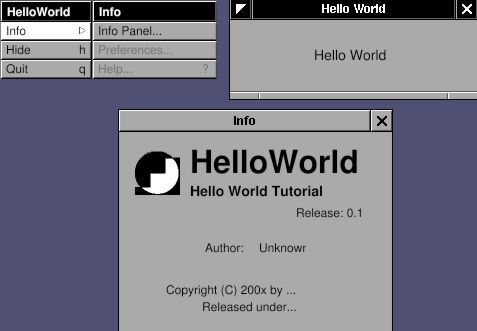&gt;

The "Info" window is a built-in function of GNUstep. I only need to make
the menu and the "Hello World" window.

Start with the `main.m` file.

`main.m:`

<table>
<colgroup>
<col style="width: 100%" />
</colgroup>
<tbody>
<tr class="odd">
<td><pre class="PROGRAMLISTING"><code>#include &quot;AppController.h&quot;
#include &lt;AppKit/AppKit.h&gt;

int main(int argc, const char *argv[]) 
{
   NSAutoreleasePool *pool;
   AppController *delegate;
   
   pool = [[NSAutoreleasePool alloc] init];
   delegate = [[AppController alloc] init];

   [NSApplication sharedApplication];
   [NSApp setDelegate: delegate];

   RELEASE(pool);
   return NSApplicationMain (argc, argv);
}</code></pre></td>
</tr>
</tbody>
</table>

I define a class called "AppController" as the delegate of this
application. After the NSApp starts up ( \[NSApplication
sharedApplication\] ), I set an instance of AppController as the
delegate of this application ( \[NSApp setDelegate: delegate\] ). Then
let the NSApp run ( NSApplicationMain (argc, argv) ).

Then what even should I intercept ? I want to display the menu, a window
and a text inside. Therefore, I need to know when the application is
\*going\* to launch, and when it is \*finished\* launching. Here is the
`AppController.h`.

`AppController.h:`

<table>
<colgroup>
<col style="width: 100%" />
</colgroup>
<tbody>
<tr class="odd">
<td><pre class="PROGRAMLISTING"><code>#ifndef _AppController_H_
#define _AppController_H_

#include &lt;Foundation/NSObject.h&gt;

@class NSWindow;
@class NSTextField;
@class NSNotification;

@interface AppController : NSObject
{
   NSWindow *window;
   NSTextField *label;
}

- (void)applicationWillFinishLaunching:(NSNotification *) not;
- (void)applicationDidFinishLaunching:(NSNotification *) not;

@end

#endif /* _AppController_H_ */</code></pre></td>
</tr>
</tbody>
</table>

The NSWindow and NSTextField are the window and text field in GNUstep. I
just declare them here for later use. These two methods:
-applicationWillFinishLaunching: and -applicationDidFinishLaunching: are
self-explained. When NSApp is going to launch, it will call the method
-applicationWillFinishLaunching, in delegate. So does NSApp finish
launching. No matter what class the delegate is, it can be the delegate
of NSApp, as long as it implements the proper methods so that NSApp can
notify the delegate when proper events come. If the delegate doesn't
implement these two methods, NSApp will handle the events by itself.
Therefore, implement proper methods when you want to intercept some
specific events. The usage of delegate is everywhere in GNUstep, which
makes the programming very easy.

Usually, not always, I set up the user interface in method
-applicationWillFinishLaunching:, and display the user interface in
method -applicationDidFinishLaunching:. Here is the implementation.

`AppController.m:`

<table>
<colgroup>
<col style="width: 100%" />
</colgroup>
<tbody>
<tr class="odd">
<td><pre class="PROGRAMLISTING"><code>#include &quot;AppController.h&quot;
#include &lt;AppKit/AppKit.h&gt;

@implementation AppController
- (void) applicationWillFinishLaunching: (NSNotification *) not
{
   /* Create Menu */
   NSMenu *menu;
   NSMenu *info;

   menu = [NSMenu new];
   [menu addItemWithTitle: @&quot;Info&quot;
                   action: NULL
            keyEquivalent: @&quot;&quot;];
   [menu addItemWithTitle: @&quot;Hide&quot;
                   action: @selector(hide:)
            keyEquivalent: @&quot;h&quot;];
   [menu addItemWithTitle: @&quot;Quit&quot;
                   action: @selector(terminate:)
            keyEquivalent: @&quot;q&quot;];

   info = [NSMenu new];
   [info addItemWithTitle: @&quot;Info Panel...&quot;
                   action: @selector(orderFrontStandardInfoPanel:)
            keyEquivalent: @&quot;&quot;];
   [info addItemWithTitle: @&quot;Preferences&quot;
                   action: NULL 
            keyEquivalent: @&quot;&quot;];
   [info addItemWithTitle: @&quot;Help&quot;
                   action: @selector (orderFrontHelpPanel:)
            keyEquivalent: @&quot;?&quot;];

   [menu setSubmenu: info 
            forItem: [menu itemWithTitle:@&quot;Info&quot;]];
   RELEASE(info);

   [NSApp setMainMenu:menu];
   RELEASE(menu);

   /* Create Window */
   window = [[NSWindow alloc] initWithContentRect: NSMakeRect(300, 300, 200, 100)
                                        styleMask: (NSTitledWindowMask |
                                                    NSMiniaturizableWindowMask |
                                                    NSResizableWindowMask)
                                          backing: NSBackingStoreBuffered
                                            defer: YES];
   [window setTitle: @&quot;Hello World&quot;];

   /* Create Label */
   label = [[NSTextField alloc] initWithFrame: NSMakeRect(30, 30, 80, 30)]; 
   [label setSelectable: NO];
   [label setBezeled: NO];
   [label setDrawsBackground: NO];
   [label setStringValue: @&quot;Hello World&quot;];

   [[window contentView] addSubview: label];
   RELEASE(label);
}

- (void) applicationDidFinishLaunching: (NSNotification *) not
{
   [window makeKeyAndOrderFront: self];
}

- (void) dealloc
{
  RELEASE(window);
  [super dealloc];
}

@end</code></pre></td>
</tr>
</tbody>
</table>

Firstly, menu is created. NSMenu is a collection of NSMenuItem. Add
NSMenuItem into NSMenu, connect the NSMenuItem to an action, or to
another NSMenu. For example, the NSMenuItem "Hide" is connected to the
action "hide:" ( @selector(hide:) ). When this NSMenuItem "Hide" is
clicked, the method -hide: will be called. But where is the method
-hide: ? It is a built-in method in NSApp. Therefore, I don't need to
implement it. So does the method -terminate:. NSMenuItem will
automatically find these methods. The NSMenuItem "Info" is connected to
the NSMenu "Info", which is how the submenu is constructed. That's the
reason why the action of NSMenuItem "Info" is NULL. Once NSMenu "info"
is set into NSMenu "menu" ( \[menu setSubmenu: forItem:\] ), NSMenu
"info" will be retained by NSMenu "menu". Therefore I can release the
NSMenu "info". So does the NSMenu "menu" after it is set into the main
menu of NSApp ( \[NSApp setMainMenu: \] ). The methods,
-orderFrontStandardInfoPanel and -orderFrontHelpPanel, are also the
built-in methods in NSApp.

Secondly, NSWindow is created and title is set. NSMakeRect is a shortcut
function to create a NSRect structure. The origin of GNUstep is at
left-bottom. The first two numbers are the left-bottom position (x, y)
of the window related to the monitor, and the rest two numbers are the
width and height of the window. GUI classes are usually initialized with
-initWithFrame: method or something similar in order to assign the
position and size. GNUstep use absolute position/size rather than
relative position/size in most of the cases.

Finally, a NSTextField is set up with many properties. Most important
one is the method -setStringValue:, which sets the text in NSTextField.

The way GNUstep build up the user interface is that you add some GUI
classes on other GUI classes. In this case, I want to add the
NSTextField on the NSWindow. Therefore, NSTextField will be the
\*subview\* of NSWindow, and NSWindow will be the \*superview\* of
NSTextField. The only tricky part is that NSWindow is not a single view,
but contains many components, like the title, border, etc. Therefore,
you can not add NSTextField on top of NSWindow, but you can add
NSTextField on top of the content view of NSWindow. That's how I build
up the user interface. Read [*Drawing and
Views*](http://developer.apple.com/techpubs/macosx/Cocoa/TasksAndConcepts/ProgrammingTopics/DrawViews/index.html#//apple_ref/doc/uid/10000079i)
for more details about NSViews.

Once everything is set up, they are ready to display. Menu is already
set to NSApp. So NSApp will handle the display by itself. I only need to
display the window. In method -applicationDidFinishLaunching:, I use
\[window makeKeyAndOrderFront:\] to display the window and its subviews.
This method will put the window in front of the display, and make it is
the key window, the window which can accept the key-in.

So the idea is very simple: create the menu and user interface you want
to display; connect the menu to the methods, which could be built-in or
user-defined; put all the GUI into the window, then display it.

Again, I need the `GNUmakefile`.

`GNUmakefile:`

<table>
<colgroup>
<col style="width: 100%" />
</colgroup>
<tbody>
<tr class="odd">
<td><pre class="PROGRAMLISTING"><code>include $(GNUSTEP_MAKEFILES)/common.make

APP_NAME = HelloWorld
HelloWorld_HEADERS = AppController.h
HelloWorld_OBJC_FILES = main.m AppController.m
HelloWorld_RESOURCE_FILES = HelloWorldInfo.plist

include $(GNUSTEP_MAKEFILES)/application.make</code></pre></td>
</tr>
</tbody>
</table>

You will notice that there is a file called "HelloWorldInfo.plist". This
is the file which will be used by the info panel from the method
-orderFrontStandardInfoPanel:. The file name has to be the "application
name" + "Info.plist". In this case, it is "HelloWorldInfo.plist". If
this file exists, the info panel of the application will display its
content automatically.

Here is the content of Info.plist file. You can modify the content.

`HelloWorldInfo.plist:`

<table>
<colgroup>
<col style="width: 100%" />
</colgroup>
<tbody>
<tr class="odd">
<td><pre class="PROGRAMLISTING"><code>{
   ApplicationDescription = &quot;Hello World Tutorial&quot;;
   ApplicationIcon = &quot;&quot;;
   ApplicationName = HelloWorld;
   ApplicationRelease = 0.1;
   Authors = &quot;&quot;;
   Copyright = &quot;Copyright (C) 200x by ...&quot;;
   CopyrightDescription = &quot;Released under...&quot;;
   FullVersionID = 0.1;
   URL = &quot;&quot;;
}</code></pre></td>
</tr>
</tbody>
</table>

------------------------------------------------------------------------

Use Gorm
---------------------------------

Gorm is the tool to build the user interface for GNUstep application.
The idea is that there is an instance called "controller", and an user
interface called "view". The "view" is created by Gorm, and the
"controller" controls the behavior of "view". Therefore, any event from
this "view" will go to this "controller", and this "controller" can
control the GUI component of this "view". Since the "view" is created by
Gorm, and the "controller" is written as source code, there must be some
way to connect these two instances. "Controller" must define the
variables which correspond to the components on the "view" in order to
control them. These variables called "outlets". Once these outlets
(variables) are connected to the components on the "view", manipulation
on these outlets equals to the manipulation on these components. Any
event on the "view" should call a specific method in the "controller".
For example, when user click the menu "Quit", it should call the method
-terminate: in NSApp so that this application can quit. The methods
called by the components on the "view" are called "actions". So the
"actions" are the "methods" in the "controller" which are called when
the components on the "view" are triggered. And the "outlets" are the
variables in "controller" which corresponds to the components on the
"view".

There is a
[*tutorial*](http://wiki.gnustep.org/index.php/GNUstep%20Development%20Tools%20Tutorials)
which use the older Gorm. The operation might be a little bit different,
but the comcept of "action" and "outlet" are the same. They are worthy
to read. Gorm can also be used with ProjectCenter.

Assume the Gorm is installed. Use 'openapp Gorm" to start. You should
see these window/panels of Gorm:

**Figure 3-2. Gorm main window**

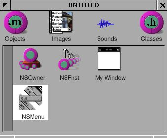&gt;

**Figure 3-3. Gorm palettes**

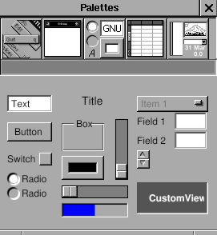&gt;

**Figure 3-4. Gorm inspector**

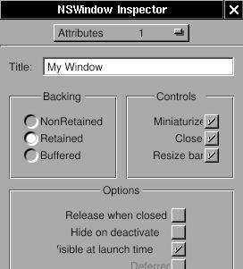&gt;

Choose "Document-&gt;New Application" to create a new user interface for
this application. A window and a menu will appear. They are the main
window and the main menu for this new application.

Click the window, and the inspector will become "NSWindow Inspector".
Change the "Title" in "Attributes". Remember to press enter key to make
it effective. You can change the size of this windows by drag the
border, or set the number in "Size" in inspector.

For the text inside the window, drag the "title" from palettes into the
main window like this:

**Figure 3-5. Add title into window**

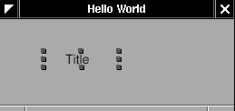&gt;

Double-click it and type.

**Figure 3-6. Change title**

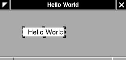&gt;

That's all for the main window. Let's work on the menu. Besides the
default "Hide" and "Quit", I need an "Info" menu. Click on the left
button of the palettes to show up the menus. Drag the "Info" submenu
into the main menu. Clicking on the new "Info" menu item will show the
submenu "Info".

**Figure 3-7. Add menu**

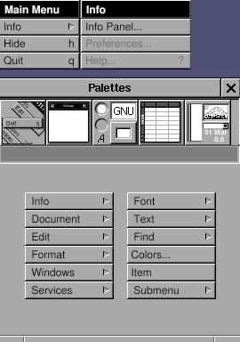&gt;

That's all the user interface I need. Since I don't manipulate any GUI
component in this example, I don't need any outlet. But some GUI
component need to set the "action" so that they can trigger the specific
events. Therefore, I need to connect these GUI components to the
"actions".

"Actions" are the methods in the controller for this view. And where is
the controller for the main window ? The answer is the NSApp in this
case. Since NSApp already exist, and contains many built-in methods, I
don't even need to write any method by my own. I only need to connect
each GUI component to the existing method in NSApp. The more general
examples about "outlets" and "actions" will be in the following
tutorials.

There are two steps to connect GUI component to the action in an
specific instance. The first step is connect the GUI component to the
instance which has the "action". The second is to specify the "action" I
want to use in this instance.

I start with the "Info Panel...", which is a "NSMenuItem". There is a
method -orderFrontStandardInfoPanel in NSApp. Therefore, I need to
connect the NSMenuItem "Info Panel" to NSApp. Then where is NSApp ?
Since this is the main menu of this application, its owner is this
application. Therefore, the instance NSOwner is NSApp. Look at the
"Attributes" of NSOwner. It will tell you which class the NSOwner is.

**Figure 3-8. Change file owner**

&gt;

Hold on the "Ctrl" key, and drag the "Info Panel..." into the NSOwner.
There should be a small green circle with "s" (source) and a red circle
with "t" (target). That means the source is connected to the target.

**Figure 3-9. Connect menu action**

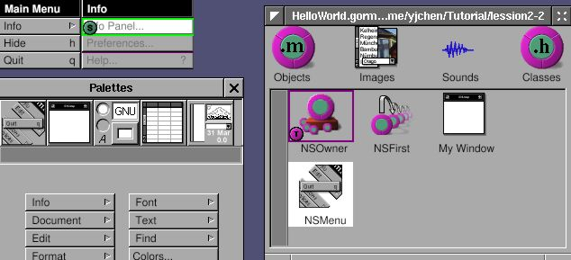&gt;

Look at the inspector now. It should be the "NSMenuItem Inspector"
because the "Info Panel" is a NSMenuItem instance. Choose the
"Connections" in the inspector. In the "Outlets" column, there is a
"target", which means the target of this NSMenuItem. Since I connect
"Info Panel" to NSOwer, which is NSApp, the target refers to NSApp.
Click on this target, it will show all the actions available in the
target, NSApp. In the "Actions" column, you can find the method
-orderFrontStandardInfoPanel:. Choose it, and click the "Connect" button
in the inspector.

**Figure 3-10. Choose action**

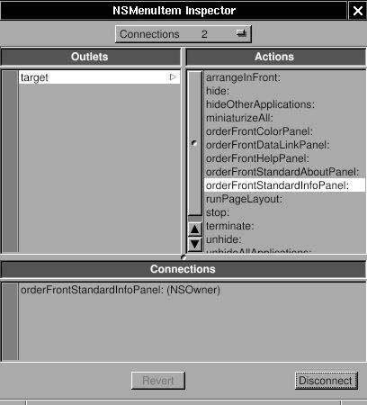&gt;

In the "Connections" column, you can see this NSMenuItem is connected to
the method -orderFrontStandardInfoPanel: of NSOwer, which is NSApp in
this case. Keep doing that for the menu "Hide" and "Quit": Ctrl-drag,
and connect the proper action.

**Figure 3-11. Connect action for "Hide" menu**

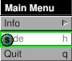&gt;

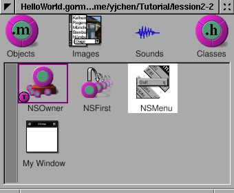&gt;

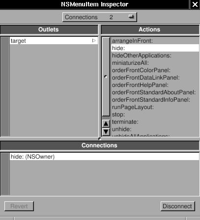&gt;

Then the part for Gorm is done ! Save it as "HelloWorld.gorm", which is
actually an directory and contains all the stuff it needs.

I still need the basic GNUmakefile and main.m to make it work. Here are
the files:

`GNUmakefile:`

<table>
<colgroup>
<col style="width: 100%" />
</colgroup>
<tbody>
<tr class="odd">
<td><pre class="PROGRAMLISTING"><code>include $(GNUSTEP_MAKEFILES)/common.make

APP_NAME = HelloWorld
HelloWorld_HEADERS = 
HelloWorld_OBJC_FILES = main.m 
HelloWorld_RESOURCE_FILES = HelloWorldInfo.plist HelloWorld.gorm
HelloWorld_MAIN_MODEL_FILE = HelloWorld.gorm

include $(GNUSTEP_MAKEFILES)/application.make</code></pre></td>
</tr>
</tbody>
</table>

`main.m:`

<table>
<colgroup>
<col style="width: 100%" />
</colgroup>
<tbody>
<tr class="odd">
<td><pre class="PROGRAMLISTING"><code>#include &lt;AppKit/NSApplication.h&gt;

int main(int argc, const char *argv[]) 
{
   return NSApplicationMain (argc, argv);
}</code></pre></td>
</tr>
</tbody>
</table>

`HelloWorldInfo.plist:`

<table>
<colgroup>
<col style="width: 100%" />
</colgroup>
<tbody>
<tr class="odd">
<td><pre class="PROGRAMLISTING"><code>{
   ApplicationDescription = &quot;Hello World Tutorial&quot;;
   ApplicationIcon = &quot;&quot;;
   ApplicationName = HelloWorld;
   ApplicationRelease = 0.1;
   Authors = &quot;&quot;;
   Copyright = &quot;Copyright (C) 200x by ...&quot;;
   CopyrightDescription = &quot;Released under...&quot;;
   FullVersionID = 0.1;
   URL = &quot;&quot;;
}</code></pre></td>
</tr>
</tbody>
</table>

You can find the extra entry, HelloWorld\_MAIN\_MODEL\_FILE, which means
the HelloWorld.gorm is the main user interface file for this
application. It is a shortcut to use the main user interface. Therefore,
in main.m, I can use very simple codes than previous lesson. In the
following tutorials, I will show the more general usage of Gorm file.

------------------------------------------------------------------------

Chapter 4. Unknown 1
=============================================

TimeMachine
------------------------------------

### Single Window Application

Single window application is one of the most commonly used application
type. Here, a TimeMachine application is made to demonstrate several
techniques of GNUstep programming.

------------------------------------------------------------------------

### Outlet and Action

I'll write an application which show the current time with a button to
update. It looks like this:

**Figure 4-1. Simple TimeMachine**

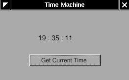&gt;

This application is very easy. Just to show how to use "outlet" and
"action" in Gorm, and the relation between "controller" and "view".

Open Gorm, choose "Document-&gt;New Application", and build a window
with a title and a button.

**Figure 4-2. Interface of simple TimeMachine**

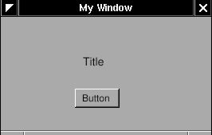&gt;

You can set the title of the button in the inspector. So does the title
of window.

**Figure 4-3. Change title of button**

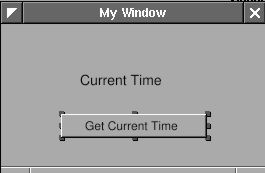&gt;

&gt;

That's all I need to do on the interface.

Now, I need an "controller" to receive the action from the "view", and
display the time on the "view". I need to create a object for this
"controller".

First, I need to design the class of this "controller". Click the
"classes" in the main window of Gorm.

**Figure 4-4. Classes in Gorm**

&gt;

It will show all the classes you can use. I want the class of this
"controller" to inherit from NSObject. Therefore, choose "NSObject",
then select the menu "Classes-&gt;Create Subclass...". It will create a
new class under the NSObject.

**Figure 4-5. Create subclass of NSObject**

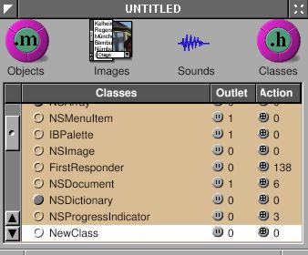&gt;

Double-click on it to change the name. I call it "Controller" here.
That's the name of this class.

**Figure 4-6. Change class name**

&gt;

Then I need a "outlet" in this class to connect to the label in the
window, and an "action" which is triggered when the button is press.

Choose the "Controller" class and click "Outlets" tab in the inspector.
Press "Add" button, and change the name to "label" by double-clicking
the "newOutlet". You will notice that "Controller" class now has one
outlet. Click on the small round button will list the outlets it has.

**Figure 4-7. Add outlet**

&gt;

&gt;

Now, click "Actions" tab and add a new action called "showCurrentTime:".
You should notice that the action is ended with colon (:), which will be
explained later.

**Figure 4-8. Add action**

&gt;

&gt;

Once I finish designing this class, I can create an instance from it.

Choose the class "Controller", then select the menu
"Classes-&gt;Instantiate". Look at the objects of Gorm main window. You
should find a new instance, called "Controller". That's the instance I
want to connect to the interface.

**Figure 4-9. NSOwner**

&gt;

Now, I can connect the "controller" to the "view" for the outlet. Hold
on "Ctrl", select the "Controller" instance, drag to the label in the
window. Look at the inspector, which will show all the outlet the
"Controller" instance has. Select the only one "label", click the
"connect" button. That's it.

**Figure 4-10. Connect outlet**

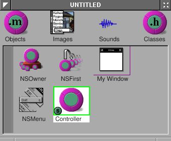&gt;

&gt;

&gt;

Again, I can connect the "view" to the "controller" for the action. Hold
on "Ctrl", select the button in the window, drag to the "Controller"
instance. Look at the inspector, which will show all the outlet the
button has. Select the "target" in the outlet column, then select the
only one action the target has, "showCurrentTime". Click the "connect"
button. That's it.

**Figure 4-11. Connect action**

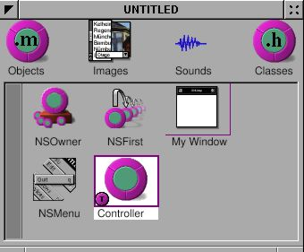&gt;

&gt;

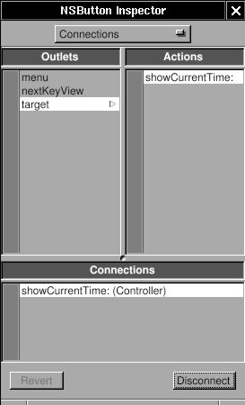&gt;

Finally, I need to create the files for this "Controller" class in order
to add the the source code. Otherwise, this class has not function at
all. Select the class "Controller" ( not the instance !) in the Gorm
main window. Choose menu "Classes-&gt;Create Class Files". A "Save"
panel will show up and ask the filename. The default is "Controller.m",
which is good enough. Click "O.K.". Save this Gorm file as
"TimeMachine.gorm", then leave Gorm.

Now, I have a directory, "TimeMachine.gorm", and two file,
"Controller.h" and "Controller.m".

`Controller.h:`

<table>
<colgroup>
<col style="width: 100%" />
</colgroup>
<tbody>
<tr class="odd">
<td><pre class="PROGRAMLISTING"><code>/* All Rights reserved */

#import &lt;AppKit/AppKit.h&gt;

@interface Controller : NSObject
{
   id label;
}
- (void) showCurrentTime: (id)sender;
@end</code></pre></td>
</tr>
</tbody>
</table>

`Controller.m:`

<table>
<colgroup>
<col style="width: 100%" />
</colgroup>
<tbody>
<tr class="odd">
<td><pre class="PROGRAMLISTING"><code>/* All Rights reserved */

#import &lt;AppKit/AppKit.h&gt;
#import &quot;Controller.h&quot;

@implementation Controller

- (void) showCurrentTime: (id)sender
{
   /* insert your code here */
}</code></pre></td>
</tr>
</tbody>
</table>

That's the source code of the class "Controller" I just created in Gorm.
The method -showCurrentTime: has the message "sender". That's the reason
the action name in Gorm must has the colon (:) in the end. In the
"Controller.h", you can find the outlet "label" and the action
"showCurrentTime:". Therefore, whatever you do on the outlet "label"
will reflect to the "label" in the interface, and when the button "Get
Current Time" is pressed, the action -showCurrentTime: will be called.
That's how the outlet and action work.

Now, I can put some source code in this class.

`Controller.m:`

<table>
<colgroup>
<col style="width: 100%" />
</colgroup>
<tbody>
<tr class="odd">
<td><pre class="PROGRAMLISTING"><code>/* All Rights reserved */

#import &lt;AppKit/AppKit.h&gt;
#import &quot;Controller.h&quot;

@implementation Controller

- (void) showCurrentTime: (id)sender
{
   /* insert your code here */
  NSCalendarDate *date = [NSCalendarDate date];
  [date setCalendarFormat: @&quot;%H : %M : %S&quot;];
  [label setStringValue: [date description]];
}</code></pre></td>
</tr>
</tbody>
</table>

First, \[NSCalendarDate date\] will create an instance with the current
date and time. After setting the format, put the description of current
time into the outlet "label". When users click the "Get Current Time"
button, it will show the current time.

That's it. Add the main.m and GNUmakefile, then it is ready to go.

`main.m:`

<table>
<colgroup>
<col style="width: 100%" />
</colgroup>
<tbody>
<tr class="odd">
<td><pre class="PROGRAMLISTING"><code>#import &lt;AppKit/AppKit.h&gt;

int main(int argc, const char *argv[]) 
{
   return NSApplicationMain (argc, argv);
}</code></pre></td>
</tr>
</tbody>
</table>

`GNUmakefile:`

<table>
<colgroup>
<col style="width: 100%" />
</colgroup>
<tbody>
<tr class="odd">
<td><pre class="PROGRAMLISTING"><code>include $(GNUSTEP_MAKEFILES)/common.make

APP_NAME = TimeMachine
TimeMachine_HEADERS = Controller.h
TimeMachine_OBJC_FILES = main.m Controller.m
TimeMachine_RESOURCE_FILES = TimeMachineInfo.plist TimeMachine.gorm
TimeMachine_MAIN_MODEL_FILE = TimeMachine.gorm

include $(GNUSTEP_MAKEFILES)/application.make</code></pre></td>
</tr>
</tbody>
</table>

In this example, the owner of the interface is NSApp, which is the
NSOwner in Gorm, but the controller is the "Controller" instance.
Sometimes, the owner and the controller could be the same. In simple
application, the owner/controller of the window can also be the delegate
of NSApp. That's all depending on the design of your application.

------------------------------------------------------------------------

### Custom View

Gorm can work on the custom view, which is designed by the programmer,
not the built-in GUI component. Here, I continue my "time machine"
application to demonstrate how to do that. The new interface looks like
this:

**Figure 4-12. TimeMachine with custom view**

&gt;

Since I want to use the custom view in Gorm, I have to design the class
first. The custom view can inherit from NSView, or NSControl, depending
on what kind of functions you want. Actually, NSControl is a subclass of
NSView. So I will inherit from NSControl. Click on the small circle of
NSResponder to open its subclasses, then do the same thing on NSView and
NSControl. Now, you can see that many GUI component inherit from
NSControl, ex. NSTextField.

**Figure 4-13. NSControl in Gorm**

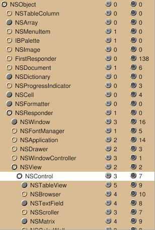&gt;

I want my custom view, called "TimeView", inherit from NSControl. Choose
"NSControl", then select menu "Classes-&gt;Create Subclass...".
Double-click to change the name.

**Figure 4-14. Add subclass of NSControl**

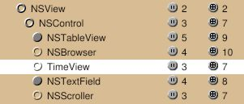&gt;

You can notice that class "TimeView" also inherits 3 outlets and 7
actions from NSControl. Once the class "TimeView" is created, I can use
it as custom view.

Build the interface as below:

**Figure 4-15. Interface with custom view**

&gt;

Look at the "Attributes" in inspector of CustomView. Choose the class
"TimeView".

**Figure 4-16. Change class of custom view**

&gt;

The "CustomView" becomes "TimeView". That's it !

**Figure 4-17. Custom view with TimeView class**

&gt;

As I did before, create another class for the "controller". Add one
outlet for this "TimeView", and one action for the button. I name the
outlet "timeView".

**Figure 4-18. Add outlet**

&gt;

**Figure 4-19. Add action**

&gt;

Create an instance of class "Controller". Connect the button to the
action "showCurrentTime", and the outlet "timeView" to the custom view
"TimeView".

**Figure 4-20. Connect outlet**

&gt;

&gt;

&gt;

Finally, create the class file for the classes "TimeView" and
"Controller". Save this application as "TimeMachine.gorm".

Now, I need to design the interface for the class "TimeView". The class
"TimeView" is actually four NSTextField in a NSBox. The reason that I
made them in one class is because I can reuse it later on. Classes
inherited from NSView will be initialized by calling method
-initWithFrame:. Therefore, I only need to rewrite the method
-initWithFrame: in the class "TimeView". Here are the files:

`TimeView.h:`

<table>
<colgroup>
<col style="width: 100%" />
</colgroup>
<tbody>
<tr class="odd">
<td><pre class="PROGRAMLISTING"><code>#import &lt;AppKit/AppKit.h&gt;

@interface TimeView : NSControl
{
   NSTextField *labelDate, *labelTime;
   NSTextField *localDate, *localTime;
   NSCalendarDate *date;
}

- (NSCalendarDate *) date;
- (void) setDate: (NSCalendarDate *) date;

@end</code></pre></td>
</tr>
</tbody>
</table>

`TimeView.m:`

<table>
<colgroup>
<col style="width: 100%" />
</colgroup>
<tbody>
<tr class="odd">
<td><pre class="PROGRAMLISTING"><code>#import &lt;AppKit/AppKit.h&gt;
#import &quot;TimeView.h&quot;

@implementation TimeView
- (id) initWithFrame: (NSRect) frame
{
   NSBox *box;

   self = [super initWithFrame: frame];
   box = [[NSBox alloc] initWithFrame: NSMakeRect(0, 0,
                                                  frame.size.width,
                                                  frame.size.height)];
   [box setBorderType: NSGrooveBorder];
   [box setTitlePosition: NSAtTop];
   [box setTitle: @&quot;Local Time&quot;];

   labelDate = [[NSTextField alloc] initWithFrame: NSMakeRect(10, 45, 35, 20)];
   [labelDate setStringValue: @&quot;Date: &quot;];
   [labelDate setBezeled: NO];
   [labelDate setBackgroundColor: [NSColor windowBackgroundColor]];
   [labelDate setEditable: NO];

   labelTime = [[NSTextField alloc] initWithFrame: NSMakeRect(10, 15, 35, 20)];
   [labelTime setStringValue: @&quot;Time: &quot;];
   [labelTime setBezeled: NO];
   [labelTime setBackgroundColor: [NSColor windowBackgroundColor]];
   [labelTime setEditable: NO];

   localDate = [[NSTextField alloc] initWithFrame: NSMakeRect(55, 45, 130, 20)];
   localTime = [[NSTextField alloc] initWithFrame: NSMakeRect(55, 15, 130, 20)];

   [box addSubview: labelDate];
   [box addSubview: labelTime];
   [box addSubview: localDate];
   [box addSubview: localTime];
   RELEASE(labelDate);
   RELEASE(labelTime);
   RELEASE(localDate);
   RELEASE(localTime);

   [self addSubview: box];
   RELEASE(box);

   return self;
}

- (NSCalendarDate *) date
{
   return date;
}

- (void) setDate: (NSCalendarDate *) aDate
{
   ASSIGN(date, aDate);
   [date setCalendarFormat: @&quot;%a, %b %e, %Y&quot;];
   [localDate setStringValue: [date description]];
   [date setCalendarFormat: @&quot;%H : %M : %S&quot;];
   [localTime setStringValue: [date description]];
}

- (void) dealloc
{
  RELEASE(date);
  [super dealloc];
}

@end</code></pre></td>
</tr>
</tbody>
</table>

When Gorm generates the class files, it contains some default codes in
it. Since I don't need any of them, they are safe to be removed. In
TimeView.h, I declare four NSTextField for display, and on
NSCalendarDate to store the date. I also declare two accessory methods
to set and get the date. In the -initWithFrame, one NSBox is set up, and
four NSTextField is put into it. And class "TimeView" is a subclass of
NSView, I add the NSBox as the subview of the class "TimeView".

Other parts of this application should be very easy. Here are the files:

`Controller.h:`

<table>
<colgroup>
<col style="width: 100%" />
</colgroup>
<tbody>
<tr class="odd">
<td><pre class="PROGRAMLISTING"><code>#import &lt;AppKit/AppKit.h&gt;
#import &quot;TimeView.h&quot;

@interface Controller : NSObject
{
   id timeView;
}
- (void) showCurrentTime: (id)sender;
@end</code></pre></td>
</tr>
</tbody>
</table>

`Controller.m:`

<table>
<colgroup>
<col style="width: 100%" />
</colgroup>
<tbody>
<tr class="odd">
<td><pre class="PROGRAMLISTING"><code>#import &lt;AppKit/AppKit.h&gt;
#import &quot;Controller.h&quot;

@implementation Controller
- (void) showCurrentTime: (id)sender
{
   /* insert your code here */
   NSCalendarDate *date = [NSCalendarDate date];
   [timeView setDate: date];
}

@end</code></pre></td>
</tr>
</tbody>
</table>

`main.m:`

<table>
<colgroup>
<col style="width: 100%" />
</colgroup>
<tbody>
<tr class="odd">
<td><pre class="PROGRAMLISTING"><code>#import &lt;AppKit/AppKit.h&gt;

int main(int argc, const char *argv[]) 
{
   return NSApplicationMain (argc, argv);
}</code></pre></td>
</tr>
</tbody>
</table>

`GNUmakefile:`

<table>
<colgroup>
<col style="width: 100%" />
</colgroup>
<tbody>
<tr class="odd">
<td><pre class="PROGRAMLISTING"><code>include $(GNUSTEP_MAKEFILES)/common.make

APP_NAME = TimeMachine
TimeMachine_HEADERS = Controller.h TimeView.h
TimeMachine_OBJC_FILES = main.m Controller.m TimeView.m
TimeMachine_RESOURCE_FILES = TimeMachineInfo.plist TimeMachine.gorm
TimeMachine_MAIN_MODEL_FILE = TimeMachine.gorm

include $(GNUSTEP_MAKEFILES)/application.make</code></pre></td>
</tr>
</tbody>
</table>

You should notice that I didn't instantiate the class "TimeView" in
class "Controller" because when I add an custom view to the window, it
is instantiated automatically. I only need to specify the class the
custom view should be. On the contrary, I have to instantiate the class
"Controller" in Gorm because it is not a GUI component. Without
instantiation, I can't connect the "controller" to the "view".

------------------------------------------------------------------------

### Drawing

I want a graphic clock, which looks like this:

**Figure 4-21. Custom view with analog clock**

&gt;

It is very simple. I only need to add a new GUI component in the class
TimeView. I call this new class "ClockView". Since "ClockView" will be
the subview of "TimeView", when "TimeView" is update, I also need to
update the "ClockView".

`ClockView.h:`

<table>
<colgroup>
<col style="width: 100%" />
</colgroup>
<tbody>
<tr class="odd">
<td><pre class="PROGRAMLISTING"><code>#import &lt;AppKit/AppKit.h&gt;
#include &lt;math.h&gt;

@interface ClockView : NSView
{
   NSPoint posHour, posMinute;
}

- (void) setDate: (NSCalendarDate *) aDate;
@end</code></pre></td>
</tr>
</tbody>
</table>

`ClockView.m:`

<table>
<colgroup>
<col style="width: 100%" />
</colgroup>
<tbody>
<tr class="odd">
<td><pre class="PROGRAMLISTING"><code>#import &quot;ClockView.h&quot;

@implementation ClockView
- (id) init
{
   self = [super init];
   posHour = NSMakePoint(0,0);
   posMinute = NSMakePoint(0,0);
   return self;
}

- (void) drawRect: (NSRect) frame
{
   NSPoint origin = NSMakePoint(frame.size.width/2, frame.size.height/2);

   NSBezierPath *bp = [NSBezierPath bezierPathWithRect: [self bounds]];
   [[NSColor yellowColor] set];
   [BP fill];

   BP = [NSBezierPath bezierPathWithRect: NSMakeRect(1, 1,
                                                     frame.size.width-2,
                                                     frame.size.height-2)];
   [[NSColor blackColor] set];
   [BP stroke];

   BP = [NSBezierPath bezierPath];
   [BP setLineWidth: 3];
   [BP moveToPoint: origin];
   [BP relativeLineToPoint: posHour];
   [BP stroke];

   [BP setLineWidth: 1];
   [BP moveToPoint: origin];
   [BP relativeLineToPoint: posMinute];
   [BP stroke];
}

- (void) setDate: (NSCalendarDate *) date;
{
   int hour = [date hourOfDay];
   int minute = [date minuteOfHour];
   float hour_x = 40*sin((M_PI*hour/6)+(M_PI*minute/360));
   float hour_y = 40*cos((M_PI*hour/6)+(M_PI*minute/360));
   float minute_x = 60*sin(M_PI*minute/30);
   float minute_y = 60*COs(M_PI*minute/30);

   posHour = NSMakePoint(hour_x, hour_y);
   posMinute = NSMakePoint(minute_x, minute_y);
   [self setNeedsDisplay: YES];
}

@end</code></pre></td>
</tr>
</tbody>
</table>

ClockView inherits from NSView. The most important method it should
override is -drawRect:. When this view need to update, -drawRect: will
be called. Therefore, I put all the drawing in this method. NSBezierPath
is how GNUstep draws. I assign the path, set the color, then draw. There
are good article about drawing: [*Introduction to Cocoa Graphics, Part
I*](http://www.macdevcenter.com/pub/a/mac/2001/10/19/cocoa.html), [*Part
II*](http://www.macdevcenter.com/pub/a/mac/2001/11/06/cocoa.html).

A few codes are needed to include ClockView in TimeView. One is to add
ClockView as a subview of NSBox in TimeView. Another is to update
ClockView when TimeView is update. In method -setDate: of ClockView, it
uses \[self setNeedsDisplay: YES\] to make this view update. This
modification is easy to do. You can play around it.

------------------------------------------------------------------------

### Panel

Panel is a special kind of window. Read the Cocoa document for more
details: [*Windows and
Panels*](http://developer.apple.com/techpubs/macosx/Cocoa/TasksAndConcepts/ProgrammingTopics/WinPanel/index.html).
Since I have a clock already, I want to know the time in different time
zones. My idea is that when I click the title of the NSBox, a panel will
show up and ask the time zone. Once the time zone is inputted, it will
display the time in that area. Since NSPanel is a subclass of NSWindow,
the usage of NSPanel is similar to the NSWindow. Again, I need a
"controller" to control the "view", which is NSPanel in this case.
"View" is generated by Gorm, and I need to write the "controller" by
myself. In this example, I'll show how to load the gorm file. There are
many built-in panel in GNUstep. I also use one in this example.

Firstly, I need to build the interface for the panel. Open Gorm, Choose
menu "Document -&gt; New Module -&gt; New Empty". Look at the palettes.
There is one for panel.

**Figure 4-22. Panel in Gorm**

&gt;

Drag the panel out of palettes. Build the interface as below.

**Figure 4-23. Interface of time zone panel**

&gt;

You can change the size of panel in the inspector. Here is the
attributes of this panel I use.

**Figure 4-24. Panel attributes**

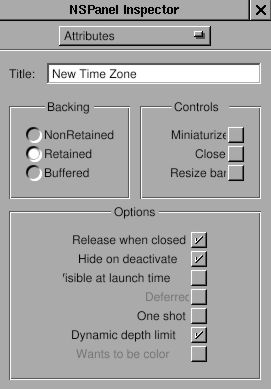&gt;

Now, I got the "view". Then where is the "controller" ? Generally, I can
write a new class as the controller of this view, but this is a small
program. It is not necessary to write a new class only as the
controller. So I decide to use the class "TimeView" as the controller
for this panel. So class "TimeView" acts as the custom view for that
main window interface, and the controller for the panel. Since
"TimeView" is the controller of this panel, I need to connect the
outlets and actions. Therefore, I need to create the class "TimeView"
again in this gorm file, even though there is already one in
TimeMachine.gorm file.

You already know how to create the class "TimeView". I add two outlets,
"zonePanel" and "zoneField", and two actions, "okAction:" and
"cancelAction:".

**Figure 4-25. Outlets for time zone panel**

&gt;

**Figure 4-26. Actions for time zone panel**

&gt;

But rather than creating an instance to connect the panel, I'll set the
owner of this panel as the class "TimeView". The advantage is that I can
reduce the number of instances to use.

Select the NSOwner in Gorm main window, then select class "TimeView" in
"attributes" of inspector.

**Figure 4-27. Set NSOwner to TimeView class**

&gt;

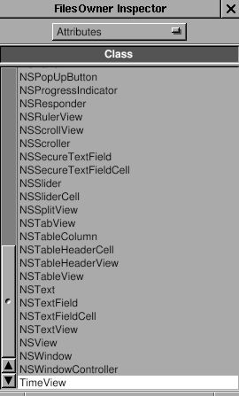&gt;

By this way, I can connect the panel to the NSOwner, which is an
instance of class "TimeView". Connect the two buttons to the actions in
NSOwner, the outlet "zoneField" to the NSTextField in panel, and the
outlet "zonePanel" to the panel. Pay attention to how the NSOwner
connects to the panel.

**Figure 4-28. Connect outlet**

&gt;

&gt;

Save this interface as "TimeZonePanel.gorm" file, and quit Gorm. Don't
generate the files for class "TimeView" because I already have the
files. GNUstep can figure out where the classes are and where the
outlets/actions are.

Now, I need to add the new outlets and actions into the files of
"TimeView". Here is the header.

`TimeView.h:`

<table>
<colgroup>
<col style="width: 100%" />
</colgroup>
<tbody>
<tr class="odd">
<td><pre class="PROGRAMLISTING"><code>#import &lt;AppKit/AppKit.h&gt;
#import &quot;ClockView.h&quot;

@interface TimeView : NSControl
{
   id zonePanel;
   id zoneField;
   NSBox *box;
   NSTextField *labelDate, *labelTime;
   NSTextField *localDate, *localTime;
   NSCalendarDate *date;
   ClockView *clockView;
}

- (NSCalendarDate *) date;
- (void) setDate: (NSCalendarDate *) date;
- (void) okAction: (id) sender;
- (void) cancelAction: (id) sender;
@end</code></pre></td>
</tr>
</tbody>
</table>

I add the outlets and actions by myself.

`TimeView.m:`

<table>
<colgroup>
<col style="width: 100%" />
</colgroup>
<tbody>
<tr class="odd">
<td><pre class="PROGRAMLISTING"><code>- (void) mouseDown: (NSEvent *) event
{
   NSRect titleFrame = [box titleRect];
   NSPoint windowLocation = [event locationInWindow];
   NSPoint viewLocation = [self convertPoint: windowLocation fromView: [self superview]];
   BOOL status = NSMouseInRect(viewLocation, titleFrame, NO);
   if (status == YES)
     {
       [NSBundle loadNibNamed: @&quot;TimeZonePanel.gorm&quot; owner: self]; 
       [NSApp runModalForWindow: zonePanel];
     }
}</code></pre></td>
</tr>
</tbody>
</table>

The method -mouseDown: is called when mouse is clicked within this view.
Here, I calculate whether the mouse is clicked in the area of the title
of NSBox. If so, use \[NSBundle loadNibName: owner:\] to load the
window, and \[NSApp runModalForWindow\] display it. Read Cocoa's
document about "[*How Modal Windows
Work*](http://developer.apple.com/techpubs/macosx/Cocoa/TasksAndConcepts/ProgrammingTopics/WinPanel/Concepts/UsingModalWindows.html#CJBEADBA)".

Now, I just need to finish the actions part in `TimeView.m`.

`TimeView.m:`

<table>
<colgroup>
<col style="width: 100%" />
</colgroup>
<tbody>
<tr class="odd">
<td><pre class="PROGRAMLISTING"><code>- (void) cancelAction: (id) sender
{
   [NSApp abortModal];
   [zonePanel close];
}

- (void) okAction: (id) sender
{
   NSTimeZone *tempZone;
   tempZone = [NSTimeZone timeZoneWithName: [zoneField stringValue]];
   [NSApp stopModal];
   [zonePanel close];
   if (tempZone == nil)
      {
         NSRunAlertPanel(@&quot;Warning!&quot;,
                         @&quot;Wrong Time Zone !!&quot;,
                         @&quot;OK&quot;, nil, nil);
      }
   else
      {
         [date setTimeZone: tempZone];
         [box setTitle: [tempZone description]];
         [self setDate: date];
      }
}</code></pre></td>
</tr>
</tbody>
</table>

In method -okAction:, I use a built-in panel, NSRunAlertPanel. There are
several built-in panels in GNUstep ready to use. Now, you can display
the current time in different time zone.

It is inconvenient to use this pop-up panel because you have to click
the NSTextField before typing. Sometimes, it is more convenient to
control the user interface via keyboard rather than mouse. Here, I touch
a little bit this topic to make the panel more easy to use.

When a window pop-up, it is the first object to receive events and
key-in. It is called the "First Responder". But usually we want some
other objects in this window to receive the key-in. Therefore, we need
to change the "first responder" of this window, which I can do that by
using \[NSWindow makeFirstResonpder:\].

When I want to use "Tab" key to switch between different views in the
window, I need to assign the "nextKeyView" for the next view when "Tab"
key is pressed so that the application know where the responder should
be.

Finally, when I finish typing in the NSTextField, I want to hit the
"Return" key equivalent to press the "OK" button by mouse so that I
don't need to move my hand out of the keyboard. In this case, since
NSTextField is also a subclass of NSControl, I can set the target and
action of NSTextField the same as the NSButton "OK". Therefore, when I
hit the "Return", it is equivalent to click on the "OK" button.

These are small tune-ups for the application, but it makes users more
easy to use the application.

Firstly, let's set the "first responder" of the window to the
NSTextField:

`TimeView.m:`

<table>
<colgroup>
<col style="width: 100%" />
</colgroup>
<tbody>
<tr class="odd">
<td><pre class="PROGRAMLISTING"><code>- (void) mouseDown: (NSEvent *) event
{
   NSRect titleFrame = [box titleRect];
   NSPoint windowLocation = [event locationInWindow];
   NSPoint viewLocation = [self convertPoint: windowLocation fromView: [self superview]];
   BOOL status = NSMouseInRect(viewLocation, titleFrame, NO);
   if (status == YES)
      {
         [NSBundle loadNibNamed: @&quot;TimeZonePanel.gorm&quot; owner: self]; 
         [zonePanel makeFirstResponder: zoneField];
         [NSApp runModalForWindow: zonePanel];
      }
}</code></pre></td>
</tr>
</tbody>
</table>

Only one line is enough. Now, when this panel shows up, the cursor will
automatically in the NSTextField, and this NSTextField are ready to
type.

Secondly, I want to set the target and action of NSTextField the same as
the NSButton "O.K.". Open the TimeZonePanel.gorm, connect the
NSTextField to the method -okAction: of the NSOwner. That's it. Whenever
you hit the "Return" key in the NSTextField, the method -okAction: is
called.

**Figure 4-29. Connection NSTextField action**

&gt;

&gt;

&gt;

Thirdly, I need to connect the nextKeyView outlet between the views in
the window. I'll connect the nextKeyView of NSTextField to NSButton
"O.K.", the nextKeyView outlet of NSButton "O.K." to NSButton "Cancel",
and the nextKeyView outlet of NSButton "Cancel" to the NSTextField. By
doing that, I can switch between these views by "Tab" key. Here, I just
show how the nextKeyView of NSTextField connects to NSButton "O.K.". You
can do the rest of the part.

**Figure 4-30. Connect nextKeyView**

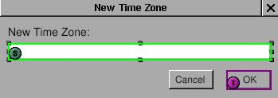&gt;

&gt;

Source code:
[Panel-src.tar.gz](http://gnustep.made-it.com/GSPT/Panel/Panel-src.tar.gz).

------------------------------------------------------------------------

### Notification

Since I can change the time zone, I would like to display several clock
at the same window, and adjust the number of clocks dynamically. First,
I need to add new submenu: "Edit", and two menu item in it: "Add Clock"
and "Delete Clock". Then add two action in the class "Controller":
"addClock:" and "deleteClock". Connect the menu item to the action in
the instance of class "Controller" in the gorm file. Then I have done
the part of interface. When user select the menu item "Add Clock", the
method "addClock:" will be called, so does the menu item "Delete Clock".

Now, how do I manage these clocks dynamically ? I can trace each of them
manually, but it will be complicated. Another way is that I don't trace
any of them, but the problem is how do it control any of them ? I can
use the notification in GNUstep, which is a pretty handy way to
communicate between objects.

Here is a related article:
[*NSNotificationCenter*](http://cocoadevcentral.com/articles/000029.php)

Firstly, I need to adjust the interface according to the adding and
deleting clock. I need trace how many clocks exist so that I won't
accidentally delete the last clock.

`Controller.h:`

<table>
<colgroup>
<col style="width: 100%" />
</colgroup>
<tbody>
<tr class="odd">
<td><pre class="PROGRAMLISTING"><code>#import &lt;AppKit/AppKit.h&gt;
#import &quot;TimeView.h&quot;

@interface Controller : NSObject
{
   id timeView;
   unsigned int totalNumber;
}

- (void) showCurrentTime: (id) sender;
- (void) addClock: (id) sender;
- (void) deleteClock: (id) sender;
@end</code></pre></td>
</tr>
</tbody>
</table>

I add a variable, totalNumber to trace the number of clocks, and add two
actions manually since I didn't generate the class files from Gorm.

`Controller.m:`

<table>
<colgroup>
<col style="width: 100%" />
</colgroup>
<tbody>
<tr class="odd">
<td><pre class="PROGRAMLISTING"><code>- (id) init
{
   self = [super init];
   totalNumber = 1;
   return self;
}

- (void) addClock: (id) sender
{
   TimeView *aView;
   NSWindow *mainWindow = [NSApp mainWindow];
   NSRect windowFrame, timeViewFrame;
   windowFrame = [mainWindow frame];
   timeViewFrame = [timeView frame];

   [mainWindow setFrame: NSMakeRect(windowFrame.origin.x,    
                                    windowFrame.origin.y,
                                    windowFrame.size.width+timeViewFrame.size.width, 
                                    windowFrame.size.height)
                display: YES];
   aView = [[TimeView alloc] initWithFrame: NSMakeRect(timeViewFrame.origin.x + totalNumber*timeViewFrame.size.width,
                                                       timeViewFrame.origin.y,
                                                       timeViewFrame.size.width,
                                                       timeViewFrame.size.height)];
   
   [[mainWindow contentView] addSubview: aView];
   RELEASE(aView);
   totalNumber ++;
}

- (void) deleteClock: (id) sender
{
   NSArray *subviews;
   NSWindow *mainWindow = [NSApp mainWindow];
   NSRect windowFrame, timeViewFrame;
   int i;
   windowFrame = [mainWindow frame];
   timeViewFrame = [timeView frame];

   subviews = [[mainWindow contentView] subviews];

   for (i = [subviews count]-1; i &gt; 1; i--) 
     {
       if ([[subviews objectAtIndex: i] isMemberOfClass: [TimeView class]])  
       [[subviews objectAtIndex: i] removeFromSuperview];
       totalNumber--;
       [mainWindow setFrame: NSMakeRect(windowFrame.origin.x,
                                        windowFrame.origin.y,
                                        windowFrame.size.width-timeViewFrame.size.width,
                                        windowFrame.size.height)
                    display: YES];
       break;
     }
}</code></pre></td>
</tr>
</tbody>
</table>

In the method -init, I initiate the variable, totalNumber, as 1 since
there is already one in the Gorm file. In method -addClock:, I have to
calculate the change of window size and where to put the new clock. They
are done by very simple calculation. Once I add the new clock into the
window, the window will retain this clock. Therefore, I can release it
and no longer trace it. In the method -deleteClock:, I also need to
change the size of window by simple calculation. The only problem is
that since I don't trace the clocks, how do I delete them ? I can get
all the subviews from the window, and delete from the last "TimeView"
object. That's the way I can access the objects in the window. Very easy
to maintain.

Now, if you hit the button "Get Current Time", you will notice that only
the origin clock is updated. That's because it is the only one which is
connected by the outlet. I can get all the subviews from the window, and
call their method one by one. That will work, but is not a elegent way.
I can use the "Notification" and "Notification Center" to archive this
goal. Read the [*Cocoa
document*](http://developer.apple.com/techpubs/macosx/Cocoa/TasksAndConcepts/ProgrammingTopics/Notifications/index.html)
for more details.

The idea is that an object can be a speaker, and many objects can be the
audience. So one talks, many listen. That's the way it works. So when
user press the button "Get Current Time", the "Controller" must speak to
all the clocks. Below is how it speak:

`Controller.h:`

<table>
<colgroup>
<col style="width: 100%" />
</colgroup>
<tbody>
<tr class="odd">
<td><pre class="PROGRAMLISTING"><code>- (void) showCurrentTime: (id)sender
{
   [[NSNotificationCenter defaultCenter] postNotificationName: @&quot;TimeViewShouldUpdateCurrentTime&quot;
                                                       object: [NSCalendarDate date]];
}</code></pre></td>
</tr>
</tbody>
</table>

Actually, it talks to the "Notification Center", and the notification
center will broadcast what it say. I need to specify the name of
notification because there are so many notifications on the air. The
name of notification is the way to distinguish them. And a notification
can contain an object within it. That's how the speaker and audience
transfer the information. It can be nil. Here, I use \[NSCalendarDate
date\].

Now, the speaker speaks. How do the audience listen ? In this example,
all the instance of class TimeView should listen in order to update the
current time. I need to register the audience to the notification center
so that they can receive the notification.

`TimeView.m:`

<table>
<colgroup>
<col style="width: 100%" />
</colgroup>
<tbody>
<tr class="odd">
<td><pre class="PROGRAMLISTING"><code>- (id) initWithFrame: (NSRect) frame
{
   self = [super initWithFrame: frame];

   box = [[NSBox alloc] initWithFrame: NSMakeRect(0, 0,
                                                  frame.size.width,
                                                  frame.size.height)];
   [box setBorderType: NSGrooveBorder];
   [box setTitlePosition: NSAtTop];
   [box setTitle: @&quot;Local Time&quot;];

   clockView = [[ClockView alloc] initWithFrame: NSMakeRect(0, 70, 
                                                            frame.size.width,
                                                            frame.size.height)];
   labelDate = [[NSTextField alloc] initWithFrame: NSMakeRect(10, 45, 35, 20)];
   [labelDate setStringValue: @&quot;Date: &quot;];
   [labelDate setBezeled: NO];
   [labelDate setBackgroundColor: [NSColor windowBackgroundColor]];
   [labelDate setEditable: NO];

   labelTime = [[NSTextField alloc] initWithFrame: NSMakeRect(10, 15, 35, 20)];
   [labelTime setStringValue: @&quot;Time: &quot;];
   [labelTime setBezeled: NO];
   [labelTime setBackgroundColor: [NSColor windowBackgroundColor]];
   [labelTime setEditable: NO];

   localDate = [[NSTextField alloc] initWithFrame: NSMakeRect(55, 45, 130, 20)];
   localTime = [[NSTextField alloc] initWithFrame: NSMakeRect(55, 15, 130, 20)];

   [box addSubview: clockView];
   [box addSubview: labelDate];
   [box addSubview: labelTime];
   [box addSubview: localDate];
   [box addSubview: localTime];
   RELEASE(clockView);
   RELEASE(labelDate);
   RELEASE(labelTime);
   RELEASE(localDate);
   RELEASE(localTime);

   [self addSubview: box];
   RELEASE(box);
   [[NSNotificationCenter defaultCenter] addObserver: self
                                            selector: @selector(setDate:)
                                                name: @&quot;TimeViewShouldUpdateCurrentTime&quot;
                                              object: nil];
   [self showCurrentTime: self];
   return self;
}</code></pre></td>
</tr>
</tbody>
</table>

Only one line is needed for register. It specify what object to receive
the notification (addObserver:), which method to handle the notification
(selector:), what's the name of notification (name:), and what's the
object of the notification. It is important that the name of
notification should be the same as what the speaker use. So once the
speaker say "TimeViewShouldUpdateCurrentTime", the objects which
register them using "TimeViewShouldUpdateCurrentTime" will receive the
notification, and the selector will be called. The "object: nil" means
that this object accept all the notification with the name
"TimeViewShouldUpdateCurrentTime" no matter what kind of object it
carries on.

Now, I register the TimeView for the notification
"TimeViewShouldUpdateCurrentTime". Once the speaker speak, the method
-setDate: will be called. So I need to set up this method.

`TimeView.m:`

<table>
<colgroup>
<col style="width: 100%" />
</colgroup>
<tbody>
<tr class="odd">
<td><pre class="PROGRAMLISTING"><code>- (void) setDate: (NSNotification *) not
{
   ASSIGN(date, [not object]);
   [date setTimeZone: [NSTimeZone timeZoneWithName: [box title]]];
   [date setCalendarFormat: @&quot;%a, %b %e, %Y&quot;];
   [localDate setStringValue: [date description]];
   [date setCalendarFormat: @&quot;%H : %M : %S&quot;];
   [localTime setStringValue: [date description]];
   [clockView setDate: date];
}</code></pre></td>
</tr>
</tbody>
</table>

I reuse the -setDate in previous lesson, but change the interface
because right now, it is called by notification center. And I can get
the object the notification carries on by using \[NSNotification
object\] method.

Finally, I need to remove the observer from notification center when it
is released. Otherwise, it causes problems. So here is the -dealloc.

`TimeView.m:`

<table>
<colgroup>
<col style="width: 100%" />
</colgroup>
<tbody>
<tr class="odd">
<td><pre class="PROGRAMLISTING"><code>- (void) dealloc
{
   [[NSNotificationCenter defaultCenter] removeObserver: self];
   RELEASE(date);
   [super dealloc];
}</code></pre></td>
</tr>
</tbody>
</table>

To sum up, the speaker speak to notification center with a specific name
of notification, and may or may not carry an object with the
notification. The audience register themselves to notification center
with what kinds of notification they want to receive by the name of
notification. When notification center get the notification, it will
call the registered method in the audience.

There are some source codes needed to be modified due to the change of
setDate: method. They are not shown here, and it's not hard to figure
them out.

Since I can update all the clocks manually, I can do it automatically.
NSTimer is a timer which can trigger an action after a given time
repeatly or not. Here, I'll use a NSTimer to make the clock "run".

I need to add new submenu: "Timer", and two menu item: "Start" and
"Stop". Add two action in class "Controller": "startTimer:" and
"stopTimer:". Then connect the menu item to the action. This should be
very easy now.

**Figure 4-31. Connect menu action**

&gt;

&gt;

&gt;

Add these two actions and a NSTimer in Controller.

`Controller.h:`

<table>
<colgroup>
<col style="width: 100%" />
</colgroup>
<tbody>
<tr class="odd">
<td><pre class="PROGRAMLISTING"><code>#import &lt;AppKit/AppKit.h&gt;
#import &quot;TimeView.h&quot;

@interface Controller : NSObject
{
   id timeView;
   unsigned int totalNumber;
   NSTimer *timer;
}
- (void) showCurrentTime: (id) sender;
- (void) addClock: (id) sender;
- (void) deleteClock: (id) sender;
- (void) startTimer: (id) sender;
- (void) stopTimer: (id) sender;
@end</code></pre></td>
</tr>
</tbody>
</table>

`Controller.m:`

<table>
<colgroup>
<col style="width: 100%" />
</colgroup>
<tbody>
<tr class="odd">
<td><pre class="PROGRAMLISTING"><code>- (void) startTimer: (id) sender
{
  timer = [NSTimer scheduledTimerWithTimeInterval: 1
                                           target: self
                                         selector: @selector(showCurrentTime:)
                                         userInfo: nil
                                          repeats: YES];
}

- (void) stopTimer: (id) sender
{
  [timer invalidate];
}</code></pre></td>
</tr>
</tbody>
</table>

That's all. In NSTimer, set the interval, target, selector (action), and
repeats. Then it will trigger the action -showCurrentTime: every second.
Use -invalidate to stop the timer. Generally, you need to write a thread
in order not to block the user interface. But with the help of timer,
you can totally avoid this problem. Finger (in gnustep/usr-apps/) is
another good example how to avoid thread using non-blocking I/O.

<table>
<tbody>
<tr class="odd">
<td></td>
<td>
Since timer is autoreleased, it might disappear anytime in this example, which causes serious memory problem, and usually make application unstable. It would be better to retain the timer in -startTimer: and release it in -stopTimer:, and to ensure that only one timer exist when user click the "start" menu more than once.
</td>
</tr>
</tbody>
</table>

------------------------------------------------------------------------

Money
------------------------------

### Document-base application

The Document-base application is a kind of special, but commonly used
applications. You can open multiple documents, edit and save each of
them. Most text editors belong to the document-base application. The
Ink.app in GNUstep is a very good example to look at. Here is the
[*Cocoa document about document-base
application*](http://developer.apple.com/techpubs/macosx/Cocoa/TasksAndConcepts/ProgrammingTopics/Documents/index.html).
You have to read it first. Otherwise, you probably will not know what I
am doing. It looks complicated at the first time. You have to deal with
NSDocumentController, NSWindowController, NSDocument and NSWindow.
Actually, since I use Gorm to build the NSWindow, and
NSDocumentController and NSWindowController are not required to
subclass, NSDocument is the only class I have to deal with. That makes
everything very easy. In this tutorial, I only make the skeleton of the
document-base application. The real functions will be add in the later
tutorials.

Now, I have to create the main user interface first. Since it is a
document-base application, there is not main window at all. I only need
a menu so that users can open, save and close each document. So open
Gorm, choose "Document-&gt;New Application". Click the window in the
Gorm main window, use "Edit-&gt;Delete" to delete the window. Drag the
menu "Info" and "Document" into the main menu. The main user interface
will be like this:

**Figure 4-32. Menu of document-base application**

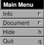&gt;

Only the menu, no window.

Next, I need a NSDocumentController. Choose the class
"NSDocumentController", use menu "Classes-&gt;Instantiate" to make an
instance.

**Figure 4-33. Create instance of NSDocumentController**

&gt;

The main user interface is done. Save to as "Money.gorm".

NSDocumentController will look at the property list of this application
in order to know what kind of document it should handle. Here is an
example of propery list.

`MoneyInfo.plist`

<table>
<colgroup>
<col style="width: 100%" />
</colgroup>
<tbody>
<tr class="odd">
<td><pre class="PROGRAMLISTING"><code>{
   ApplicationDescription = &quot;Money&quot;;
   ApplicationIcon = &quot;&quot;;
   ApplicationName = Money;
   ApplicationRelease = 0.1;
   Authors = &quot;&quot;;
   Copyright = &quot;Copyright (C) 200x by ...&quot;;
   CopyrightDescription = &quot;Released under...&quot;;
   FullVersionID = 0.1;
   URL = &quot;&quot;;
   NSTypes = (
      {
         NSName = &quot;mon&quot;;
         NSHumanReadableName = &quot;Money Document&quot;;
         NSUnixExtensions = (&quot;mon&quot;);
         NSRole = Editor;
         NSDocumentClass = Document;
      }
   );
}</code></pre></td>
</tr>
</tbody>
</table>

The important part is that NSTypes define what kind of document it
should handle, and what class to call. In this case, it is class
"Document", which I haven't implement yet. This is a simplified property
list, but it works. Look at the InkInfo.plist as a better one.

Now, I need to make the class "Document" as the property indicates, and
the window for each document. Open Gorm, choose "Document-&gt;New
Empty". Drag a window out of the palettes. Since this tutorial is only
the skeleton, I do nothing in the window.

Look at the classes in the Gorm main window, and use "Classes-&gt;Create
Subclass" to create a subclass of NSDocument, called "Document".

**Figure 4-34. Create NSDocument subclass**

&gt;

Don't instantiate it. Instead, it will be the owner of the document
window. Click the NSOwner in the Gorm main window, Look at the
"Attributes" in the inspector. Choose the "Document" class.

**Figure 4-35. Set document as NSOwner of window**

&gt;

&gt;

Now, the NSOwner is the class of Document. I need to connect the
\_window outlet of NSOwner (class "Document") to the window,

**Figure 4-36. Connect NSOwner to window**

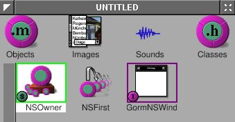&gt;

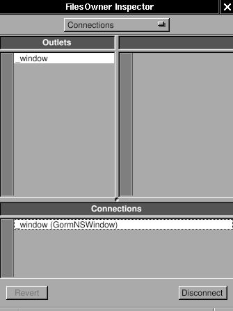&gt;

and the set the delegate of window to the NSOwner (class "Document").

**Figure 4-37. Connect delegate to NSOwner**

&gt;

&gt;

Finally, use "Classes-&gt;Create Class Files" to create the files of
class "Document". Save them to Document.m and Document.h. Save the Gorm
file into "Document.gorm".

Now, I have Money.gorm, MoneyInfo.plist, Document.h, Document.m and
Document.gorm. Five files (Gorm files are actually directories).

NSDocumentController know what class to use because it is written in the
property list file. How do NSDocument (or its subclass, "Document") know
where the interface of document is ? In this case, the interface of
document is Document.gorm. The simple way is to implement the
-windowNibName: in NSDocument. The Document files created from Gorm
won't work perfectly. Here is the working one:

`Document.h:`

<table>
<colgroup>
<col style="width: 100%" />
</colgroup>
<tbody>
<tr class="odd">
<td><pre class="PROGRAMLISTING"><code>#import &lt;AppKit/AppKit.h&gt;
#import &lt;AppKit/NSDocument.h&gt;

@interface Document : NSDocument
{
}
@end</code></pre></td>
</tr>
</tbody>
</table>

`Document.m:`

<table>
<colgroup>
<col style="width: 100%" />
</colgroup>
<tbody>
<tr class="odd">
<td><pre class="PROGRAMLISTING"><code>#import &quot;Document.h&quot;

@implementation Document

- (NSString *) windowNibName
{
   return @&quot;Document.gorm&quot;;
}

@end</code></pre></td>
</tr>
</tbody>
</table>

I deleted the extra codes inherited from NSDocument. Include the
NSDocument explicitly in the header file because AppKit.h doesn't
include it. The most important part is that I return the name of the
document interface, "Document.gorm", so that NSDocument can find where
the interface are.

Here are the rest of files:

`main.m:`

<table>
<colgroup>
<col style="width: 100%" />
</colgroup>
<tbody>
<tr class="odd">
<td><pre class="PROGRAMLISTING"><code>#import &lt;AppKit/AppKit.h&gt;
int main(int argc, const char *argv[]) 
{
   return NSApplicationMain (argc, argv);
}</code></pre></td>
</tr>
</tbody>
</table>

`GNUmakefile:`

<table>
<colgroup>
<col style="width: 100%" />
</colgroup>
<tbody>
<tr class="odd">
<td><pre class="PROGRAMLISTING"><code>include $(GNUSTEP_MAKEFILES)/common.make

APP_NAME = Money
Money_HEADERS = Document.h
Money_OBJC_FILES = main.m \
                   Document.m
Money_RESOURCE_FILES = MoneyInfo.plist \
                       Money.gorm \
                       Document.gorm
Money_MAIN_MODEL_FILE = Money.gorm

include $(GNUSTEP_MAKEFILES)/application.make</code></pre></td>
</tr>
</tbody>
</table>

Here is the source code:
[Money-src.tar.gz](http://gnustep.made-it.com/GSPT/Money/Money-src.tar.gz)

Once the application starts up, you will see only the menu. Use
"Document-&gt;New" to open a new document. A empty window will show up.
You can keep as many documents as you want. The menu items will be
automatically enabled depending on the existance of the document. Most
menu doesn't work yet.

GNUstep offer a greate framework for document-base applications. Right
now, I only need to focus on the Document itself, and don't need to
worry about how to manage the multiple documents/windows. GNUstep will
handle it perfectly.

------------------------------------------------------------------------

### Table

I have the skeleton of document-base application already. I want it be a
spreadsheet-like application to track the expense. If you are interested
in text editors, Ink.app in GNUstep CVS is a pretty good one. It
involves the text system of GNUstep, which is a big topic.
Spreadsheet-like applications need a table. NSTableView is a good start.
NSTableView is a more complicated user interface than NSButton,
NSTextField, etc. So do NSBrowser, NSOutlineView, NSMatrix, etc. GNUstep
does a great job to make it very easy to use. I'll try to explain it
step by step.

Here is a related article: [*Getting Started With
NSTableView*](http://cocoadevcentral.com/articles/000063.php)

Use Gorm to open Document.gorm. Add a table view into the window. Try to
resize it until it fit the whole window.

**Figure 4-38. Add table into window**

&gt;

&gt;

Check the "Horizontal" scroller. Actually it doesn't matter for now.

**Figure 4-39. Attributes of NSTableView**

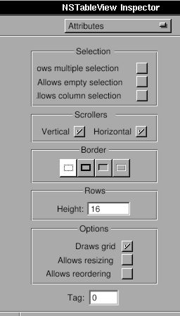&gt;

Look at the "Size" in the inspector of NSTableView. Click the line in
the box to make them the spring.

**Figure 4-40. Set resize attribute of table view**

&gt;

The box represent the NSTableView. The straight line or spring represent
the distance relationship. Line outside the box is the distance between
NSTableView and its superview. It is the window in this case. The line
inside the box is the size of the NSTableView. Straight line means the
distance is fixed, the spring means it is resizable. In this case, when
window is resized, since the distance between NSTableView and window is
fixed, NSTableView will be resized according to the window. That's the
behavior I want.

You can change the title of the column by double-click on it. But it is
not necessary for now. You will find that it is still hard to control
the interface of NSTableView from Gorm. I'll do that programmingly.
Therefore, I need a outlet connected to this NSTableView from NSOwner.

Add an outlet, tableView, in the class "Document".

**Figure 4-41. Add outlet for table view**

&gt;

Set NSOwner as the data source and delegate of the NSTableView. I'll
explain the data source later.

**Figure 4-42. Connect data source and delegate of table view**

&gt;

&gt;

&gt;

Connect the outlet "tableView" to NSTableView.

**Figure 4-43. Connect outlet to table view**

&gt;

&gt;

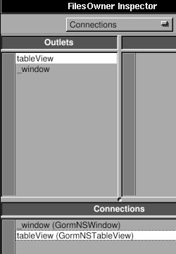&gt;

Save the Gorm file and quit Gorm.

Add the new outlet in Document.h.

`Document.h:`

<table>
<colgroup>
<col style="width: 100%" />
</colgroup>
<tbody>
<tr class="odd">
<td><pre class="PROGRAMLISTING"><code>#import &lt;AppKit/AppKit.h&gt;
#import &lt;AppKit/NSDocument.h&gt;

@interface Document : NSDocument
{
   id tableView;
}
@end</code></pre></td>
</tr>
</tbody>
</table>

The way NSTableView work is that when it need to display, it will ask
its data source to provide the data it needs. So I need to implement
some methods to provide NSTableView the data it need. There are
necessary two methods:

`Document.m:`

<table>
<colgroup>
<col style="width: 100%" />
</colgroup>
<tbody>
<tr class="odd">
<td><pre class="PROGRAMLISTING"><code>- (int) numberOfRowsInTableView: (NSTableView *) view
{
   return 5;
}

- (id) tableView: (NSTableView *) view
       objectValueForTableColumn: (NSTableColumn *) column
       row: (int) row
{
   return [NSString stringWithFormat: @&quot;column %@ row %d&quot;, [column identifier], row]; 
}</code></pre></td>
</tr>
</tbody>
</table>

Method -numberOfRowsInTableView: will ask how many rows NSTableView
should display. I set it to 5. Method
-tableView:objectValueForTableColumn:Row: will ask the object for a
given column and row. I return a string with the identifier of column
and the number of row.

Now, this application is ready to run, even though it does nothing but
display the data of 5 rows. This is merely a demo how the NSTableView
works. I provide the number of rows, and the object in a given column
and row. As long as these two kinds of data are provided, the
NSTableView can display anything, even a image in the cell. I'll talk
about more details about data source later on.

Here is the source code:
[Table-1-src.tar.gz](http://gnustep.made-it.com/GSPT/Table/Table-1-src.tar.gz)

Let's work on the interface first. NSTableView is a collection of
NSTableColumn. I want three columns for date, item and amount. There are
two default columns in the Gorm. Therefore, I need to add a
NSTableColumn into it.

`Document.m:`

<table>
<colgroup>
<col style="width: 100%" />
</colgroup>
<tbody>
<tr class="odd">
<td><pre class="PROGRAMLISTING"><code>- (void) windowControllerDidLoadNib: (NSWindowController *) controller
{
   NSTableColumn *column;
   NSArray *columns = [tableView tableColumns];

   column = [columns objectAtIndex: 0];
   [column setWidth: 100];
   [column setEditable: NO];
   [column setResizable: YES];
   [column setIdentifier: @&quot;date&quot;];
   [[column headerCell] setStringValue: @&quot;Date&quot;];

   column = [columns objectAtIndex: 1];
   [column setWidth: 100];
   [column setEditable: NO];
   [column setResizable: YES];
   [column setIdentifier: @&quot;item&quot;];
   [[column headerCell] setStringValue: @&quot;Item&quot;];

   column = [[NSTableColumn alloc] initWithIdentifier: @&quot;amount&quot;];
   [column setWidth: 100];
   [column setEditable: NO];
   [column setResizable: YES];
   [[column headerCell] setStringValue: @&quot;Amount&quot;];
   [tableView addTableColumn: column];
   RELEASE(column);

   [tableView sizeLastColumnToFit];
   [tableView setAutoresizesAllColumnsToFit: YES];
}</code></pre></td>
</tr>
</tbody>
</table>

I adjust the interface of NSTableView in method
-windowControllerDidLoadNib:, which quarantees that the Gorm file is
loaded. This is similar to -awakeFromNib. Firstly, I get the existing
columns, change their property. Secondly I create a new NSTableColumn
and add it into NSTableView. Finally, I adjust the layout of
NSTableView. By this way, I can arrange the user interface programmingly
even though Gorm is not fully functional yet. Run this application
again, and you will see the new column.

An important thing of NSTableColumn is the "identifier". Every
NSTableColumn has an unique "identifier" to distinguish them.
"Identifier" can be any object, but used to being NSString. The
identifier is not necessary to be the same as the header of column, but
used to being the same for easilier management. So we access the
NSTableColumn via its identifier. You can find the "identifier" in many
GNUstep objects.

The interface is done. Go back for the data source. Data source is an
object which provide the data for NSTableView. Therefore, data source is
the model of NSTableView in [*MVC
paradigm*](http://cocoadevcentral.com/articles/000003.php). Depending on
the behavior of NSTableView, I need to implement the proper methods in
the data source of NSTableView. I already show the methods for display.
But they are useless. Now, I will make them real functional.

The data for NSTableView can be considered as an NSArray of
NSDictionary. The object in each index of NSArray corresponds to each
row of NSTableView. And the object of each NSDictionary with a given key
corresponds to each NSTableColumn with a given identifier. That's the
simplest way to build the model for NSTableView. Therefore, I add an
NSMutableArray in Document class.

`Document.h:`

<table>
<colgroup>
<col style="width: 100%" />
</colgroup>
<tbody>
<tr class="odd">
<td><pre class="PROGRAMLISTING"><code>#import &lt;AppKit/AppKit.h&gt;
#import &lt;AppKit/NSDocument.h&gt;

@interface Document : NSDocument
{
   id tableView;
   NSMutableArray *records;
}
@end</code></pre></td>
</tr>
</tbody>
</table>

The "records" will store the data of NSTableView. About the usage of
NSMutableArray, read [*Basic GNUstep Base Library
Classes*](http://www.gnustep.it/nicola/Tutorials/BasicClasses/).

I want there are always an empty row so that user can add data into the
table. Before I add the function of adding data, look at the new methods
for display.

`Document.m:`

<table>
<colgroup>
<col style="width: 100%" />
</colgroup>
<tbody>
<tr class="odd">
<td><pre class="PROGRAMLISTING"><code>- (id) init
{
   self = [super init];
   records = [NSMutableArray new];
   return self;
}

- (void) dealloc
{
   RELEASE(records);
   [super dealloc];
}

- (int) numberOfRowsInTableView: (NSTableView *) view
{
   return [records count] + 1;
}

- (id) tableView: (NSTableView *) view
       objectValueForTableColumn: (NSTableColumn *) column 
       row: (int) row
{
   if (row &gt;= [records count])
      {
         return @&quot;&quot;; 
      }
   else
      {
         return [[records objectAtIndex: row] objectForKey: [column identifier]];
      }
}</code></pre></td>
</tr>
</tbody>
</table>

I create the instance of NSMutableArray in method -init, and release it
in -dealloc. In the method -numberOfRowsInTableView:, I return one more
number because I want it to display an extra empty row. Hence, in the
method -tableView:objectValueForTableColumn:row:, I have to check
whether the row the NSTableView request is large than the actuall number
of data. If so, it is request the empty row. I just return an empty
string "". The trick to use a NSArray of NSDictionary is to make the key
of NSDictionary the same as the identifier of NSTableColumn. So I can
get the object directly by knowing the identifier of NSTableColumn. If
you are not using the NSDictionary for each row, you can consider the
[*Key Value Coding
(KVC)*](http://developer.apple.com/techpubs/macosx/Cocoa/TasksAndConcepts/ProgrammingTopics/KeyValueCoding/index.html),
which offer similar way to get the right object. Otherwise, you have to
use if-else to get the right object. The advantage of NSDictionary (or
KVC) will be more clear for data input.

Now, I'll add the function of data input. Firstly, I have to set the
NSTableColumn editable.

<table>
<colgroup>
<col style="width: 100%" />
</colgroup>
<tbody>
<tr class="odd">
<td><pre class="PROGRAMLISTING"><code>- (void) windowControllerDidLoadNib: (NSWindowController *) controller
{
   NSTableColumn *column;
   NSArray *columns = [tableView tableColumns];

   column = [columns objectAtIndex: 0];
   [column setWidth: 100];
   [column setEditable: YES];
   [column setResizable: YES];
   [column setIdentifier: @&quot;date&quot;];
   [[column headerCell] setStringValue: @&quot;Date&quot;];

   column = [columns objectAtIndex: 1];
   [column setWidth: 100];
   [column setEditable: YES];
   [column setResizable: YES];
   [column setIdentifier: @&quot;item&quot;];
   [[column headerCell] setStringValue: @&quot;Item&quot;];

   column = [[NSTableColumn alloc] initWithIdentifier: @&quot;amount&quot;];
   [column setWidth: 100];
   [column setEditable: YES];
   [column setResizable: YES];
   [[column headerCell] setStringValue: @&quot;Amount&quot;];
   [tableView addTableColumn: column];
   RELEASE(column);

   [tableView sizeLastColumnToFit];
   [tableView setAutoresizesAllColumnsToFit: YES];
}</code></pre></td>
</tr>
</tbody>
</table>

Once the users double-click each cell in the table, they can input the
data.

The way data source receive the data is in the method
-tableView:setObjectValue:forTableColumn:row:, which is the opposite of
the method for display.

`Document.h:`

<table>
<colgroup>
<col style="width: 100%" />
</colgroup>
<tbody>
<tr class="odd">
<td><pre class="PROGRAMLISTING"><code>- (void) tableView: (NSTableView *) view
         setObjectValue: (id) object
         forTableColumn: (NSTableColumn *) column
         row: (int) row
{
   if (row &gt;= [records count])
      {
         [records addObject: [NSMutableDictionary new]];
      }
   [[records objectAtIndex: row] setObject: object
                                    forKey: [column identifier]];
   [tableView reloadData];
}</code></pre></td>
</tr>
</tbody>
</table>

Again, I need to take care the situation when user input in the last
empty row. Since it is not in the records, I need to add a new
NSMutableDictionary first. When ever user input the data, it will be
store into records according its row and the identifier of column. And
the key of NSDictionary is the same as the identifier of NSTableColumn.
Hence I can retrieve the data according to the identifier of column.
Finally I ask the NSTableView to reload the data in order to reflect the
change of data source.

Now you can play around this application and input the data. Here is the
source code:
[Table-2-src.tar.gz](http://gnustep.made-it.com/GSPT/Table/Table-2-src.tar.gz).
This example shows how easy I can make a real document-base application
without worry about the management of multiple documents and windows.

------------------------------------------------------------------------

### Load and Save

As a document-base application, it has to be able to load and save file.
Depending on the structure of the files, I have several choices to
override in NSDocument:

**Table 4-1. Methods for loading and saving files**

<table>
<tbody>
<tr class="odd">
<td> </td>
<td>Load file</td>
<td>Save file</td>
</tr>
<tr class="even">
<td>High level</td>
<td>loadDataRepresentation:ofType:</td>
<td>dataRepresentationOfType:</td>
</tr>
<tr class="odd">
<td>Middle level</td>
<td>loadFileWrapperRepresentation:ofType:</td>
<td>fileWrapperRepresentationOfType:</td>
</tr>
<tr class="even">
<td>Low level</td>
<td>readFromFile:ofType:, readFromURL:ofType:</td>
<td>writeToFile:ofType:, writeToURL:ofType:</td>
</tr>
</tbody>
</table>

Read [*How do I implement saving and loading for simple
files?*](http://developer.apple.com/techpubs/macosx/Cocoa/TasksAndConcepts/ProgrammingTopics/Documents/Tasks/FAQ.html#//apple_ref/doc/uid/20000954/BAJBFGAG),
[*How do I implement document packages (documents that are really
folders, but appear to be opaque
documents)?*](http://developer.apple.com/techpubs/macosx/Cocoa/TasksAndConcepts/ProgrammingTopics/Documents/Tasks/FAQ.html#//apple_ref/doc/uid/20000954/BAJHBHGJ),
and [*How do I implement loading and saving when the simple data or file
wrapper API won't
do?*](http://developer.apple.com/techpubs/macosx/Cocoa/TasksAndConcepts/ProgrammingTopics/Documents/Tasks/FAQ.html#//apple_ref/doc/uid/20000954/BAJIGEFI).

In this case, -loadDataRepresentation:ofType: and
-dataRepresentationOfType: are enough.

`Document.m:`

<table>
<colgroup>
<col style="width: 100%" />
</colgroup>
<tbody>
<tr class="odd">
<td><pre class="PROGRAMLISTING"><code>- (NSData *) dataRepresentationOfType: (NSString *) type
{
   if (type == nil)
      type = @&quot;mon&quot;;
   if ([type isEqualToString: @&quot;mon&quot;])
      return [NSArchiver archivedDataWithRootObject: records];
   else
      return nil;
}

- (BOOL) loadDataRepresentation: (NSData *) data ofType: (NSString *) type
{
   if ([type isEqualToString: @&quot;mon&quot;])
      {
         [records setArray: [NSUnarchiver unarchiveObjectWithData: data]];
         return YES;
      }
   return NO;
}</code></pre></td>
</tr>
</tbody>
</table>

When document is going to be saved, it will call
-dataRepresentationOfType:. The type will be the NSName in the property
list of this application (MoneyInfo.plist). Here, I use NSArchiver to
transform the whole NSArray into NSData, and I don't need to worry about
the internal format. When document is going to be loaded, it will call
-loadDataRepresentation:ofType:. Again, I use NSUnarchiver to transform
the NSData into NSArray. That's all. If you are using your own data
structure, you have to deal with [*data
archives*](http://developer.apple.com/techpubs/macosx/Cocoa/TasksAndConcepts/ProgrammingTopics/Archiving/index.html)
by yourself. Here is a related article: [*Using the Property List
Objects and the NSCoding
Protocol*](http://cocoadevcentral.com/articles/000059.php).

The saved data is in binary format, which is usually undesired. Since I
only use the basic data structure, I could save it into property list,
which is human-readable.

`Document.m:`

<table>
<colgroup>
<col style="width: 100%" />
</colgroup>
<tbody>
<tr class="odd">
<td><pre class="PROGRAMLISTING"><code>- (NSData *) dataRepresentationOfType: (NSString *) type
{
   if (type == nil)
      type = @&quot;mon&quot;;
   if ([type isEqualToString: @&quot;mon&quot;])
      return [[records description] dataUsingEncoding: [NSString defaultCStringEncoding]];
   else
      return nil;
}

- (BOOL) loadDataRepresentation: (NSData *) data ofType: (NSString *) type
{
   if ([type isEqualToString: @&quot;mon&quot;])
      {
        NSString *string = [[NSString alloc] initWithData: data 
                                                 encoding: [NSString defaultCStringEncoding]];
        [records setArray: [string propertyList]];
        RELEASE(string);
        return YES;
      }
   return NO;
}</code></pre></td>
</tr>
</tbody>
</table>

I use -description to get the property list, which is NSString. Then use
-dataUsingEncoding to transform property list (NSString) into NSData for
saving. And do the opposite for the loading. Now, you can look at the
saved file, which is very easy to read.

Here is the source code for the easy-read version:
[LoadSave-src.tar.gz](http://gnustep.made-it.com/GSPT/LoadSave/LoadSave-src.tar.gz).

If you are saving the document into a directory, such as HTML document,
which contain text and images, you may want to use
-loadFileWrapperRepresentation:ofType: and
-fileWrapperRepresentationOfType:. Methods -readFromFile:ofType: and
-writeToFile:ofType: offers the ability to access the file system
directly.

------------------------------------------------------------------------

### Drag and drop in table

[*Drag and drop in
general*](http://developer.apple.com/techpubs/macosx/Cocoa/TasksAndConcepts/ProgrammingTopics/DragandDrop/index.html)
is easy, but even easier in NSTableView. Here is an article about it:
[*Drag and Drop
Destinations*](http://cocoadevcentral.com/articles/000056.php).
Basically, drag and drop is copy and paste with graphic interactivity.
Therefore, it involves the pasteboard. I'll add the fuction of drag and
drop in this tutorial so that you can drag and drop in-between different
document. NSTableView has its built-in drag and drop support. Therefore,
it is sort of different from drag and drop in general. Here is the
[*drag and drop in NSTableView from
Cocoa*](http://developer.apple.com/techpubs/macosx/Cocoa/TasksAndConcepts/ProgrammingTopics/TableView/Tasks/UsingDragAndDrop.html).

Firstly, I need to set up the dragging source, the source you can drag
something out. I need to register the table as dragging source, and
implement one method.

`Document.m:`

<table>
<colgroup>
<col style="width: 100%" />
</colgroup>
<tbody>
<tr class="odd">
<td><pre class="PROGRAMLISTING"><code>- (void) windowControllerDidLoadNib: (NSWindowController *) controller
{
   NSTableColumn *column;
   NSArray *columns = [tableView tableColumns];

   column = [columns objectAtIndex: 0];
   [column setWidth: 100];
   [column setEditable: YES];
   [column setResizable: YES];
   [column setIdentifier: @&quot;date&quot;];
   [[column headerCell] setStringValue: @&quot;Date&quot;];

   column = [columns objectAtIndex: 1];
   [column setWidth: 100];
   [column setEditable: YES];
   [column setResizable: YES];
   [column setIdentifier: @&quot;item&quot;];
   [[column headerCell] setStringValue: @&quot;Item&quot;];

   column = [[NSTableColumn alloc] initWithIdentifier: @&quot;amount&quot;];
   [column setWidth: 100];
   [column setEditable: YES];
   [column setResizable: YES];
   [[column headerCell] setStringValue: @&quot;Amount&quot;];
   [tableView addTableColumn: column];
   RELEASE(column);

   [tableView sizeLastColumnToFit];
   [tableView setAutoresizesAllColumnsToFit: YES];
   
   [tableView registerForDraggedTypes: [NSArray arrayWithObjects: NSGeneralPboardType, nil]];
}

- (BOOL) tableView: (NSTableView *) view
         writeRows: (NSArray *) rows
         toPasteboard: (NSPasteboard *) pboard
{
   id object = [records objectAtIndex: [[rows lastObject] intValue]];
   NSData *data = [NSArchiver archivedDataWithRootObject: object];

   [pboard declareTypes: [NSArray arrayWithObject: @&quot;NSGeneralPboardType&quot;]
                                            owner: nil];
   [pboard setData: data forType: @&quot;NSGeneralPboardType&quot;];
   return YES;
}</code></pre></td>
</tr>
</tbody>
</table>

In method -windowControllerDidLoadNib:, NSTableView register what kind
of pasteboard it will use. Once it registers, it is ready to drag and
drop. The [*usage of
pasteboard*](http://developer.apple.com/techpubs/macosx/Cocoa/TasksAndConcepts/ProgrammingTopics/CopyandPaste/index.html)
is not covered in this tutorial. Basically, you set the type of
pasteboard, put data in, and take it out.

Method -tableView:writeRows:toPasteboard will be called when user try to
drag some rows out of the table, It is the methods in the data source of
table, not in the delegate of table. Therefore, in this method, I only
need to put the data into pasteboard. Since this table only allow single
selection, I only need to handle the data in one row, which is a
NSDictionary. I archive NSDictionary into NSData, put it into pasteboard
of NSGeneralPboardType, then return YES. Now, you can drag the row out
of the table.

NSTableView will handle all the graphic interactivity. When users drop
the data into another document, I need to implement two methods.

`Document.m:`

<table>
<colgroup>
<col style="width: 100%" />
</colgroup>
<tbody>
<tr class="odd">
<td><pre class="PROGRAMLISTING"><code>- (NSDragOperation) tableView: (NSTableView *) view
                    validateDrop: (id &lt;NSDraggingInfo&gt;) info
                    proposedRow: (int) row
                    proposedDropOperation: (NSTableViewDropOperation) operation
{
   if (row &gt; [records count])
   return NSDragOperationNone;

   if (nil == [info draggingSource]) // From other application
     {
       return NSDragOperationNone;
     }
   else if (tableView == [info draggingSource]) // From self
     {
       return NSDragOperationNone;
     }
   else // From other documents 
     {
       [view setDropRow: row dropOperation: NSTableViewDropAbove];
       return NSDragOperationCopy;
     }
}

- (BOOL) tableView: (NSTableView *) view
         acceptDrop: (id &lt;NSDraggingInfo&gt;) info
         row: (int) row
         dropOperation: (NSTableViewDropOperation) operation
{
   NSPasteboard *pboard = [info draggingPasteboard];
   NSData *data = [pboard dataForType: @&quot;NSGeneralPboardType&quot;];

   if (row &gt; [records count])
     return NO;

   if (nil == [info draggingSource]) // From other application
     {
       return NO;
     }
   else if (tableView == [info draggingSource]) // From self
     {
       return NO;
     }
   else // From other documents
     {
       id object = [NSUnarchiver unarchiveObjectWithData: data];
       [records insertObject: object atIndex: row];
       [tableView reloadData];

       return YES;
     }
   return NO;
}</code></pre></td>
</tr>
</tbody>
</table>

When users hold the mouse button and move above the table, the table
will keep receiving the call for method
-tableView:validateDrop:proposedRow:ProposedDropOperation:. The only
thing I need to do in this method is to examine the proposed drop and
return the action I can accept. If the source is not from other
documents, return NSDragOperationNone to indicate that this table
doesn't accept drop. Otherwise, return NSDragOperationCopy to indicate
that this table accept copy. In table, you can drop between rows or over
rows. That's NSTableViewDropOperation means. I only want to insert the
data. When it is proposed to drop, I change the propose by
-setDropRow:dropOperation:. By this way, I can change all the drop
in-between rows, not over rows. So this method gives the table chances
to change its interface when mouse is moving above it.

Once users release the mouse button, method
-tableView:acceptDrop:row:dropOperation: will be called. I get the
dropped data from this method. Extract the data from pbastebord,
unarchive into NSDictionary, and add into records. Don't forget to
reload the table to reflect the change.

NSTableView offers the basic fuction of drag and drop, which is useful
for general applications. If you want more support for drag and drop,
you have to subclass NSTableView and write your own using the general
drag and drop support of GNUstep. For example, NSTableView doesn't
support drag and drop from other application. If you want to do that,
you have to subclass NSTableView. I'll talk about the drag and drop in
general later.

Here is the source code:
[DragDropInTable-src.tar.gz](http://gnustep.made-it.com/GSPT/DragDropInTable/DragDropInTable-src.tar.gz)

------------------------------------------------------------------------

Overview
----------------------------------

NSOutlineView is a subclass of NSTableView. The only difference is that
the rows of NSOutlineView act like a data-structure tree of multiple
children. In NSTableView, we can use an array of dictionary to store the
data of NSTableView. In NSOutlineView, we need a tree strcuture. Here, I
will make an application to display several system information in
outline view.

First, create "New Application" in Gorm and drag a NSOutlineView into
the window

**Figure 4-44. Interface of Overview**

&gt;

Change the Autoresizing attribute of NSOutlineView

**Figure 4-45. Autoresizing attribute of NSOutlineView**

&gt;

Double-click on the column to select

**Figure 4-46. Select column in NSOutlineView**

&gt;

Uncheck the "Editable" and change the identifier to "Attribute" in the
first column and "Value" in the second column

**Figure 4-47. Change attribute of NSTableColumn**

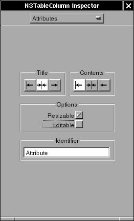&gt;

The makeing of interface is done. Now, I need a controller for the
interface. Create a subclass of NSObject, called "Controller"

**Figure 4-48. Create subclass in Gorm**

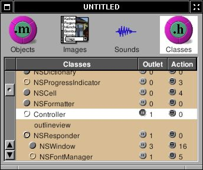&gt;

Add a outlet called "outlineview"

**Figure 4-49. Create outlet**

&gt;

Create an instance of Controller, and connect the outlet "outlineview"
to the outline view in the window. Be sure that you connect to outline
view, not the scroll view or the table column

**Figure 4-50. Connect outlet to NSOutlineView**

&gt;

Since NSOutlineView is the subclass of NSTableView, we need to assing
the data source and delegate of NSOutlineView by connecting the
"dataSource" and "delegate" from NSOutlineView to Controller.

**Figure 4-51. Connect data source of NSOutlineView**

&gt;

Finally, we can assign Controller as the delegate of NSApp

**Figure 4-52. Assign delegate of NSApp**

&gt;

Now, save the Gorm file as "Overview.gorm", and generate the files of
Controller.

I need a data source for the NSOutlineView. I can do that by creating a
tree sturcture with very simple nodes

`Node.h`

<table>
<colgroup>
<col style="width: 100%" />
</colgroup>
<tbody>
<tr class="odd">
<td><pre class="PROGRAMLISTING"><code>#ifndef _Overview_Node_
#define _Overview_Node_

#include &lt;Foundation/NSObject.h&gt;

@class NSArray;
@class NSMutableArray;
@class NSString;

@interface Node: NSObject
{
  NSString *name;
  NSString *value;
  NSMutableArray *children;
}

- (void) setName: (NSString *) name;
- (NSString *) name;
- (void) setValue: (NSString *) value;
- (NSString *) value;
- (void) addChild: (id) child;
- (NSArray *) children;
@end

#endif /* _Overview_Node_ */</code></pre></td>
</tr>
</tbody>
</table>

`Node.m`

<table>
<colgroup>
<col style="width: 100%" />
</colgroup>
<tbody>
<tr class="odd">
<td><pre class="PROGRAMLISTING"><code>#include &quot;Node.h&quot;
#include &lt;Foundation/Foundation.h&gt;

@implementation Node

- (id) init
{
  self = [super init];

  children = [NSMutableArray new];

  return self;
}

- (void) setName: (NSString *) string
{
  ASSIGN(name, string);
}

- (NSString *) name
{
  return name;
}

- (void) setValue: (NSString *) string
{
  ASSIGN(value, string);
}

- (NSString *) value
{
  return value;
}

- (void) addChild: (id) child
{
  [children addObject: child];
}

- (NSArray *) children
{
  return children;
}

- (void) dealloc
{
  RELEASE(name);
  RELEASE(value);
  RELEASE(children);
  [super dealloc];
}

@end</code></pre></td>
</tr>
</tbody>
</table>

Now, I can build a tree by connect these nodes

In NSTableView, there are two necessary methods to display the data:

<table>
<colgroup>
<col style="width: 100%" />
</colgroup>
<tbody>
<tr class="odd">
<td><pre class="PROGRAMLISTING"><code>- (int) numberOfRowsInTableView: (NSTableView *) tableView;

- (id) tableView: (NSTableView *) tableView
       objectValueForTableColumn: (NSTableColumn *) column
       row: (int) row;</code></pre></td>
</tr>
</tbody>
</table>

In NSOutlineView, due to the tree-like structure, there are 4 mecessary
methods to display the data:

<table>
<colgroup>
<col style="width: 100%" />
</colgroup>
<tbody>
<tr class="odd">
<td><pre class="PROGRAMLISTING"><code>- (id)outlineView: (NSOutlineView *)outlineView 
            child: (int)index 
           ofItem: (id)item;

- (BOOL)outlineView: (NSOutlineView *)outlineView
        isItemExpandable: (id)item;

- (int)outlineView: (NSOutlineView *)outlineView
       numberOfChildrenOfItem: (id)item;

- (id)outlineView: (NSOutlineView *)outlineView 
      objectValueForTableColumn:(NSTableColumn *)tableColumn 
      byItem:(id)item;</code></pre></td>
</tr>
</tbody>
</table>

"Item" means the node in the data source. If item is nil, it means it is
root node. Starting from root node, NSOutlineView ask each node how many
children it has ? is it expandable ? display the object value of the
node, and get the next child. After it goes over the nodes, it finish
displaying the data source.

So I have to build the tree first:

`Controller.h`

<table>
<colgroup>
<col style="width: 100%" />
</colgroup>
<tbody>
<tr class="odd">
<td><pre class="PROGRAMLISTING"><code>/* All Rights reserved */

#include &lt;AppKit/AppKit.h&gt;

@class Node;

@interface Controller : NSObject
{
  id outlineview;
  Node *root;
  
}
@end</code></pre></td>
</tr>
</tbody>
</table>

`Controller.m`

<table>
<colgroup>
<col style="width: 100%" />
</colgroup>
<tbody>
<tr class="odd">
<td><pre class="PROGRAMLISTING"><code>/* All Rights reserved */

#include &lt;AppKit/AppKit.h&gt;
#include &quot;Controller.h&quot;
#include &quot;Node.h&quot;

@implementation Controller

- (id) init
{
  Node *child, *temp;

  self = [super init];

  root = [Node new];

  child = [Node new];
  [child setName: @&quot;System&quot;];

  /* Add operating system */
  temp = [Node new];
  [temp setName: @&quot;Operating System&quot;];
  [temp setValue: [[NSProcessInfo processInfo] operatingSystemName]];
  [child addChild: temp];
  RELEASE(temp);

  /* Add user name */
  temp = [Node new];
  [temp setName: @&quot;User Name&quot;];
  [temp setValue: NSUserName()];
  [child addChild: temp];
  RELEASE(temp);

  /* Add home directory */
  temp = [Node new];
  [temp setName: @&quot;Home Directory&quot;];
  [temp setValue: NSHomeDirectory()];
  [child addChild: temp];
  RELEASE(temp);

  [root addChild: child];
  RELEASE(child);

  return self;
}

- (void) dealloc
{
  RELEASE(root);
  [super dealloc];
}</code></pre></td>
</tr>
</tbody>
</table>

I create a root node, add an "System" node. Then add three nodes into
"System" node. That's a very simple tree for now. Once I have a tree, I
can display it in outline view.

`Controller.m`

<table>
<colgroup>
<col style="width: 100%" />
</colgroup>
<tbody>
<tr class="odd">
<td><pre class="PROGRAMLISTING"><code>- (id) outlineView: (NSOutlineView *) outlineView
             child: (int) index
            ofItem: (id) item
{
  /* Root */
  if (item == nil)
    return [[root children] objectAtIndex: index];

  /* Others */
  if ([[item children] count])
    return [[item children] objectAtIndex: index];
  else
    return nil;
}

- (BOOL) outlineView: (NSOutlineView *) outlineView
         isItemExpandable: (id) item
{
  /* Root */
  if (item == nil)
    return YES;

  /* Others */
  if ([[item children] count])
    return YES;
  else
    return NO;
}

- (int) outlineView: (NSOutlineView *) outlineView
        numberOfChildrenOfItem: (id) item
{
  /* Root */
  if (item == nil)
    return [[root children] count];

  /* Others */
  return [[item children] count];
}

- (id) outlineView: (NSOutlineView *) outlineView
       objectValueForTableColumn: (NSTableColumn *) tableColumn
       byItem: (id) item
{
  if ([[tableColumn identifier] isEqualToString: @&quot;Attribute&quot;])
    return [(Node *)item name];
  else
    return [item value];
}</code></pre></td>
</tr>
</tbody>
</table>

These methods are straight-forward. Just need to take care the case when
item is nil, which means it is root node.

Now, this application is ready to go. You can finish the `main.m` and
`GNUmakefile`. Here is the source code:
[Overview-src.tar.gz](http://gnustep.made-it.com/GSPT/Overview/Overview-src.tar.gz)

Actually I can get more information

`Controller.m`

<table>
<colgroup>
<col style="width: 100%" />
</colgroup>
<tbody>
<tr class="odd">
<td><pre class="PROGRAMLISTING"><code>- (id) init
{
  Node *child, *temp;
  NSCalendarDate *date;
  NSRect frame;
  id object;

#define ADD_NAME_VALUE(name, value) \
        temp = [Node new]; \
        [temp setName: name]; \
        [temp setValue: value]; \
        [child addChild: temp]; \
        RELEASE(temp);

  self = [super init];

  root = [Node new];

  child = [Node new];
  [child setName: @&quot;System&quot;];

  /* operating system */
  ADD_NAME_VALUE(@&quot;Operating System&quot;, [[NSProcessInfo processInfo] operatingSystemName]);

  /* user name */
  ADD_NAME_VALUE(@&quot;User Name&quot;, NSUserName());

  /* home directory */
  ADD_NAME_VALUE(@&quot;Home Directory&quot;, NSHomeDirectory());

  /* gnustep root directory */
  ADD_NAME_VALUE(@&quot;GNUstep Directory&quot;, NSOpenStepRootDirectory());

  /* host and address */
  ADD_NAME_VALUE(@&quot;Host&quot;, [[NSHost currentHost] name]);
  ADD_NAME_VALUE(@&quot;Address&quot;, [[NSHost currentHost] address]); 

  /* Screen */
  ADD_NAME_VALUE(@&quot;Screen Depth&quot;, [[NSNumber numberWithInt: [[NSScreen mainScree
n] depth]] description]);
  frame = [[NSScreen mainScreen] frame];
  object = [NSString stringWithFormat: @&quot;%d x %d&quot;, (int)frame.size.width, (int)f
rame.size.height];
  ADD_NAME_VALUE(@&quot;Screen Size&quot;, object);

  [root addChild: child];
  RELEASE(child);

  child = [Node new];
  [child setName: @&quot;Date &amp; Time&quot;];

  /* Time Zone */
  ADD_NAME_VALUE(@&quot;System Time Zone&quot;, [[NSTimeZone systemTimeZone] timeZoneName]
);
  ADD_NAME_VALUE(@&quot;Local Time Zone&quot;, [[NSTimeZone localTimeZone] timeZoneName]);

  /* Date */
  date = [NSCalendarDate calendarDate];
  [date setCalendarFormat: @&quot;%a, %b %e, %Y&quot;];
  ADD_NAME_VALUE(@&quot;Date&quot;, [date description]);
  [date setCalendarFormat: @&quot;%H : %M : %S&quot;];
  ADD_NAME_VALUE(@&quot;Time&quot;, [date description]);

  [root addChild: child];
  RELEASE(child);

  child = [Node new];
  [child setName: @&quot;Text Related&quot;];

  /* default encoding */
  ADD_NAME_VALUE(@&quot;Default Encoding&quot;, [NSString localizedNameOfStringEncoding: [NSString defaultCStringEncoding]]);

  /* Font */
  ADD_NAME_VALUE(@&quot;System Font&quot;, [[NSFont systemFontOfSize: [NSFont systemFontSize]] displayName]);
  ADD_NAME_VALUE(@&quot;System Font Size&quot;, [[NSNumber numberWithFloat: [NSFont systemFontSize]] description]);
  ADD_NAME_VALUE(@&quot;System Font Encoding&quot;, [[NSFont systemFontOfSize: [NSFont systemFontSize]] encodingScheme]);
  ADD_NAME_VALUE(@&quot;System Bold Font&quot;, [[NSFont boldSystemFontOfSize: [NSFont systemFontSize]] displayName]);

  [root addChild: child];
  RELEASE(child);

  return self;
}</code></pre></td>
</tr>
</tbody>
</table>

Now, it looks better:

**Figure 4-53. Overview**

&gt;

You will notice that when window is close, the application is not quit.
We can make the application quit when last window closes.

`Controller.m`

<table>
<colgroup>
<col style="width: 100%" />
</colgroup>
<tbody>
<tr class="odd">
<td><pre class="PROGRAMLISTING"><code>- (BOOL) applicationShouldTerminateAfterLastWindowClosed: (id) sender
{
  return YES;
}</code></pre></td>
</tr>
</tbody>
</table>

This is the method for NSApp delegate. Therefore, Controller must be the
delegate of NSApp. I assign it already in Gorm

------------------------------------------------------------------------

LunarCalendar
---------------------------------------

Solar calendar is commonly used worldwide, but lunar calendar is still
used in many places since sun and moon play equivalent roles in the
weather and ocean system. Here, I'll make a graphic interface for
convert solar calendar into moon calendar.

The graphic interface for solar calendar looks like this:

**Figure 4-54. CalendarView**

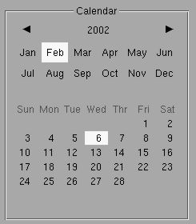&gt;

The conversion from solar calendar to lunar calendar is not the point in
this chapter. If you are interested, you can check the source code. The
interface of LunarCalendarDate is:

`LunarCalendarDate.h`

<table>
<colgroup>
<col style="width: 100%" />
</colgroup>
<tbody>
<tr class="odd">
<td><pre class="PROGRAMLISTING"><code>#ifndef _LunarCalendarDate_
#define _LunarCalendarDate_

#include &lt;Foundation/NSObject.h&gt;

@interface LunarCalendarDate: NSObject
{
  int lunarDay, lunarMonth;
}

- (void) setDate: (NSCalendarDate *) date;
- (int) dayOfMonth;
- (int) monthOfYear;
@end

#endif /* _LunarCalendarDate_ */</code></pre></td>
</tr>
</tbody>
</table>

Basically, you put the date into LunarCalendarDate, and get the month
and day out of it. This conversion may not be bug-free, and only work
between 1998-2031. But it is good enough as an example.

Now, use Gorm to build a interface like this:

**Figure 4-55. Interface of LunarCalendar**

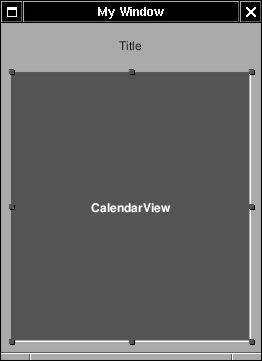&gt;

Create a subclass of NSView, called CalendarView. Use this class for the
custom class. The size of custom class must be width 240 and height 270.
Add a NSTextField on top of it to display the lunar date.

Create a outlet called "label"in CalendarView.

**Figure 4-56. Add outlet**

&gt;

Connect the outlet "label" to the NSTextField

**Figure 4-57. Connect outlet**

&gt;

Save the interface as LunarCalendar.gorm. Now, let's work on the
CalendarView.

`CalendarView.h`

<table>
<colgroup>
<col style="width: 100%" />
</colgroup>
<tbody>
<tr class="odd">
<td><pre class="PROGRAMLISTING"><code>#ifndef _CalendarView_
#define _CalendarView_

#include &lt;AppKit/AppKit.h&gt;

@interface CalendarView : NSView
{
  NSBox *calendarBox;
  NSTextField *yearLabel;
  NSButton *lastYearButton, *nextYearButton;
  NSMatrix *monthMatrix, *dayMatrix;
  NSCalendarDate *date;
  NSArray *monthArray;

  /* Outlet */
  id label;
}

- (NSCalendarDate *) date;
- (void) setDate: (NSCalendarDate *)date;

/* Used by interface */
- (void) updateDate: (id) sender;

@end

#endif /* _CalendarView_ */</code></pre></td>
</tr>
</tbody>
</table>

`CalendarDate.m`

Setup basic header and functions

<table>
<colgroup>
<col style="width: 100%" />
</colgroup>
<tbody>
<tr class="odd">
<td><pre class="PROGRAMLISTING"><code>#include &quot;CalendarView.h&quot;
#include &quot;LunarCalendarDate.h&quot;

@implementation CalendarView

#define isLeapYear(year) (((year % 4) == 0 &amp;&amp; ((year % 100) != 0)) || (year % 400) 
== 0)

static short numberOfDaysInMonth[] = {31, 28, 31, 30, 31, 30, 31, 31, 30, 31, 30, 3
1};</code></pre></td>
</tr>
</tbody>
</table>

Here, I use several matrix to build the interface

<table>
<colgroup>
<col style="width: 100%" />
</colgroup>
<tbody>
<tr class="odd">
<td><pre class="PROGRAMLISTING"><code>- (id) initWithFrame: (NSRect) rect
{
   int i, j, count=0;
   NSImage *rightArrow, *leftArrow;
   NSButtonCell *monthCell, *dayCell, *tempCell;
   NSArray *weekArray;

   [super initWithFrame: rect];</code></pre></td>
</tr>
</tbody>
</table>

Everything is add into the NSBox

<table>
<colgroup>
<col style="width: 100%" />
</colgroup>
<tbody>
<tr class="odd">
<td><pre class="PROGRAMLISTING"><code>   calendarBox = [[NSBox alloc] initWithFrame: NSMakeRect(0, 0, 240, 270)];
   [calendarBox setBorderType: NSGrooveBorder];
   [calendarBox setTitlePosition: NSAtTop];
   [calendarBox setTitle: @&quot;Calendar&quot;];</code></pre></td>
</tr>
</tbody>
</table>

Year is composed by two button and on text field. Press buttons to
change the year. The arrow images come with GNUstep. Buttons will call
-updateDate: when pressed.

<table>
<colgroup>
<col style="width: 100%" />
</colgroup>
<tbody>
<tr class="odd">
<td><pre class="PROGRAMLISTING"><code>   yearLabel = [[NSTextField alloc] initWithFrame: NSMakeRect(85, 220, 60, 20)];
   [yearLabel setStringValue: @&quot;This Year&quot;];
   [yearLabel setBezeled: NO];
   [yearLabel setBackgroundColor: [NSColor windowBackgroundColor]];
   [yearLabel setEditable: NO];
   [yearLabel setSelectable: NO];
   [yearLabel setAlignment: NSCenterTextAlignment];

   leftArrow = [NSImage imageNamed: @&quot;common_ArrowLeft.tiff&quot;];
   rightArrow = [NSImage imageNamed: @&quot;common_ArrowRight.tiff&quot;];

   lastYearButton = [[NSButton alloc] initWithFrame: NSMakeRect(10, 220, 22, 22)];
   [lastYearButton setImage: leftArrow];
   [lastYearButton setImagePosition: NSImageOnly];
   [lastYearButton setBordered: NO];

   nextYearButton = [[NSButton alloc] initWithFrame: NSMakeRect(198, 220, 22, 22)];
   [nextYearButton setImage: rightArrow];
   [nextYearButton setImagePosition: NSImageOnly];
   [nextYearButton setBordered: NO];

   [lastYearButton setTarget: self];
   [lastYearButton setAction: @selector(updateDate:)];

   [nextYearButton setTarget: self];
   [nextYearButton setAction: @selector(updateDate:)];

   [calendarBox addSubview: yearLabel];
   [calendarBox addSubview: lastYearButton];
   [calendarBox addSubview: nextYearButton];
   RELEASE(yearLabel);
   RELEASE(lastYearButton);
   RELEASE(nextYearButton);</code></pre></td>
</tr>
</tbody>
</table>

[Matrix](http://developer.apple.com/documentation/Cocoa/Conceptual/Matrix/index.html)
is used to put cells together. Cell is a light-weight of NSView. Read
[*Introduction to Controls and
Cells*](http://developer.apple.com/documentation/Cocoa/Conceptual/ControlCell/index.html).
Firstly, I define the cell prototype for the matrix. Matrix will use
this prototype to display every cell. Each cell has a tag to identify
itself.

<table>
<colgroup>
<col style="width: 100%" />
</colgroup>
<tbody>
<tr class="odd">
<td><pre class="PROGRAMLISTING"><code>   monthArray = [[NSArray alloc] initWithObjects: 
                   @&quot;Jan&quot;, @&quot;Feb&quot;, @&quot;Mar&quot;, @&quot;Apr&quot;, @&quot;May&quot;, @&quot;Jun&quot;, 
                   @&quot;Jul&quot;, @&quot;Aug&quot;, @&quot;Sep&quot;, @&quot;Oct&quot;, @&quot;Nov&quot;, @&quot;Dec&quot;, nil];

   monthCell = [[NSButtonCell alloc] initTextCell: @&quot;&quot;];
   [monthCell setBordered: NO];
   [monthCell setShowsStateBy: NSOnOffButton];
   [monthCell setAlignment: NSCenterTextAlignment];

   monthMatrix = [[NSMatrix alloc] initWithFrame: NSMakeRect(10, 165, 210, 50)
                                            mode: NSRadioModeMatrix
                                       prototype: monthCell
                                    numberOfRows: 2
                                 numberOfColumns: 6];

   for (i = 0; i &lt; 2; i++)
      for (j = 0; j &lt; 6; j++)
      {
         tempCell = [monthMatrix cellAtRow: i column: j];
         [tempCell setTag: count];
         [tempCell setTitle: [monthArray objectAtIndex: count]];
         count++;
      }
   RELEASE(monthCell);

   weekArray = [NSArray arrayWithObjects: @&quot;Sun&quot;, @&quot;Mon&quot; @&quot;Tue&quot;, @&quot;Wed&quot;,
                                          @&quot;Thr&quot;, @&quot;Fri&quot;, @&quot;Sat&quot;, nil];

   dayCell = [[NSButtonCell alloc] initTextCell: @&quot;&quot;];
   [dayCell setBordered: NO];
   [dayCell setShowsStateBy: NSOnOffButton];
   [dayCell setAlignment: NSCenterTextAlignment];

   dayMatrix = [[NSMatrix alloc] initWithFrame: NSMakeRect(10, 20, 210, 120)
                                          mode: NSRadioModeMatrix
                                     prototype: dayCell
                                  numberOfRows: 7
                               numberOfColumns: 7];

   for (j = 0; j &lt; 7; j++)
   {
      tempCell = [dayMatrix cellAtRow: 0 column: j];
      [tempCell setTitle: [weekArray objectAtIndex: j]];
      [tempCell setAlignment: NSCenterTextAlignment];
      [tempCell setEnabled: NO];
   }

   RELEASE(dayCell);

   count = 0;

   for (i = 1; i &lt; 7; i++)
      for (j = 0; j &lt; 7; j++)
         {
           [[dayMatrix cellAtRow: i column: j] setTag: count++];
         }</code></pre></td>
</tr>
</tbody>
</table>

When each cell in the matrix is pressed, it will call the action of
matrix. It is -updateDate: here.

<table>
<colgroup>
<col style="width: 100%" />
</colgroup>
<tbody>
<tr class="odd">
<td><pre class="PROGRAMLISTING"><code>   [monthMatrix setTarget: self];
   [monthMatrix setAction: @selector(updateDate:)];

   [dayMatrix setTarget: self];
   [dayMatrix setAction: @selector(updateDate:)];

   [calendarBox addSubview: monthMatrix];
   [calendarBox addSubview: dayMatrix];
   RELEASE(monthMatrix);
   RELEASE(dayMatrix);

   [self addSubview: calendarBox];
   RELEASE(calendarBox);

   return self;
}</code></pre></td>
</tr>
</tbody>
</table>

The title of cell in dayMatrix depending on the month. Therefore, when
set date in CalendarView, it has to display days in correct cells.

<table>
<colgroup>
<col style="width: 100%" />
</colgroup>
<tbody>
<tr class="odd">
<td><pre class="PROGRAMLISTING"><code>- (void) setDate: (NSCalendarDate *) newDate
{
   int i, currentDay, currentMonth, currentYear;
   int daysInMonth, startDayOfWeek, day;
   NSCalendarDate *firstDayOfMonth;
   NSButtonCell *tempCell;
   LunarCalendarDate *lunarDate;</code></pre></td>
</tr>
</tbody>
</table>

Retain the date. It will be released in -dealloc.

<table>
<colgroup>
<col style="width: 100%" />
</colgroup>
<tbody>
<tr class="odd">
<td><pre class="PROGRAMLISTING"><code>   ASSIGN(date, newDate);</code></pre></td>
</tr>
</tbody>
</table>

Update year.

<table>
<colgroup>
<col style="width: 100%" />
</colgroup>
<tbody>
<tr class="odd">
<td><pre class="PROGRAMLISTING"><code>   [yearLabel setStringValue: [date descriptionWithCalendarFormat: @&quot;%Y&quot;]];</code></pre></td>
</tr>
</tbody>
</table>

Update month.

<table>
<colgroup>
<col style="width: 100%" />
</colgroup>
<tbody>
<tr class="odd">
<td><pre class="PROGRAMLISTING"><code>   currentMonth = [date monthOfYear];
   [monthMatrix selectCellWithTag: currentMonth-1];</code></pre></td>
</tr>
</tbody>
</table>

Update day.

<table>
<colgroup>
<col style="width: 100%" />
</colgroup>
<tbody>
<tr class="odd">
<td><pre class="PROGRAMLISTING"><code>   currentYear = [date yearOfCommonEra];
   firstDayOfMonth = [NSCalendarDate dateWithYear: currentYear
                                            month: currentMonth
                                              day: 1
                                             hour: 0
                                           minute: 0
                                           second: 0
                                         timeZone: [NSTimeZone localTimeZone]];

   daysInMonth = numberOfDaysInMonth[currentMonth - 1];

   if ((currentMonth == 2) &amp;&amp; (isLeapYear(currentYear)))
      daysInMonth++;

   startDayOfWeek = [firstDayOfMonth dayOfWeek];

   day = 1;

   for (i = 0; i &lt; 42; i++)
   {
      tempCell = [dayMatrix cellWithTag: i];
      if (i &lt; startDayOfWeek || i &gt;= (daysInMonth + startDayOfWeek))
      {
         [tempCell setEnabled: NO];
         [tempCell setTitle: @&quot;&quot;];
      }
      else
      {
         [tempCell setEnabled: YES];
         [tempCell setTitle: [NSString stringWithFormat: @&quot;%d&quot;, day++]];
      }
   }

   currentDay = [date dayOfMonth];
   [dayMatrix selectCellWithTag: startDayOfWeek + currentDay - 1];</code></pre></td>
</tr>
</tbody>
</table>

Use LunarCalendarDate to get the lunar date and update in the
NSTextField.

<table>
<colgroup>
<col style="width: 100%" />
</colgroup>
<tbody>
<tr class="odd">
<td><pre class="PROGRAMLISTING"><code>   /* Update label */
   lunarDate = [LunarCalendarDate new];
   [lunarDate setDate: date];
   [label setStringValue: [NSString stringWithFormat: @&quot;%@ %d&quot;, [monthArray objectA
tIndex: [lunarDate monthOfYear]-1], [lunarDate dayOfMonth]]];
   RELEASE(lunarDate);
}</code></pre></td>
</tr>
</tbody>
</table>

When this application starts, I want it to show the date of today. Since
CalendarView is not the delegate of NSApp, how do I know this
application start ? In the graphic application with Gorm interface,
-awakeFromNib will be called when the interface shows up. Therefore,
-awakeFromNib is a good place to initialize this instance.

<table>
<colgroup>
<col style="width: 100%" />
</colgroup>
<tbody>
<tr class="odd">
<td><pre class="PROGRAMLISTING"><code>- (void) awakeFromNib
{
  [self setDate: [NSCalendarDate calendarDate]];
}</code></pre></td>
</tr>
</tbody>
</table>

Finally, I have to handle the user event, which all go into
-updateDate:. Depending on the sender, it calculate the new date.

<table>
<colgroup>
<col style="width: 100%" />
</colgroup>
<tbody>
<tr class="odd">
<td><pre class="PROGRAMLISTING"><code>- (void) updateDate: (id) sender
{
   int i=0, j=0, k=0;
   NSCalendarDate *newDate;

   if (sender == lastYearButton)
   {
      i = -1;
   }
   else if (sender == nextYearButton)
   {
      i = 1;
   }
   else if (sender == monthMatrix)
   {
      j = [[[sender selectedCells] lastObject] tag] + 1 - [date monthOfYear];
   }
   else if (sender == dayMatrix)
   {
      k = [[[[sender selectedCells] lastObject] stringValue] intValue] - [date dayO
fMonth];
   }

   newDate = [date addYear: i
                     month: j
                       day: k
                      hour: 0
                    minute: 0
                    second: 0];</code></pre></td>
</tr>
</tbody>
</table>

Since LunarCalendarDate only work between 1998-2031, do nothing if it is
out of range

<table>
<colgroup>
<col style="width: 100%" />
</colgroup>
<tbody>
<tr class="odd">
<td><pre class="PROGRAMLISTING"><code>   if (([newDate yearOfCommonEra] &gt; 1998) &amp;&amp; ([newDate yearOfCommonEra] &lt; 2031))
     [self setDate: newDate];
}</code></pre></td>
</tr>
</tbody>
</table>

Now, you can check the status of moon. Here is the source code:
[LunarCalendar-src.tar.gz](http://gnustep.made-it.com/GSPT/LunarCalendar/LunarCalendar-src.tar.gz)

------------------------------------------------------------------------

Chapter 5. Services
=============================================

NSLookupService
-----------------------------------------

[System
service](http://developer.apple.com/documentation/Cocoa/Conceptual/SysServices/index.html)
is an important feature of GNUstep, which connects applications
together. The basic idea is that any application can be a service
provider. Service provider will offer some functions for other
applications. Through service menu, one application can use the
functions of other applications. They can also exchange the data
in-between. GNUstep offer several basic service by default. Try open
Ink.app. Type something, select some
word, choose menu "Services-&gt;To upper", then selected word change to
upper case. The function of converting letter into upper case is
provider by exampleService, not Ink. Ink simply send the word to
exampleService and get the result back. Through system service, you can
simply throw an email address in the document to a mail client, throw
the url in the document to web browser, or throw the image in
imageviewer to a filter and get the result back. With system service,
applications can concentrate more on its own and communicate with other
applications to expand the functions.

Firstly, let's start with an application which can use system service.
I'll make an simple application which can look up the address of a
hostname. That's the graphic version of **nslookup**.

Open Gorm, make an interface looks like this:

**Figure 5-1. Interface of NSLookupService**

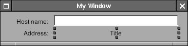&gt;

Create a subclass of NSObject called "Controller", and add two outlets:
"hostname" and "address". Connect the outlet to the NSTextField in the
interface.

**Figure 5-2. Connect outlet**

&gt;

Add an action called "action:" in Controller and connect action of
NSTextField to "action:"

**Figure 5-3. Connect action.**

&gt;

Connect delegate of NSOwner (NSApp in this case) to Controller since
service is associated with NSApp. It will be useful in the later.

**Figure 5-4. Connect delegate of NSApp**

&gt;

Modify Controller.m

`Controller.m`

<table>
<colgroup>
<col style="width: 100%" />
</colgroup>
<tbody>
<tr class="odd">
<td><pre class="PROGRAMLISTING"><code>- (void) action: (id)sender
{
  [address setStringValue: [[NSHost hostWithName: [hostname stringValue]] address]];
}</code></pre></td>
</tr>
</tbody>
</table>

It takes the value in hostname text field and convert into the address.

Now, I want this application be able to use system service provided by
other applications. I only need to add a menu so that menu of system
service can shows up.

`Controller.m`

<table>
<colgroup>
<col style="width: 100%" />
</colgroup>
<tbody>
<tr class="odd">
<td><pre class="PROGRAMLISTING"><code>- (void) awakeFromNib
{
  NSMenu *mainMenu, *serviceMenu;

  mainMenu = [NSApp mainMenu];

  [mainMenu insertItemWithTitle: @&quot;Services&quot;
                         action: NULL
                  keyEquivalent: @&quot;&quot;
                        atIndex: 0];

  serviceMenu = [[NSMenu alloc] initWithTitle: @&quot;Services&quot;];
  [mainMenu setSubmenu: serviceMenu
               forItem: [mainMenu itemWithTitle: @&quot;Services&quot;]];
  [NSApp setServicesMenu: serviceMenu];
  RELEASE(serviceMenu);
}</code></pre></td>
</tr>
</tbody>
</table>

After the Gorm interface is loaded, add a Services menu. The most
important is to assign this menu as the service menu of NSApp. Now,
start this application, type something in the NSTextField, and default
services can be used. The service menu changes depending on the object
you select. If there is no selection, there is no item in the service
menu.

Now, I can provide the service for other applications. Only two things
are need: one is to write the interface of system service, the other is
to implement the system service. The interface of system service is in
the property list of the application. In this case, it is
NSLookupServiceInfo.plist since I name this application as
NSLookupServiceInfo.

`NSLookupServiceInfo.plist`

<table>
<colgroup>
<col style="width: 100%" />
</colgroup>
<tbody>
<tr class="odd">
<td><pre class="PROGRAMLISTING"><code>{
  NSServices = (
    {
      NSPortName = NSLookupService;
      NSMessage = getAddress;
      NSSendTypes = (NSStringPboardType);
      NSMenuItem = {
        default = &quot;Get Address&quot;;
        English = &quot;Get Address&quot;;
      };
      NSKeyEquivalent = {
        default = &quot;G&quot;;
      };
    }
  );
}</code></pre></td>
</tr>
</tbody>
</table>

In property list, NSPortName is the name of the application. NSMessage
is the method I need to implement later. NSSendTypes is the type of
pasteboard to use when other application want to send data to this
application. In other word, this application only accept
NSStringPboardType, not other data type. NSMenuItem and NSKeyEquivalent
is the menu which will show up in the service menu of all the
applications. The menu will show up only when the selection is the type
of string.

As the NSMessage is getAddress, I have to implement getAddress method.
The interface of this method is fixed as:

<table>
<colgroup>
<col style="width: 100%" />
</colgroup>
<tbody>
<tr class="odd">
<td><pre class="PROGRAMLISTING"><code>- (void) getAddress: (NSPasteboard *) pboard
           userData: (NSString *) userData
              error: (NSString **) error</code></pre></td>
</tr>
</tbody>
</table>

getAddress: is the name the same as NSMessage. pboard is the pasteboard
which contain the data from other applications. userData is the string
if you have NSUserData in the property list of NSServices. error is the
error message you want to shows up if something wrong.

Now, let's implement this method in Controller.m

`Controller.m`

<table>
<colgroup>
<col style="width: 100%" />
</colgroup>
<tbody>
<tr class="odd">
<td><pre class="PROGRAMLISTING"><code>- (void) getAddress: (NSPasteboard *) pboard
           userData: (NSString *) userData
              error: (NSString **) error
{
  NSArray *allTypes;
  NSString *name;</code></pre></td>
</tr>
</tbody>
</table>

Check whether pasteboard reall contain NSString type. If not, show the
error.

<table>
<colgroup>
<col style="width: 100%" />
</colgroup>
<tbody>
<tr class="odd">
<td><pre class="PROGRAMLISTING"><code>  allTypes = [pboard types];

  if ( ![allTypes containsObject: NSStringPboardType] )
    {
      *error = @&quot;No string type supplied by pasteboard&quot;;
      return;
    }</code></pre></td>
</tr>
</tbody>
</table>

Get the string out of pasteboard. If there is no string, show the error.

<table>
<colgroup>
<col style="width: 100%" />
</colgroup>
<tbody>
<tr class="odd">
<td><pre class="PROGRAMLISTING"><code>  name = [pboard stringForType: NSStringPboardType]; 

  if (name == nil)
    {
      *error = @&quot;No string value supplied by pasteboard&quot;;
      return;
    }</code></pre></td>
</tr>
</tbody>
</table>

Put the hostname into the NSTextField, check whether it is valid. If
not, show the error. Use -action: to get the address

<table>
<colgroup>
<col style="width: 100%" />
</colgroup>
<tbody>
<tr class="odd">
<td><pre class="PROGRAMLISTING"><code>  [hostname setStringValue: name];
  if ([[NSHost hostWithName: name] address] == nil)
    {
      *error = @&quot;Host name is not valid&quot;;
      return;
    }
  [self action: self];
}</code></pre></td>
</tr>
</tbody>
</table>

Finally, I have to let NSApp know which object in this application
provides the service.

<table>
<colgroup>
<col style="width: 100%" />
</colgroup>
<tbody>
<tr class="odd">
<td><pre class="PROGRAMLISTING"><code>- (void) applicationDidFinishLaunching: (NSNotification *) not
{
  [NSApp setServicesProvider: self];
}</code></pre></td>
</tr>
</tbody>
</table>

In other word, you can have an object specialized for providing service.

You have to install this application to make the service work, and you
have to run **make\_services** so that GNUstep can know there is a new
service. **make\_services** is a tool of GNUstep, and is called in
GNUstep.sh or GNUstep.csh. Therefore, everytime you login, it is called
automatically. If you install new application which offer system
service, you must manually run **make\_services** or login again.

After runing **make\_services**, open Ink. Type something and select them. Now,
service menu of Ink should show the service provide by NSLookupService.
Choose the menu, and NSLookupService will start automatically. If the
selected string is valid hostname, NSLookupService will show its
address, otherwise, Ink will show the error message provided by
NSLookupService.

If I want to get the value back from NSLookupService, it's easy. Add the
return type in property list:

`NSLookupServiceInfo.plist`

<table>
<colgroup>
<col style="width: 100%" />
</colgroup>
<tbody>
<tr class="odd">
<td><pre class="PROGRAMLISTING"><code>{
  NSServices = (
    {
      NSPortName = NSLookupService;
      NSMessage = getAddress;
      NSSendTypes = (NSStringPboardType);
      NSReturnTypes = (NSStringPboardType);
      NSMenuItem = {
        default = &quot;Get Address&quot;;
        English = &quot;Get Address&quot;;
      };
      NSKeyEquivalent = {
        default = &quot;G&quot;;
      };
    }
  );
}</code></pre></td>
</tr>
</tbody>
</table>

The return type is also string in this case. In the end of -getAddress:,
I just need to put the return value back into the pasteboard. Whatever
application use this service will get the return value from the
pasteboard.

`Controller.m`

<table>
<colgroup>
<col style="width: 100%" />
</colgroup>
<tbody>
<tr class="odd">
<td><pre class="PROGRAMLISTING"><code>- (void) getAddress: (NSPasteboard *) pboard
           userData: (NSString *) userData
              error: (NSString **) error
{
  NSArray *allTypes;
  NSString *name;

  allTypes = [pboard types];

  if ( ![allTypes containsObject: NSStringPboardType] )
    {
      *error = @&quot;No string type supplied by pasteboard&quot;;
      return;
    }

  name = [pboard stringForType: NSStringPboardType];

  if (name == nil)
    {
      *error = @&quot;No string value supplied by pasteboard&quot;;
      return;
    }

  [hostname setStringValue: name];
  if ([[NSHost hostWithName: name] address] == nil)
    {
      *error = @&quot;Host name is not valid&quot;;
      return;
    }
  [self action: self];
  /* For return value */
  allTypes = [NSArray arrayWithObject: NSStringPboardType];
  [pboard declareTypes: allTypes owner: nil];
  [pboard setString: [NSString stringWithFormat: @&quot;%@ (%@)&quot;, name, [address stringValue]]
            forType: NSStringPboardType];
}</code></pre></td>
</tr>
</tbody>
</table>

In this case, I return the original string with its address appended.
You can test it in Ink again.

Here is the source code:
[NSLookupService-src.tar.gz](http://gnustep.made-it.com/GSPT/NSLookupService/NSLookupService-src.tar.gz)

------------------------------------------------------------------------

Chapter 6. Regular expressions
========================================================

Regular Expression
--------------------------------------------

Besides application, GNUstep also support library, bundle and tool. Here
is the demonstration of them. I'll write a regular expression library,
which will be used by a tool.

Library is very simple. It's just a collection of classes. Unix usually
have a built-in posix regular expression engine. Here, I wrap it into a
library.

`GNUmakefile`

<table>
<colgroup>
<col style="width: 100%" />
</colgroup>
<tbody>
<tr class="odd">
<td><pre class="PROGRAMLISTING"><code>include $(GNUSTEP_MAKEFILES)/common.make

LIBRARY_NAME = libRegEx

libRegEx_OBJC_FILES = RegEx.m 

libRegEx_HEADERS = RegEx.h 

# The Headers that are to be installed
libRegEx_HEADER_FILES = RegEx.h 

libRegEx_HEADER_FILES_DIR = .
libRegEx_HEADER_FILES_INSTALL_DIR = RegEx

include $(GNUSTEP_MAKEFILES)/library.make</code></pre></td>
</tr>
</tbody>
</table>

That's almost the same as the GNUmakefile for application. It use
LIBRARY\_NAME instead APP\_NAME. libRegEx\_HEADER\_FILES is the files to
be installed as headers. libRegEx\_HEADER\_FILES\_DIR is where the
header files are in the source code.
libRegEx\_HEADER\_FILES\_INSTALL\_DIR is where the headers to be
install. Once this library is installed, the headers should be in
`GNUstep/Local/Library/Headers/RegEx/`. There is a [document for GNUstep
Makefiles
Package](http://www.gnustep.org/resources/documentation/make_toc.html)

Then here is a source code of RegEx class, which use C library

`RegEx.h`

<table>
<colgroup>
<col style="width: 100%" />
</colgroup>
<tbody>
<tr class="odd">
<td><pre class="PROGRAMLISTING"><code>#ifndef _RegEx_H_
#define _RegEx_H_

#include &lt;Foundation/Foundation.h&gt;
#include &lt;regex.h&gt;

@interface RegExPattern : NSObject
{
  regex_t *preg;
  /* Mask could be regex options. For example: REG_ICASE, REG_NEWLINE*/
  unsigned int _mask;
}

+ (RegExPattern *) regexPattern: (NSString *) pattern;

- (id) initWithPattern: (NSString *) pattern options: (unsigned int) mask;
- (regex_t *) pattern;

@end

@interface RegExParser: NSObject
{
}

/* The return range is related to the whole string.
 * Not related to the given range.
 */
+ (NSRange) rangeOfString:(NSString *) pattern
                 inString: (NSString *) string;

+ (NSRange) rangeOfPattern: (RegExPattern *) pattern
                  inString: (NSString *) string;

+ (NSRange) rangeOfString: (NSString *) pattern
                 inString: (NSString *) string
                    range: (NSRange) range;

+ (NSRange) rangeOfPattern: (RegExPattern *) pattern
                  inString: (NSString *) string
                     range: (NSRange) range;
@end

#endif /* _RegEx_H_ */</code></pre></td>
</tr>
</tbody>
</table>

`RegEx.m`

<table>
<colgroup>
<col style="width: 100%" />
</colgroup>
<tbody>
<tr class="odd">
<td><pre class="PROGRAMLISTING"><code>#include &quot;RegEx.h&quot;

@implementation RegExPattern

+ (RegExPattern *) regexPattern: (NSString *) pattern
{
  id object = [[RegExPattern alloc] initWithPattern: pattern
                                            options: REG_EXTENDED];

  return AUTORELEASE(object);
}

- (void) dealloc
{
  regfree(preg);
  free(preg); /* Not sure about this */
  [super dealloc];
}

- (id) initWithPattern: (NSString *) pattern options: (unsigned int) mask
{
  int result;
  char errbuf[255];
  _mask = mask;

  preg = malloc(sizeof(regex_t));
  result = regcomp(preg, [pattern cString], mask);

  if (result != 0)
    {
      regerror(result, preg, errbuf, 255);
      NSLog(@&quot;RegEx Error: Couldn&#39;t compile regex %@: %s&quot;, pattern, errbuf);

      regfree(preg);
      return nil;
    }

  self =  [super init];
  return self;
}

- (regex_t *) pattern
{
  return preg;
}
@end

static  regmatch_t pmatch[1];
static  char errbuf[255];

@implementation RegExParser

+ (NSRange) rangeOfString:(NSString *) pattern
                 inString: (NSString *) string
{
  return [RegExParser rangeOfString: pattern
                           inString: string
                              range: NSMakeRange(0, [string length])];
}

+ (NSRange) rangeOfPattern: (RegExPattern *) pattern
                  inString: (NSString *) string
{
  return [RegExParser rangeOfPattern: pattern
                            inString: string
                               range: NSMakeRange(0, [string length])];
}

+ (NSRange) rangeOfString: (NSString *) pattern
                 inString: (NSString *) string
                    range: (NSRange) range;
{
  return [RegExParser rangeOfPattern: [RegExPattern regexPattern: pattern]
                            inString: string
                               range: range];
}

+ (NSRange) rangeOfPattern: (RegExPattern *) pattern
                  inString: (NSString *) string
                     range: (NSRange) range
{
  int result;
  int location, length;
  int mask = 0;

  /* Considering the situation of beginning line */
  if (range.location != 0)
    mask = mask | REG_NOTBOL;
  if ((range.location + range.length) != [string length])
    mask = mask | REG_NOTEOL;
   
  result = regexec([pattern pattern], 
                   [[string substringWithRange: range] cString],
                   1, pmatch, mask);
  if (result != 0)
    {
      if (result != REG_NOMATCH) 
        {
          regerror(result, [pattern pattern], errbuf, 255);
          NSLog(@&quot;RegEx Error: Couldn&#39;t match RegEx %s&quot;, errbuf);
        }
      return NSMakeRange(NSNotFound, 0);
    }

  location = range.location + pmatch-&gt;rm_so;
  length = pmatch-&gt;rm_eo - pmatch-&gt;rm_so;

  return NSMakeRange(location, length);
}

@end</code></pre></td>
</tr>
</tbody>
</table>

There is nothing special in the RegEx source code. Just use C library
from Objective-C source. After compilation and installation, I can use
it as library.

Here is a little tool to test the library, called **regex\_test**

`GNUmakefile`

<table>
<colgroup>
<col style="width: 100%" />
</colgroup>
<tbody>
<tr class="odd">
<td><pre class="PROGRAMLISTING"><code>include $(GNUSTEP_MAKEFILES)/common.make

TOOL_NAME = regex_test

regex_test_OBJC_FILES = \
        main.m

regex_HEADERS =

ADDITIONAL_TOOL_LIBS += -lRegEx

include $(GNUSTEP_MAKEFILES)/tool.make</code></pre></td>
</tr>
</tbody>
</table>

Again, use TOOL\_NAME instead APP\_NAME. ADDITIONAL\_TOOL\_LIBS include
the new libRegEx library.

`main.m`

<table>
<colgroup>
<col style="width: 100%" />
</colgroup>
<tbody>
<tr class="odd">
<td><pre class="PROGRAMLISTING"><code>#include &lt;Foundation/Foundation.h&gt;
#include &lt;RegEx/RegEx.h&gt;

int main (int argc, const char **argv)
{
  NSRange range;
  NSAutoreleasePool *pool = [NSAutoreleasePool new];

  range = [RegExParser rangeOfString: @&quot;middle&quot;
                            inString: @&quot;head middle end&quot;];
  NSLog(@&quot;%@&quot;, NSStringFromRange(range));

  RELEASE(pool);
  return 0;
}</code></pre></td>
</tr>
</tbody>
</table>

Generally, GNUstep tools are the same as unix commands. You can type the
command name directly with correct path environment variable, or you can
use **opentool** to open GNUstep tools. **opentool** can avoid the
problem of paths if any.

If you want to put all the tools, libraries in a project rather than
many separated directories, you can use the subproject function of
GNUstep-make.

Say I want to put everything in the `~/foo/` directory. Tool is in
`~/foo/`, and library is in `~/foo/RegEx/`. Then the GNUmakefile of this
tool can be:

`GNUmakefile`

<table>
<colgroup>
<col style="width: 100%" />
</colgroup>
<tbody>
<tr class="odd">
<td><pre class="PROGRAMLISTING"><code>include $(GNUSTEP_MAKEFILES)/common.make

SUBPROJECTS = RegEx

TOOL_NAME = regex_test

regex_test_OBJC_FILES = \
        main.m

regex_HEADERS =

ADDITIONAL_TOOL_LIBS += -lRegEx
ADDITIONAL_LIB_DIRS += -LRegEx/$(GNUSTEP_OBJ_DIR)

include $(GNUSTEP_MAKEFILES)/aggregate.make
include $(GNUSTEP_MAKEFILES)/tool.make</code></pre></td>
</tr>
</tbody>
</table>

SUBPROJECTS indicates the subproject is in the directory RegEx.
ADDITIONAL\_LIB\_DIRS can access the compiled library under the
directory RegEx so that I don't need to install the libRegEx first, then
compile the tool. `aggregate.make` told **gmake** that there are
sub-projects so that it will go into the sub-directories.

By doing this, all the source code is under the `~/foo/` directory. Here
is the source
code:[RegEx-1-src.tar.gz](http://gnustep.made-it.com/GSPT/RegEx/RegEx-1-src.tar.gz)

Instead of library, GNUstep support dynamically loaded bundle, which act
as plug-in in other applications. Bundles can be loaded anytime, and
library has to be linked at compilation.

Now, change the RegEx library into bundle.

`GNUmakefile`

<table>
<colgroup>
<col style="width: 100%" />
</colgroup>
<tbody>
<tr class="odd">
<td><pre class="PROGRAMLISTING"><code>include $(GNUSTEP_MAKEFILES)/common.make

BUNDLE_NAME = RegEx
BUNDLE_EXTENSION = .bundle
BUNDLE_INSTALL_DIR = $(GNUSTEP_INSTALLATION_DIR)/Library/Bundles

RegEx_OBJC_FILES = RegEx.m 

RegEx_HEADERS = RegEx.h 

RegEx_PRINCIPAL_CLASS = RegExParser

include $(GNUSTEP_MAKEFILES)/bundle.make</code></pre></td>
</tr>
</tbody>
</table>

Just change LIBRARY to BUNDLE. Most important one is the
RegEx\_PRINCIPAL\_CLASS. You can get the principal class from a bundle
without known its name. That's all for the bundle. No change in source
code.

You have to access the bundle by its path, then get the class inside
either by class name or by principal class. Here is the example:

`GNUmakefile`

<table>
<colgroup>
<col style="width: 100%" />
</colgroup>
<tbody>
<tr class="odd">
<td><pre class="PROGRAMLISTING"><code>include $(GNUSTEP_MAKEFILES)/common.make

SUBPROJECTS = RegEx

TOOL_NAME = regex_test

regex_test_OBJC_FILES = main.m

regex_HEADERS =

include $(GNUSTEP_MAKEFILES)/aggregate.make
include $(GNUSTEP_MAKEFILES)/tool.make</code></pre></td>
</tr>
</tbody>
</table>

`main.m`

<table>
<colgroup>
<col style="width: 100%" />
</colgroup>
<tbody>
<tr class="odd">
<td><pre class="PROGRAMLISTING"><code>#include &lt;Foundation/Foundation.h&gt;
#include &lt;RegEx/RegEx.h&gt;

int main (int argc, const char **argv)
{
  NSRange range;
  NSAutoreleasePool *pool;
  NSArray *paths;
  NSFileManager *fileManager;
  NSString *path;
  NSBundle *bundle;
  Class RegExClass;
  int i;

  pool = [NSAutoreleasePool new];</code></pre></td>
</tr>
</tbody>
</table>

Search the bundle first

<table>
<colgroup>
<col style="width: 100%" />
</colgroup>
<tbody>
<tr class="odd">
<td><pre class="PROGRAMLISTING"><code>  fileManager = [NSFileManager defaultManager];

  /* Search for the bundles */
  paths = NSSearchPathForDirectoriesInDomains(NSLibraryDirectory,
                                              NSLocalDomainMask, YES);

  for (i = 0; i &lt; [paths count]; i++)
    {
      path = [[paths objectAtIndex: i] stringByAppendingPathComponent: @&quot;Bundles/RegEx.bundle&quot;];
      if ([fileManager fileExistsAtPath: path])
        break;
    }</code></pre></td>
</tr>
</tbody>
</table>

Get the bundle by its path. Then get the principalClass, which is the
regular expression parser.

<table>
<colgroup>
<col style="width: 100%" />
</colgroup>
<tbody>
<tr class="odd">
<td><pre class="PROGRAMLISTING"><code>  bundle = [NSBundle bundleWithPath: path];
  RegExClass = [bundle principalClass];</code></pre></td>
</tr>
</tbody>
</table>

Once the class is got, use it as normal class from libraries

<table>
<colgroup>
<col style="width: 100%" />
</colgroup>
<tbody>
<tr class="odd">
<td><pre class="PROGRAMLISTING"><code>  range = [RegExClass rangeOfString: @&quot;middle&quot;
                           inString: @&quot;head middle end&quot;];

  NSLog(@&quot;%@&quot;, NSStringFromRange(range));
  
  RELEASE(pool);
  return 0;
}</code></pre></td>
</tr>
</tbody>
</table>

Here is the source code:
[RegEx-2-src.tar.gz](http://gnustep.made-it.com/GSPT/RegEx/RegEx-2-src.tar.gz)

The advantage of bundle is to load it dynamically. For example, if the
application can't find the RegEx bundle, it can disable the functions at
runtime. In this way, many function can be put into bundle, and
depending on which bundle is installed, an application can offer
different kind of function. Bundle can also be used as plug-in. For
example, an application can have many bundles for different file
formats. They only need to share a common header, either using protocal
or using the same super class. An application can give a file to all the
bundles, and ask which one can handle it. Then use the one to process
the file format. The way to install header of bundles is the same as
library. Use \_HEADER\_FILES in `GNUmakefile` to specify the headers to
install.

Bundle is something really useful in GNUstep. You should take some time
to read the header of it. You can even have some resources (images,
sound) in the bundle.

------------------------------------------------------------------------

Chapter 7. Language support
=====================================================

Localization
--------------------------------------

Localization is pretty simple in GNUstep. Strings in the source code and
in the Gorm interface use different methods to localize. Here, I write
an useless application to demonstrate both localization methods.

Open Gorm, make an interface like this:

**Figure 7-1. Interface of Localization example**

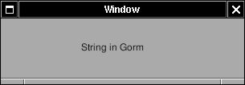&gt;

Make a subclass of NSObject called "AppDelegate" as application
delegate. Add an outlet "window", connect this outlet to the window. I
don't not plan to use this Gorm as main interface. There, I set the
NSOwner to AppDelegate. I'll load this interface manually.

Save the Gorm file as "Localization.gorm". Here is the code of
AppDelegate.

`AppDelegate.h`

<table>
<colgroup>
<col style="width: 100%" />
</colgroup>
<tbody>
<tr class="odd">
<td><pre class="PROGRAMLISTING"><code>#ifndef _AppDelegate_
#define _AppDelegate_

#include &lt;Foundation/NSObject.h&gt;

@interface AppDelegate: NSObject
{
  id window;
}
@end

#endif /* _AppDelegate */</code></pre></td>
</tr>
</tbody>
</table>

`AppDelegate.m`

<table>
<colgroup>
<col style="width: 100%" />
</colgroup>
<tbody>
<tr class="odd">
<td><pre class="PROGRAMLISTING"><code>#include &quot;AppDelegate.h&quot;
#include &lt;AppKit/AppKit.h&gt;

@implementation AppDelegate

- (void) applicationWillFinishLaunching: (NSNotification *) not
{
  NSMenu *menu;</code></pre></td>
</tr>
</tbody>
</table>

The way to localize string in source code is to use bundle. But GNUstep
offer a macro to make thing more easy. By use \_() around the strings,
they are ready to be localized later.

<table>
<colgroup>
<col style="width: 100%" />
</colgroup>
<tbody>
<tr class="odd">
<td><pre class="PROGRAMLISTING"><code>  menu = [[NSMenu alloc] initWithTitle: _(@&quot;Main Menu&quot;)];

  [menu addItemWithTitle: _(@&quot;Hide&quot;)
                  action: @selector(hide:)
           keyEquivalent: @&quot;h&quot;];
  [menu addItemWithTitle: _(@&quot;Quit&quot;)
                  action: @selector(terminate:)
           keyEquivalent: @&quot;q&quot;];

  [NSApp setMainMenu: menu];

  RELEASE(menu);
}

- (void) applicationDidFinishLaunching: (NSNotification *) not
{</code></pre></td>
</tr>
</tbody>
</table>

The Gorm file is loaded manually

<table>
<colgroup>
<col style="width: 100%" />
</colgroup>
<tbody>
<tr class="odd">
<td><pre class="PROGRAMLISTING"><code>  [NSBundle loadNibNamed: @&quot;Localization.gorm&quot; owner: self];
  [window makeKeyAndOrderFront: self];
}

@end</code></pre></td>
</tr>
</tbody>
</table>

Since the main() is so simple, I write it in the same file

<table>
<colgroup>
<col style="width: 100%" />
</colgroup>
<tbody>
<tr class="odd">
<td><pre class="PROGRAMLISTING"><code>int main(int argc, const char **argv)
{
   NSAutoreleasePool *pool = [NSAutoreleasePool new];

   [NSApplication sharedApplication];

   [NSApp setDelegate: [AppDelegate new]];

   NSApplicationMain(argc, argv);

   RELEASE(pool);

   return 0;
}</code></pre></td>
</tr>
</tbody>
</table>

`GNUmakefile`

<table>
<colgroup>
<col style="width: 100%" />
</colgroup>
<tbody>
<tr class="odd">
<td><pre class="PROGRAMLISTING"><code>include $(GNUSTEP_MAKEFILES)/common.make

APP_NAME = Localization

Localization_OBJC_FILES = AppDelegate.m

Localization_HEADERS = AppDelegate.h
Localization_LANGUAGES = English TraditionalChinese

Localization_LOCALIZED_RESOURCE_FILES = \
        Localizable.strings \
        Localization.gorm
include $(GNUSTEP_MAKEFILES)/application.make</code></pre></td>
</tr>
</tbody>
</table>

In GNUmakefile, the most important is the Localization\_LANGUAGES and
Localization\_LOCALIZED\_RESOURCE\_FILES. \_LANGUAGES tell gmake which
language to support. Here are English and TraditionalChinese, which
correspond to the English.lproj/ and TraditionalChinese.lproj/
directories. \_LOCALIZED\_RESOURCE\_FILES are the files in these
language directory. Localizable.strings are the translated string.
Localization.gorm is the interface I just saved from Gorm.

Now, let's look at the English.lproj/Localizable.strings

`Localizable.strings`

<table>
<colgroup>
<col style="width: 100%" />
</colgroup>
<tbody>
<tr class="odd">
<td><pre class="PROGRAMLISTING"><code>&quot;Main Menu&quot; = &quot;Main Menu&quot;;

&quot;Hide&quot; = &quot;Hide&quot;;

&quot;Quit&quot; = &quot;Quit&quot;;</code></pre></td>
</tr>
</tbody>
</table>

Left side are the strings in the source code and surrounded by \_().
Right side are the translated strings. Since it is English translation,
they are the same. But you can still change the string at right side to
see what will happen.

For the traditional Chinese, I just copy Localizable.strings and
Localization.gorm into TraditionalChinese.lproj/ directory. Change the
right side of Localizable.strings into traditional Chinese. And use Gorm
to change every string in the Localization.gorm into Chinese. Then this
application is localized for English and traditional Chinese.

The way an application know which language to use is the NSLanguages in
the user defaults. You can check out the chapter "Languages Setup" in
this tutorial.

Here is the source code:
[Localization-src.tar.gz](http://gnustep.made-it.com/GSPT/Localization/Localization-src.tar.gz).
It contains translation in English and traditional Chinese. You can play
around it and add the support of your native language.

Some people think it is troublesome to make Gorm interfaces for each
languages. The reason for that is that length of strings in each
language may not be the same. A custom-designed interface for each
language would give the best result. That's also the reason why Gorm use
absolute position for graphic interface component. If you would rather
want to use relative position interface system, you should try
[Renaissance](http://www.gnustep.it/Renaissance).

To sum up, use \_() in the source code for every string you want to
localized. Make language.lproj/ directory for each language and specify
the language in GNUmakefile. Put the translation named
"Localizable.strings" in each language.lproj/ directory. Put all
translated Gorm interface in each language.lproj/ directory. That's all.

------------------------------------------------------------------------

Non-blocking I/O
------------------------------------------

GNUstep supports non-blocking I/O on file and network access, which
prevent freezing on user interface and avoid using hard-to-debug thread.
Here I'll make an application which use the Unix command **find** to
search the files. You can also check the Finger in gnustep-examples, which is the
reference of this example.

Use Gorm to make this interface. Adjust the resizing attributes if
needed.

**Figure 7-2. Interface of Search**

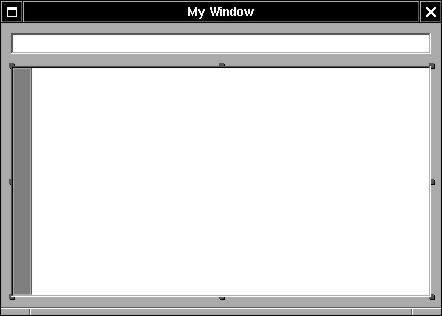&gt;

Make a subclass of NSObject called "Controller" and instaniate it. Add
outlets: "label" and "textView", and connect them to the interface. Add
one action: "searchAction:" and connect NSTextField to the action. Set
Controller object as the delegate of NSOwner (NSApp).

Create the source code of Controller class.

When user hit the ENTER key in the NSTextField, -searchAction: will be
called and use **find** to search the file. GNUstep use NSTask to access
other non-GNUstep command, and use notification to return the result of
non-blocking I/O. Here is the source code of -searchAction:

`Controller.m`

<table>
<colgroup>
<col style="width: 100%" />
</colgroup>
<tbody>
<tr class="odd">
<td><pre class="PROGRAMLISTING"><code>- (void) searchAction: (id) sender
{
  NSString *file;
  NSArray *args;
  NSTask *task;

  file = [sender stringValue];
  args = [NSArray arrayWithObjects: NSHomeDirectory(), @&quot;-name&quot;, file, @&quot;-print&quot;, nil];

  ASSIGN(pipe, [NSPipe pipe]);
  task = [NSTask new];
  [task setLaunchPath: @&quot;/usr/bin/find&quot;];
  [task setArguments: args];
  [task setStandardOutput: pipe];
  fileHandle = [pipe fileHandleForReading];
  [[NSNotificationCenter defaultCenter] addObserver: self
                                        selector: @selector(taskEnded:)
                                        name: NSTaskDidTerminateNotification
                                        object: nil];
  [[NSNotificationCenter defaultCenter] addObserver: self
                                        selector: @selector(readData:)
                                        name: NSFileHandleReadCompletionNotification
                                        object: fileHandle];
  [fileHandle readInBackgroundAndNotify];
  [task launch];
}</code></pre></td>
</tr>
</tbody>
</table>

NSTask requires launching path as the path of the Unix command, and
arguments as the parameters for the command. I redirect the output of
NSTask to a NSPipe, and get a NSFileHandle from this NSPipe so that I
can access the result of NSTask. Once the environment is set up, I add
the Controller as the observer for the notifications, which listens to
the end of task and the end of output.

Finally, I ask the NSFileHandle to read in the background and start the
NSTask. That's the way to use non-blocking I/O on NSFileHandle.

Now, I need the methods for the notification.

`Controller.m`

<table>
<colgroup>
<col style="width: 100%" />
</colgroup>
<tbody>
<tr class="odd">
<td><pre class="PROGRAMLISTING"><code>- (void) readData: (NSNotification *) not
{
  NSData *data = [[not userInfo] objectForKey: NSFileHandleNotificationDataItem]
;
  NSString *string = [[NSString alloc] initWithData: data
                                       encoding: [NSString defaultCStringEncoding]];
  [textView setString: string];
}

- (void) taskEnded: (NSNotification *) not
{
  [[NSNotificationCenter defaultCenter] removeObserver: self];
  [fileHandle closeFile];
}</code></pre></td>
</tr>
</tbody>
</table>

Once the reading of output is ended, notification center will call
-readData: as specified in the -searchAction:. Then I get the output out
of NSFileHandle and put it into NSTextView. Once the task is ended, I
remove the observer for notification and close the NSFileHandle.

About the names and keys to use in notification, you can check the
header of NSFileHandle and NSTask. Here is the source code:
[Search-src.tar.gz](http://gnustep.made-it.com/GSPT/Search/Search-src.tar.gz)

NSFileHandle serve as the port to read and write file, and it can also
be used to access network by connecting to the BSD socket.
GNUstep/OpenSTEP don't have interface for the socket. You have to make
one using C library. But GNUstep offer some extension to access network.
You can check the header for NSFileHandle for GNUstepExtensions
category.

Besides NSFileHandle, NSURL and NSURLHandle also support non-blocking
I/O for access data through URL. In NSURL, set up a client object and
use -loadResourceDataNotifyingClient:usingCache: to read in the
background. The client will receive the data. In NSURLHandle, set up a
client object and use -loadInBackground. That's pretty much the classes
you want them to be non-blocking. If you want to make a class which is
non-blocking, you need to study the run loop of GNUstep, which is out of
the range of this Tutorial.

There is also a [netclasses]() which can be use to access network as
client or server port if you don't want to write the socket in C. It has
been used in several GNUstep projects especially in instant messengers.

------------------------------------------------------------------------

Chapter 8. Advanced GNUstep Programming
=================================================================

1.  [*GNUstep Cookbook*](http://www.roard.com/docs/cookbook/)
