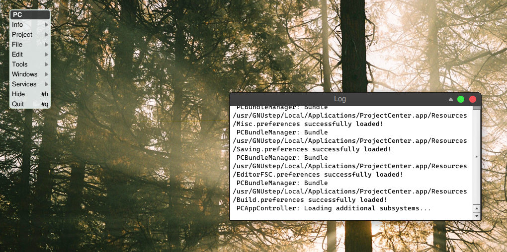
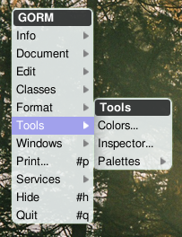
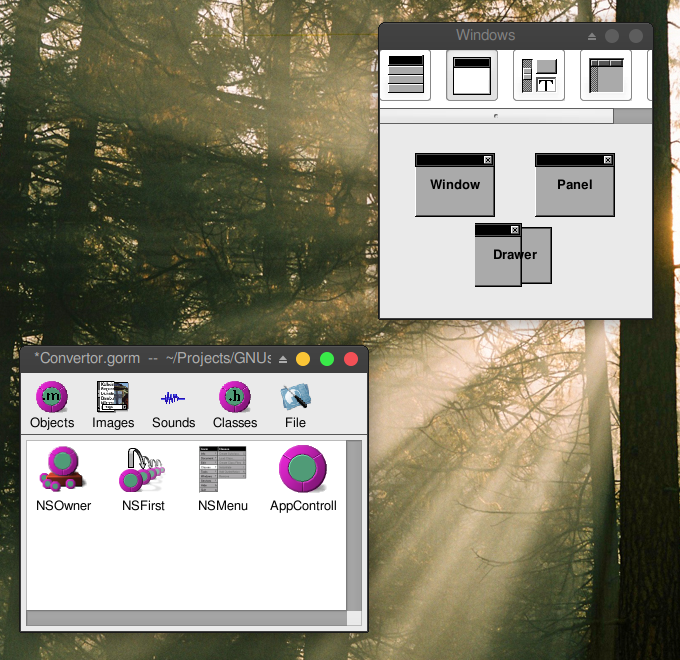

# 2.1 - Designing the UI

## Creating an App

Launch ProjectCenter.app and select <kbd>Project</kbd>&rarr;<kbd>New</kbd>. In the "<u>New Project...</u>" dialog, select Application.
Select the location of your application , give it a name (here we chose "Converter") and press OK.

## Editing the interface file

Select "<u>Interfaces</u>" in the main window browser. The project interface files will appear. Depending on the version of ProjectCenter you might find several versions of the interface (GNUstep Renaissance markup, for example). Since we are concentrating on the graphical editor Gorm, you may safely remove the the other interfaces from the project with <kbd>Project</kbd>&rarr;<kbd>Remove Files</kbd> and using "Project and Disk".

Select `Convertor.gorm` (or `name_of_your_app.gorm`) and click on it. That should launch Gorm automatically and open the file.

## Gorm first contact

Here is what you'll get once you've double-clicked the .gorm file.

If the <u>Palettes and Tools</u> don't display automatically for you, show them using: Select <kbd>Tools</kbd>&rarr;<kbd>Inspector...</kbd> and <kbd>Tools</kbd>&rarr;<kbd>Palettes...</kbd>

Then you'll see the Palettes and Insepector windows.
The Palettes Window contains many palettes. Each of the palettes contains components which can be drag-and-dropped to the interface window.

From the Windows Palette, drag a "Window" into the Gorm Document. A Window will be instantiated and shown.

## Creating the Window

Rename the title of "My Window" to, for example, "Converter".
To do that, check in the Inspector, the Title property. Change it to the name you need (e.g. Converter) and hit enter. The title of the instantiated Window will automatically change.
You may also want to change the name of the Window Object. Although this does not have effect for the user interface, it helps when having many windows and objects instantiated to identify the correct one. Select it and choose Edit->SetName. Set it to something like MainWin: the name is for identification purposes only.
In the Attributes of the Window also tick the Visible at launch time Option. This will show the window automatically when the application is launched.

## Creating the interface

Try to drag-and-drop some Text, Title and Button components to the Converter window. Drag the items you need from the Palette (Controls Palette). Move things in order to obtain an interface that looks close to the following one. Resize the Controls and the window using the Handles.

The interface

You can change the values of the control strings by directly double-clicking and doing in-line editing. Don't forget to press "Enter" or to click OK once you've finished editing the value.

Changing the texts and labels

Change the string values of the components to obtain the following.

The final look

You can readjust the sizes to match the new labels, guidelines will appear to help you aligning the elements and you can also use the arrow keys to do precise movements.