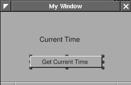
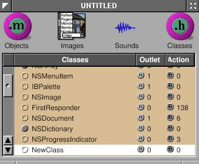

# 3.1 - A Basic Clock

I'll write an application which show the current time with a button to
update. It looks like this:

<span id="AEN509"></span>

**Figure 4-1. Simple TimeMachine**


This application is very easy. Just to show how to use "outlet" and
"action" in Gorm, and the relation between "controller" and "view".

Open Gorm, choose "Document&rarr;New Application", and build a window
with a title and a button.

<span id="AEN516"></span>

**Figure 4-2. Interface of simple TimeMachine**


You can set the title of the button in the inspector. So does the title
of window.

<span id="AEN522"></span>

**Figure 4-3. Change title of button**




That's all I need to do on the interface.

Now, I need an "controller" to receive the action from the "view", and
display the time on the "view". I need to create a object for this
"controller".

First, I need to design the class of this "controller". Click the
"classes" in the main window of Gorm.

<span id="AEN533"></span>

**Figure 4-4. Classes in Gorm**


It will show all the classes you can use. I want the class of this
"controller" to inherit from NSObject. Therefore, choose "NSObject",
then select the menu "Classes&rarr;Create Subclass...". It will create a
new class under the NSObject.

<span id="AEN539"></span>

**Figure 4-5. Create subclass of NSObject**



Double-click on it to change the name. I call it "Controller" here.
That's the name of this class.

<span id="AEN545"></span>

**Figure 4-6. Change class name**


Then I need a "outlet" in this class to connect to the label in the
window, and an "action" which is triggered when the button is press.

Choose the "Controller" class and click "Outlets" tab in the inspector.
Press "Add" button, and change the name to "label" by double-clicking
the "newOutlet". You will notice that "Controller" class now has one
outlet. Click on the small round button will list the outlets it has.

<span id="AEN552"></span>

**Figure 4-7. Add outlet**


Now, click "Actions" tab and add a new action called "showCurrentTime:".
You should notice that the action is ended with colon (:), which will be
explained later.

<span id="AEN561"></span>

**Figure 4-8. Add action**


Once I finish designing this class, I can create an instance from it.

Choose the class "Controller", then select the menu
"Classes&rarr;Instantiate". Look at the objects of Gorm main window. You
should find a new instance, called "Controller". That's the instance I
want to connect to the interface.

<span id="AEN571"></span>

**Figure 4-9. NSOwner**


Now, I can connect the "controller" to the "view" for the outlet. Hold
on "Ctrl", select the "Controller" instance, drag to the label in the
window. Look at the inspector, which will show all the outlet the
"Controller" instance has. Select the only one "label", click the
"connect" button. That's it.

<span id="AEN577"></span>

**Figure 4-10. Connect outlet**


Again, I can connect the "view" to the "controller" for the action. Hold
on "Ctrl", select the button in the window, drag to the "Controller"
instance. Look at the inspector, which will show all the outlet the
button has. Select the "target" in the outlet column, then select the
only one action the target has, "showCurrentTime". Click the "connect"
button. That's it.

<span id="AEN589"></span>

**Figure 4-11. Connect action**


Finally, I need to create the files for this "Controller" class in order
to add the the source code. Otherwise, this class has not function at
all. Select the class "Controller" ( not the instance !) in the Gorm
main window. Choose menu "Classes&rarr;Create Class Files". A "Save"
panel will show up and ask the filename. The default is "Controller.m",
which is good enough. Click "O.K.". Save this Gorm file as
"TimeMachine.gorm", then leave Gorm.

Now, I have a directory, "TimeMachine.gorm", and two file,
"Controller.h" and "Controller.m".

`Controller.h:`

```objc
/* All Rights reserved */

#import <AppKit/AppKit.h>

@interface Controller : NSObject
{
   id label;
}
- (void) showCurrentTime: (id)sender;
@end
```

`Controller.m:`

```objc
/* All Rights reserved */

#import <AppKit/AppKit.h>
#import "Controller.h"

@implementation Controller

- (void) showCurrentTime: (id)sender
{
   /* insert your code here */
}
```

That's the source code of the class "Controller" I just created in Gorm.
The method -showCurrentTime: has the message "sender". That's the reason
the action name in Gorm must has the colon (:) in the end. In the
"Controller.h", you can find the outlet "label" and the action
"showCurrentTime:". Therefore, whatever you do on the outlet "label"
will reflect to the "label" in the interface, and when the button "Get
Current Time" is pressed, the action -showCurrentTime: will be called.
That's how the outlet and action work.

Now, I can put some source code in this class.

`Controller.m:`

```objc
/* All Rights reserved */

#import <AppKit/AppKit.h>
#import "Controller.h"

@implementation Controller

- (void) showCurrentTime: (id)sender
{
   /* insert your code here */
  NSCalendarDate *date = [NSCalendarDate date];
  [date setCalendarFormat: @"%H : %M : %S"];
  [label setStringValue: [date description]];
}
```

First, \[NSCalendarDate date\] will create an instance with the current
date and time. After setting the format, put the description of current
time into the outlet "label". When users click the "Get Current Time"
button, it will show the current time.

That's it. Add the main.m and GNUmakefile, then it is ready to go.

`main.m:`

```objc
#import <AppKit/AppKit.h>

int main(int argc, const char *argv[]) 
{
   return NSApplicationMain (argc, argv);
}
```

`GNUmakefile:`

```makefile
include $(GNUSTEP_MAKEFILES)/common.make

APP_NAME = TimeMachine
TimeMachine_HEADERS = Controller.h
TimeMachine_OBJC_FILES = main.m Controller.m
TimeMachine_RESOURCE_FILES = TimeMachineInfo.plist TimeMachine.gorm
TimeMachine_MAIN_MODEL_FILE = TimeMachine.gorm

include $(GNUSTEP_MAKEFILES)/application.make
```

In this example, the owner of the interface is NSApp, which is the
NSOwner in Gorm, but the controller is the "Controller" instance.
Sometimes, the owner and the controller could be the same. In simple
application, the owner/controller of the window can also be the delegate
of NSApp. That's all depending on the design of your application.