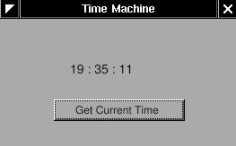
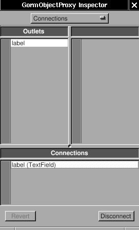

# 3.1 - A Basic Clock

In this section, you'll create an application that shows the time and a button to update it.



This teaches you to make an interface, use outlets and actions, and use the View-Controller paradigm (this app is simple enough that it doesn't need a Model). Most of this you should have already learned in Tutorial #2 (Currency Convertor), but this will be a refresher and a base for you to get started on the next section.

This tutorial does not use ProjectCenter, so please create a folder to work in before starting. I would recommend:

```bash
mkdir -p ~/Projects/GNUstep/GSTutorial/3.1_TimeMachine
cd ~/Projects/GNUstep/GSTutorial/3.1_TimeMachine
```

but of course, you can put your folder wherever you like.

Before you begin, please also choose which text editor you would like to use. If you can't decide, you can try VSCodium, which was used to create this documentation website.

## Making the interface

Open Gorm, choose "Document&rarr;New Application", and build a window
with a title and a button.

<span id="AEN516"></span>

**Figure 4-2. Interface of simple TimeMachine**


You can set the title of the button and the window in the inspector.

<span id="AEN522"></span>

**Figure 4-3. Change title of button**


That's all I need to do on the interface.

## A class

Now, I need an "controller" to receive the action from the "view", and
display the time on the "view". I need to create a object for this
"controller".

First, I need to design the class of this "controller". Click the
<u>Classes</u> tab in the main window of Gorm.

<span id="AEN533"></span>

**Figure 4-4. Classes in Gorm**


It will show all the classes you can use. I want the class of this
"controller" to inherit from `NSObject`. Therefore, choose `NSObject`,
then select the menu "Classes&rarr;Create Subclass...". It will create a
new subclass of `NSObject` called `NewClass`.

<span id="AEN539"></span>

**Figure 4-5. Create subclass of NSObject**


Double-click on it to change the name to `Controller`.

<span id="AEN545"></span>

**Figure 4-6. Change class name**


## Making Outlets and Actions

Then I need a "outlet" in this class to connect to the label in the
window, and an "action" which is triggered when the button is press.

Choose the `Controller` class and click <u>Outlets</u> tab in the inspector.
Press  the <button>Add</button> button, and change the name to `label` by double-clicking
the `newOutlet`. You will notice that the `Controller` class now has one
outlet. Click on the small round button will list the outlets it has.

<span id="AEN552"></span>

**Figure 4-7. Add outlet**


Now, click the <u>Actions</u> tab and add a new action called `showCurrentTime:`.
You should notice that the action name ends with a colon (`:`),
which will be explained later.

<span id="AEN561"></span>

**Figure 4-8. Add action**


## Connecting Outlets and Actions

Once I finish designing this class, I can create an instance from it.

Choose the class `Controller`, then select the menu
"Classes&rarr;Instantiate". Look at the objects of Gorm main window. You
should find a new instance, called `Controller`. That's the instance I
want to connect to the interface.

<span id="AEN571"></span>

**Figure 4-9. NSOwner**


Now, I can connect the "controller" to the "view" for the outlet. Hold
on <kbd>Control</kbd>, select the `Controller` instance, drag to the label in the
window. Look at the inspector, which will show all the outlet the
`Controller` instance has. Select the only one -- `label`, and click the
<button>Connect</button> button. That's it.

<span id="AEN577"></span>

**Figure 4-10. Connect outlet**




Again, I can connect the "view" to the "controller" for the action. 
Hold on <kbd>Control</kbd>, select the button in the window, 
and drag to the `Controller` instance. Look at the inspector, 
which will show all the outlets the button has. 
Select `target` in the <u>Outlets</u> column, then select the
only action the target has, `showCurrentTime`. Click the "<button>Connect</button>
button. That's it.

<span id="AEN589"></span>

**Figure 4-11. Connect action**


## Writing the Code

Finally, I need to create the files for this `Controller` class in order
to add the the source code. Otherwise, this class does not function at
all. Select the class `Controller` (not the instance!) in the Gorm
main window. Choose menu "Classes&rarr;Create Class Files". A **Save**
panel will show up and ask the for the filename. 
The default is `Controller.m`, which is good enough. Click <button>OK</button>. 
Save this Gorm file as `TimeMachine.gorm`, then leave Gorm.

Now, I have a directory, `TimeMachine.gorm`, and two files,
`Controller.h` and `Controller.m`. `TimeMachine.gorm` is a bundle, which means that some file managers treat it like a file.

`Controller.h:`

```objc
/* All Rights reserved */

#import <AppKit/AppKit.h>

@interface Controller : NSObject
{
    id label;
}
- (void) showCurrentTime: (id)sender;
@end
```

`Controller.m:`

```objc
/* All Rights reserved */

#import <AppKit/AppKit.h>
#import "Controller.h"

@implementation Controller

- (void) showCurrentTime: (id)sender {
    /* insert your code here */
}
```

That's the source code of the class `Controller` you just created in Gorm.
The method `-showCurrentTime:` has the argument `sender`. That's the reason
the action name in Gorm must have the colon (`:`) in the end. In
`Controller.h`, you can find the outlet `label` (as an instance variable) and the action
`showCurrentTime:`. Therefore, whatever you do on the outlet `label`
will reflect to the `label` variable, and when the button 
<button>Get Current Time</button> is pressed, the action `-showCurrentTime:` will be called.
That's how outlets and actions work.

Now, I can put some source code in this class.

`Controller.m:`

```objc
/* All Rights reserved */

#import <AppKit/AppKit.h>
#import "Controller.h"

@implementation Controller

- (void) showCurrentTime: (id)sender {
    NSCalendarDate* date = [NSCalendarDate date];
    [date setCalendarFormat: @"%H:%M:%S"];
    [self->label setStringValue: [date description]];
}
```

First, `[NSCalendarDate date]` will create an instance with the current
date and time. After setting the format, we put the description of current
time into the outlet `label`. When users click the <button>Get Current Time</button>
button, it will show the current time.

Technically, `self->label` is not good style, but it's way easier to understand that way, rather than just doing `label`. And if you created the method implementation yourself, as a function, you *have* to write `self->label`.

That's it. Add the `main.m` and `GNUmakefile`, then it is ready to go.

`main.m:`

```objc
#import <AppKit/AppKit.h>

int main(int argc, const char *argv[]) {
    return NSApplicationMain(argc, argv);
}
```

`GNUmakefile:`

```makefile
include $(GNUSTEP_MAKEFILES)/common.make

APP_NAME = TimeMachine
TimeMachine_HEADERS = Controller.h
TimeMachine_OBJC_FILES = main.m Controller.m
TimeMachine_RESOURCE_FILES = TimeMachineInfo.plist TimeMachine.gorm
TimeMachine_MAIN_MODEL_FILE = TimeMachine.gorm

include $(GNUSTEP_MAKEFILES)/application.make
```

In this example, the owner of the interface is `NSApp`, which is the
`NSOwner` in Gorm, but the controller is the `Controller` instance.
Sometimes, the owner and the controller could be the same. In simple
applications, the owner/controller of the window can also be the delegate
of `NSApp.` That's all depending on the design of your application.