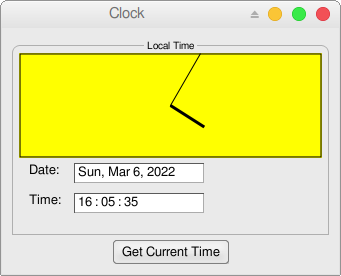
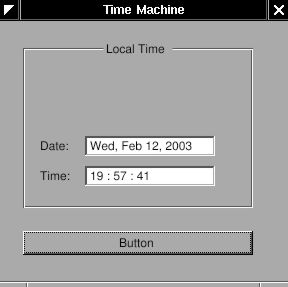
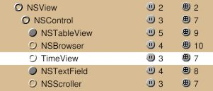
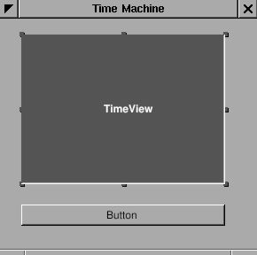
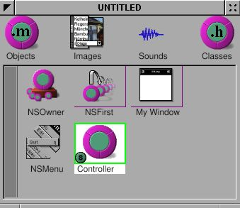

# 3.2 - Analog Clock

In this section, you will add an analog clock to your clock application.



In order to do this, you will create a custom view and use `NSBezierPath` to draw on it.

You can either work on your project folder from the previous section, or copy that folder.

You could also start over -- it seems like this guide was meant for starting over.

## Custom views

Gorm can work on custom views, which are designed by the programmer,
and not supplied by the Application Kit.

In this section, we'll start off by adding a custom view:

<span id="AEN625"></span>

**Figure 4-12. TimeMachine with custom view**



Since I want to use the custom view in Gorm, I have to design the class
first. The custom view can inherit from `NSView`, or `NSControl`, depending
on what kind of functions you want. Actually, `NSControl` is a subclass of
`NSView`. So I will inherit from `NSControl`. Click on the small circle of
`NSResponder` to open its subclasses, then do the same thing on `NSView` and
`NSControl`. Now, you can see that many GUI components inherit from
`NSControl`, ex. `NSTextField`.

<span id="AEN631"></span>

**Figure 4-13. `NSControl` in Gorm**


## Creating a custom view

I want my custom view, called `TimeView`, to inherit from `NSControl`. Choose
`NSControl`, then select the menu item "Classes&rarr;Create Subclass...".
Double-click to change the name.

<span id="AEN637"></span>

**Figure 4-14. Add subclass of `NSControl`**



You can notice that class `TimeView` also inherits 3 outlets and 7
actions from `NSControl`. Once the class `TimeView` is created, I can use
it as a custom view.

Build the interface as below:

<span id="AEN644"></span>

**Figure 4-15. Interface with custom view**


Look at the <u>Attributes</u> tab in the inspector for `CustomView`. 
Choose the class `TimeView`.

<span id="AEN650"></span>

**Figure 4-16. Change class of custom view**


The `CustomView` becomes `TimeView`. That's it !

<span id="AEN656"></span>

**Figure 4-17. Custom view with `TimeView` class**



As I did before, create another class for the "controller". Add one
outlet for this `TimeView`, and one action for the button. Name the
outlet `timeView` and the action `showCurrentTime:`.

<span id="AEN662"></span>

**Figure 4-18. Add outlet**


<span id="AEN667"></span>

**Figure 4-19. Add action**


Create an instance of `Controller`. Connect the button to the
action `showCurrentTime:`, and the outlet `timeView` to the custom view
`TimeView`.

<span id="AEN673"></span>

**Figure 4-20. Connect outlet**




Finally, create the class file for the classes `TimeView` and
`Controller`. Save this application as `TimeMachine.gorm`.

## Coding our custom view

Now, we need to code the class `TimeView`. The class
`TimeView` is actually four `NSTextField`s in an `NSBox`. The reason that I
made them in one class is because I can reuse it later on. Classes
inherited from `NSView` will be initialized by calling method
`-initWithFrame:`. Therefore, I only need to rewrite the method
`-initWithFrame:` in the class `TimeView`. Here are the files:

`TimeView.h:`

```objc
#import <AppKit/AppKit.h>

@interface TimeView : NSControl
{
    NSTextField *labelDate, *labelTime;
    NSTextField *localDate, *localTime;
    NSCalendarDate* date;
}

- (NSCalendarDate*) date;
- (void) setDate: (NSCalendarDate*) date;

@end
```

`TimeView.m:`

```objc
#import <AppKit/AppKit.h>
#import "TimeView.h"

@implementation TimeView
- (id) initWithFrame: (NSRect) frame {
    NSBox *box;

    self = [super initWithFrame: frame];
    box = [[NSBox alloc]
            initWithFrame: NSMakeRect(
              0, 0, // x=0, y=0
              frame.size.width,
              frame.size.height
            )
          ];
    [box setBorderType: NSGrooveBorder];
    [box setTitlePosition: NSAtTop];
    [box setTitle: @"Local Time"];

    self->labelDate = [[NSTextField alloc]
                        initWithFrame: NSMakeRect(10, 45, 35, 20)];
                                 // x=10, y=45, width=35, height=20
    [self->labelDate setStringValue: @"Date: "];
    [self->labelDate setBezeled: NO];
    [self->labelDate setBackgroundColor: [NSColor windowBackgroundColor]];
    [self->labelDate setEditable: NO];

    self->labelTime = [[NSTextField alloc] 
                        initWithFrame: NSMakeRect(10, 15, 35, 20)];
                                 // x=10, y=15, width=35, height=20
    [self->labelTime setStringValue: @"Time: "];
    [self->labelTime setBezeled: NO];
    [self->labelTime setBackgroundColor: [NSColor windowBackgroundColor]];
    [self->labelTime setEditable: NO];

    self->localDate = [[NSTextField alloc]
                        initWithFrame: NSMakeRect(55, 45, 130, 20)];
    self->localTime = [[NSTextField alloc]
                        initWithFrame: NSMakeRect(55, 15, 130, 20)];

    [box addSubview: self->labelDate];
    [box addSubview: self->labelTime];
    [box addSubview: self->localDate];
    [box addSubview: self->localTime];
    [self->labelDate release];
    [self->labelTime release];
    [self->localDate release];
    [self->localTime release];

    [self addSubview: box];
    [box release];

    return self;
}

- (NSCalendarDate *) date {
   return self->date;
}

- (void) setDate: (NSCalendarDate *) aDate {
   self->date = aDate;
   [self->date setCalendarFormat: @"%a, %b %e, %Y"];
   [self->localDate setStringValue: [self->date description]];
   [self->date setCalendarFormat: @"%H : %M : %S"];
   [self->localTime setStringValue: [self->date description]];
}

- (void) dealloc {
    [self->date release];
    [super dealloc];
}

@end
```

When Gorm generates the class files, it contains template code in
it. Since we don't need any of the template code, we can safely remove them. In
`TimeView.h`, we declare four `NSTextField`s to add to our view, and one
`NSCalendarDate` to store the date. We also declare two accessory methods
to set and get the date. In `-initWithFrame:`, we put four `NSTextField`s into an `NSBox`. And since class `TimeView` is a subclass of
NSView, we add the `NSBox` as the subview of our `TimeView`.

Other parts of this application should be very easy. Here are the files:

`Controller.h:`

```objc
#import <AppKit/AppKit.h>
#import "TimeView.h"

@interface Controller : NSObject
{
   id timeView;
}
- (void) showCurrentTime: (id)sender;
@end
```

`Controller.m:`

```objc
#import <AppKit/AppKit.h>
#import "Controller.h"

@implementation Controller

- (void) showCurrentTime: (id)sender {
    NSCalendarDate *date = [NSCalendarDate date];
    [self->timeView setDate: date];
}

@end
```

`main.m:`

```objc
#import <AppKit/AppKit.h>

int main(int argc, const char *argv[]) {
   return NSApplicationMain (argc, argv);
}
```

`GNUmakefile:`

```makefile
include $(GNUSTEP_MAKEFILES)/common.make

APP_NAME = TimeMachine
TimeMachine_HEADERS = Controller.h TimeView.h
TimeMachine_OBJC_FILES = main.m Controller.m TimeView.m
TimeMachine_RESOURCE_FILES = TimeMachineInfo.plist TimeMachine.gorm
TimeMachine_MAIN_MODEL_FILE = TimeMachine.gorm

include $(GNUSTEP_MAKEFILES)/application.make
```

You should notice that I didn't instantiate the class `TimeView` in
the class `Controller` because when I add an custom view to the window, it
is instantiated automatically. I only need to specify the class the
custom view should be. On the contrary, I have to instantiate the class
`Controller` in Gorm because it is not a GUI component. Without
instantiation, I can't connect the "controller" to the "view".

If you encounter a compiler error, please see [the note below](#CompileNote).

```{figure} 3.2_nfig20.5.png
Our app right now.
```

------------------------------------------------------------------------

## Drawing on our custom view

Now, let's make an analog clock using our custom view:

<span id="AEN710"></span>

```{figure} 3.2_nfig21.png
Custom view with analog clock
```

It's very simple. We only need to add a new GUI component in the class
TimeView. We'll call this new class `ClockView`. Since `ClockView` will be
a subview of `TimeView`, when `TimeView` is updated, we also need to
update the `ClockView`.

`ClockView.h:`

```objc
#import <AppKit/AppKit.h>
#import <math.h>

@interface ClockView : NSView
{
    NSPoint posHour, posMinute;
}

- (void) setDate: (NSCalendarDate *) aDate;
@end
```

`ClockView.m:`

```objc
#import "ClockView.h"

@implementation ClockView
- (id) init {
    self = [super init];
    self->posHour = NSMakePoint(0,0);
    self->posMinute = NSMakePoint(0,0);
    return self;
}

- (void) drawRect: (NSRect) frame {
    NSPoint origin = NSMakePoint(frame.size.width/2, frame.size.height/2);

    NSBezierPath* BP = [NSBezierPath bezierPathWithRect: [self bounds]];
    [[NSColor yellowColor] set];
    [BP fill];

    BP = [NSBezierPath bezierPathWithRect: NSMakeRect(1, 1,
                                                        frame.size.width-2,
                                                        frame.size.height-2)];
    [[NSColor blackColor] set];
    [BP stroke];

    BP = [NSBezierPath bezierPath];
    [BP setLineWidth: 3];
    [BP moveToPoint: origin];
    [BP relativeLineToPoint: self->posHour];
    [BP stroke];

    [BP setLineWidth: 1];
    [BP moveToPoint: origin];
    [BP relativeLineToPoint: self->posMinute];
    [BP stroke];
}

- (void) setDate: (NSCalendarDate *) date {
    int hour = [date hourOfDay];
    int minute = [date minuteOfHour];
    float hour_x = 40*sin((M_PI*hour/6)+(M_PI*minute/360));
    float hour_y = 40*cos((M_PI*hour/6)+(M_PI*minute/360));
    float minute_x = 60*sin(M_PI*minute/30);
    float minute_y = 60*cos(M_PI*minute/30);

    self->posHour = NSMakePoint(hour_x, hour_y);
    self->posMinute = NSMakePoint(minute_x, minute_y);
    [self setNeedsDisplay: YES];
}

@end
```

`ClockView` inherits from `NSView`. The most important method it should
override is `-drawRect:`. When this view need to update, `-drawRect:` will
be called. Therefore, I put all the drawing in this method. `NSBezierPath`
is how GNUstep draws. I assign the path, set the color, then draw. There
is a good article about drawing: [*Introduction to Cocoa Graphics, Part
I*](https://web.archive.org/web/20120313141602if_/http://www.macdevcenter.com/pub/a/mac/2001/10/19/cocoa.html), [*Part
II*](https://web.archive.org/web/20120313141607if_/http://macdevcenter.com/pub/a/mac/2001/11/06/cocoa.html).

```{admonition} Exercise
A bit of code is needed to include `ClockView` in `TimeView`. One is to add
ClockView as a subview of `NSBox` in `TimeView`. Another is to update
ClockView when `TimeView` is update. In method -setDate: of `ClockView`, it
uses `[self setNeedsDisplay: YES]` to make this view update. This
modification is easy to do. You can play around it.

If you don't want to do this exercise, you can see the modifications below.
```

## Adding the analog clock to our custom view

`TimeView.h`:

```objc
#import <AppKit/AppKit.h>
#import "ClockView.h"

@interface TimeView : NSControl
{
    NSTextField *labelDate, *labelTime;
    NSTextField *localDate, *localTime;
    NSCalendarDate* date;
    ClockView* clockView;
}

- (NSCalendarDate*) date;
- (void) setDate: (NSCalendarDate*) date;

@end
```

`TimeView.m`:

```objc
#import <AppKit/AppKit.h>
#import "TimeView.h"

@implementation TimeView
- (id) initWithFrame: (NSRect) frame {
    NSBox *box;

    self = [super initWithFrame: frame];
    box = [[NSBox alloc]
            initWithFrame: NSMakeRect(
              0, 0, // x=0, y=0
              frame.size.width,
              frame.size.height
            )
          ];
    [box setBorderType: NSGrooveBorder];
    [box setTitlePosition: NSAtTop];
    [box setTitle: @"Local Time"];

    self->clockView = [[ClockView alloc]
                        initWithFrame: NSMakeRect(
                          0, 70, // x=0, y=70 
                          frame.size.width,
                          frame.size.height
                        )
                      ];
    self->labelDate = [[NSTextField alloc]
                        initWithFrame: NSMakeRect(10, 45, 35, 20)];
                                 // x=10, y=45, width=35, height=20
    [self->labelDate setStringValue: @"Date: "];
    [self->labelDate setBezeled: NO];
    [self->labelDate setBackgroundColor: [NSColor windowBackgroundColor]];
    [self->labelDate setEditable: NO];

    self->labelTime = [[NSTextField alloc] 
                        initWithFrame: NSMakeRect(10, 15, 35, 20)];
                                 // x=10, y=15, width=35, height=20
    [self->labelTime setStringValue: @"Time: "];
    [self->labelTime setBezeled: NO];
    [self->labelTime setBackgroundColor: [NSColor windowBackgroundColor]];
    [self->labelTime setEditable: NO];

    self->localDate = [[NSTextField alloc]
                        initWithFrame: NSMakeRect(55, 45, 130, 20)];
    self->localTime = [[NSTextField alloc]
                        initWithFrame: NSMakeRect(55, 15, 130, 20)];

    [box addSubview: self->clockView];
    [box addSubview: self->labelDate];
    [box addSubview: self->labelTime];
    [box addSubview: self->localDate];
    [box addSubview: self->localTime];
    [self->clockView release];
    [self->labelDate release];
    [self->labelTime release];
    [self->localDate release];
    [self->localTime release];

    [self addSubview: box];
    [box release];

    return self;
}

- (NSCalendarDate *) date {
    return self->date;
}

- (void) setDate: (NSCalendarDate *) aDate {
    self->date = aDate;
    [self->date setCalendarFormat: @"%a, %b %e, %Y"];
    [self->localDate setStringValue: [self->date description]];
    [self->date setCalendarFormat: @"%H : %M : %S"];
    [self->localTime setStringValue: [self->date description]];

    [self->clockView setDate: self->date];
}

- (void) dealloc {
    [self->date release];
    [super dealloc];
}

@end
```

`GNUmakefile`:

```objc
include $(GNUSTEP_MAKEFILES)/common.make

APP_NAME = TimeMachine
TimeMachine_HEADERS = Controller.h TimeView.h ClockView.h
TimeMachine_OBJC_FILES = main.m Controller.m TimeView.m ClockView.m
TimeMachine_RESOURCE_FILES = TimeMachineInfo.plist TimeMachine.gorm
TimeMachine_MAIN_MODEL_FILE = TimeMachine.gorm

# Uncomment below if you get a compiler error about "undefined symbol: _Z15_Unwind_VRS_Set..."
ADDITIONAL_LDFLAGS += -lgcc_s

include $(GNUSTEP_MAKEFILES)/application.make
```

```{figure} 3.2_nfig21.png
Our app right now.
```

## Building our app

<span id="CompileNote"></span>

### Note

After compiling, I got the following error:

```
/home/pi/Projects/GNUstep/GSTutorial/3.1_TimeMachine/TimeMachine.app/TimeMachine: symbol lookup error: /usr/local/lib/libobjc.so.4.6: undefined symbol: _Z15_Unwind_VRS_SetP15_Unwind_Context20_Unwind_VRS_RegClassj30_Unwind_VRS_DataRepresentationPv
```

which is complaining that the function

```c++
_Unwind_VRS_Set(_Unwind_Context*, _Unwind_VRS_RegClass, unsigned int, _Unwind_VRS_DataRepresentation, void*)
```

was not found.

You can work around this by adding

```makefile
ADDITIONAL_LDFLAGS += -lgcc_s # Link to GCC C++ runtime
# or
ADDITIONAL_LDFLAGS += -lstdc++ # Link to GCC C runtime
# or
ADDITIONAL_LDFLAGS += -lc++ # Link to Clang C++ runtime
```

to your `GNUmakefile`, before the `include $(GNUSTEP_MAKEFILES)/application.make`.