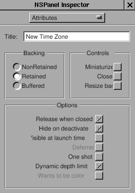
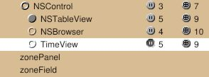
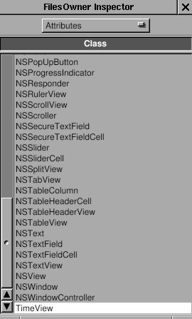
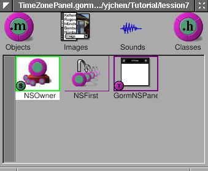
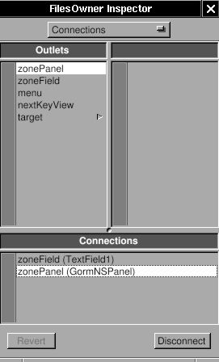
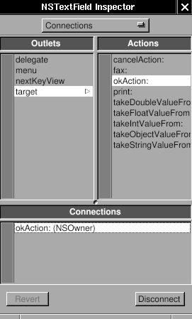
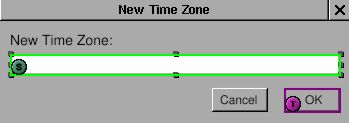

# 3.3 - New Time Zone Dialog

A Panel is a special kind of window. Read the Cocoa document for more
details: [*Windows and
Panels*](http://developer.apple.com/techpubs/macosx/Cocoa/TasksAndConcepts/ProgrammingTopics/WinPanel/index.html).

Since I have a clock already, I want to know the time in different time
zones. My idea is that when I click the title of the NSBox, a panel will
show up and ask the time zone. Once the time zone is inputted, it will
display the time in that area. Since NSPanel is a subclass of NSWindow,
the usage of NSPanel is similar to the NSWindow. Again, I need a
"controller" to control the "view", which is NSPanel in this case.
"View" is generated by Gorm, and I need to write the "controller" by
myself. In this example, I'll show how to load the gorm file. There are
many built-in panel in GNUstep. I also use one in this example.

Firstly, I need to build the interface for the panel. Open Gorm, Choose
menu "Document &rarr; New Module &rarr; New Empty". Look at the palettes.
There is one for panel.

<span id="AEN734"></span>

**Figure 4-22. Panel in Gorm**


Drag the panel out of palettes. Build the interface as below.

<span id="AEN740"></span>

**Figure 4-23. Interface of time zone panel**


You can change the size of panel in the inspector. Here is the
attributes of this panel I use.

<span id="AEN746"></span>

**Figure 4-24. Panel attributes**



Now, I got the "view". Then where is the "controller" ? Generally, I can
write a new class as the controller of this view, but this is a small
program. It is not necessary to write a new class only as the
controller. So I decide to use the class "TimeView" as the controller
for this panel. So class "TimeView" acts as the custom view for that
main window interface, and the controller for the panel. Since
"TimeView" is the controller of this panel, I need to connect the
outlets and actions. Therefore, I need to create the class "TimeView"
again in this gorm file, even though there is already one in
TimeMachine.gorm file.

You already know how to create the class "TimeView". I add two outlets,
"zonePanel" and "zoneField", and two actions, "okAction:" and
"cancelAction:".

<span id="AEN753"></span>

**Figure 4-25. Outlets for time zone panel**



<span id="AEN758"></span>

**Figure 4-26. Actions for time zone panel**


But rather than creating an instance to connect the panel, I'll set the
owner of this panel as the class "TimeView". The advantage is that I can
reduce the number of instances to use.

Select the NSOwner in Gorm main window, then select class "TimeView" in
"attributes" of inspector.

<span id="AEN765"></span>

**Figure 4-27. Set NSOwner to TimeView class**




By this way, I can connect the panel to the NSOwner, which is an
instance of class "TimeView". Connect the two buttons to the actions in
NSOwner, the outlet "zoneField" to the NSTextField in panel, and the
outlet "zonePanel" to the panel. Pay attention to how the NSOwner
connects to the panel.

<span id="AEN774"></span>

**Figure 4-28. Connect outlet**





Save this interface as "TimeZonePanel.gorm" file, and quit Gorm. Don't
generate the files for class "TimeView" because I already have the
files. GNUstep can figure out where the classes are and where the
outlets/actions are.

Now, I need to add the new outlets and actions into the files of
"TimeView". Here is the header.

`TimeView.h:`

```objc
#import <AppKit/AppKit.h>
#import "ClockView.h"

@interface TimeView : NSControl
{
   id zonePanel;
   id zoneField;
   NSBox *box;
   NSTextField *labelDate, *labelTime;
   NSTextField *localDate, *localTime;
   NSCalendarDate *date;
   ClockView *clockView;
}

- (NSCalendarDate *) date;
- (void) setDate: (NSCalendarDate *) date;
- (void) okAction: (id) sender;
- (void) cancelAction: (id) sender;
@end
```

I add the outlets and actions by myself.

`TimeView.m:`

```objc
- (void) mouseDown: (NSEvent *) event
{
   NSRect titleFrame = [box titleRect];
   NSPoint windowLocation = [event locationInWindow];
   NSPoint viewLocation = [self convertPoint: windowLocation fromView: [self superview]];
   BOOL status = NSMouseInRect(viewLocation, titleFrame, NO);
   if (status == YES)
     {
       [NSBundle loadNibNamed: @"TimeZonePanel.gorm" owner: self]; 
       [NSApp runModalForWindow: zonePanel];
     }
}
```

The method -mouseDown: is called when mouse is clicked within this view.
Here, I calculate whether the mouse is clicked in the area of the title
of NSBox. If so, use \[NSBundle loadNibName: owner:\] to load the
window, and \[NSApp runModalForWindow\] display it. Read Cocoa's
document about "[*How Modal Windows
Work*](http://developer.apple.com/techpubs/macosx/Cocoa/TasksAndConcepts/ProgrammingTopics/WinPanel/Concepts/UsingModalWindows.html#CJBEADBA)".

Now, I just need to finish the actions part in `TimeView.m`.

`TimeView.m:`

```objc
- (void) cancelAction: (id) sender
{
   [NSApp abortModal];
   [zonePanel close];
}

- (void) okAction: (id) sender
{
   NSTimeZone *tempZone;
   tempZone = [NSTimeZone timeZoneWithName: [zoneField stringValue]];
   [NSApp stopModal];
   [zonePanel close];
   if (tempZone == nil)
      {
         NSRunAlertPanel(@"Warning!",
                         @"Wrong Time Zone !!",
                         @"OK", nil, nil);
      }
   else
      {
         [date setTimeZone: tempZone];
         [box setTitle: [tempZone description]];
         [self setDate: date];
      }
}
```

In method -okAction:, I use a built-in panel, NSRunAlertPanel. There are
several built-in panels in GNUstep ready to use. Now, you can display
the current time in different time zone.

It is inconvenient to use this pop-up panel because you have to click
the NSTextField before typing. Sometimes, it is more convenient to
control the user interface via keyboard rather than mouse. Here, I touch
a little bit this topic to make the panel more easy to use.

When a window pop-up, it is the first object to receive events and
key-in. It is called the "First Responder". But usually we want some
other objects in this window to receive the key-in. Therefore, we need
to change the "first responder" of this window, which I can do that by
using \[NSWindow makeFirstResonpder:\].

When I want to use "Tab" key to switch between different views in the
window, I need to assign the "nextKeyView" for the next view when "Tab"
key is pressed so that the application know where the responder should
be.

Finally, when I finish typing in the NSTextField, I want to hit the
"Return" key equivalent to press the "OK" button by mouse so that I
don't need to move my hand out of the keyboard. In this case, since
NSTextField is also a subclass of NSControl, I can set the target and
action of NSTextField the same as the NSButton "OK". Therefore, when I
hit the "Return", it is equivalent to click on the "OK" button.

These are small tune-ups for the application, but it makes users more
easy to use the application.

Firstly, let's set the "first responder" of the window to the
NSTextField:

`TimeView.m:`

```objc
- (void) mouseDown: (NSEvent *) event
{
   NSRect titleFrame = [box titleRect];
   NSPoint windowLocation = [event locationInWindow];
   NSPoint viewLocation = [self convertPoint: windowLocation fromView: [self superview]];
   BOOL status = NSMouseInRect(viewLocation, titleFrame, NO);
   if (status == YES)
      {
         [NSBundle loadNibNamed: @"TimeZonePanel.gorm" owner: self]; 
         [zonePanel makeFirstResponder: zoneField];
         [NSApp runModalForWindow: zonePanel];
      }
}
```

Only one line is enough. Now, when this panel shows up, the cursor will
automatically in the NSTextField, and this NSTextField are ready to
type.

Secondly, I want to set the target and action of NSTextField the same as
the NSButton "O.K.". Open the TimeZonePanel.gorm, connect the
NSTextField to the method -okAction: of the NSOwner. That's it. Whenever
you hit the "Return" key in the NSTextField, the method -okAction: is
called.

<span id="AEN814"></span>

**Figure 4-29. Connection NSTextField action**




Thirdly, I need to connect the nextKeyView outlet between the views in
the window. I'll connect the nextKeyView of NSTextField to NSButton
"O.K.", the nextKeyView outlet of NSButton "O.K." to NSButton "Cancel",
and the nextKeyView outlet of NSButton "Cancel" to the NSTextField. By
doing that, I can switch between these views by "Tab" key. Here, I just
show how the nextKeyView of NSTextField connects to NSButton "O.K.". You
can do the rest of the part.

<span id="AEN826"></span>

**Figure 4-30. Connect nextKeyView**




Source code:
[Panel-src.tar.gz](http://gnustep.made-it.com/GSPT/Panel/Panel-src.tar.gz).