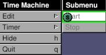
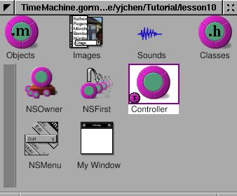
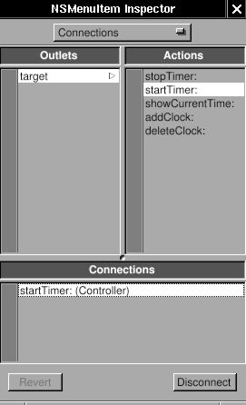

# 3.4 - Multiple Clocks

Since I can change the time zone, I would like to display several clock
at the same window, and adjust the number of clocks dynamically. First,
I need to add new submenu: "Edit", and two menu item in it: "Add Clock"
and "Delete Clock". Then add two action in the class "Controller":
"addClock:" and "deleteClock". Connect the menu item to the action in
the instance of class "Controller" in the gorm file. Then I have done
the part of interface. When user select the menu item "Add Clock", the
method "addClock:" will be called, so does the menu item "Delete Clock".

Now, how do I manage these clocks dynamically ? I can trace each of them
manually, but it will be complicated. Another way is that I don't trace
any of them, but the problem is how do it control any of them ? I can
use the notification in GNUstep, which is a pretty handy way to
communicate between objects.

Here is a related article:
[*NSNotificationCenter*](https://web.archive.org/web/20030424000148if_/http://cocoadevcentral.com/articles/000029.php)

Firstly, I need to adjust the interface according to the adding and
deleting clock. I need trace how many clocks exist so that I won't
accidentally delete the last clock.

`Controller.h:`

```objc
#import <AppKit/AppKit.h>
#import "TimeView.h"

@interface Controller : NSObject
{
   id timeView;
   unsigned int totalNumber;
}

- (void) showCurrentTime: (id) sender;
- (void) addClock: (id) sender;
- (void) deleteClock: (id) sender;
@end
```

I add a variable, totalNumber to trace the number of clocks, and add two
actions manually since I didn't generate the class files from Gorm.

`Controller.m:`

```objc
- (id) init
{
   self = [super init];
   totalNumber = 1;
   return self;
}

- (void) addClock: (id) sender
{
   TimeView *aView;
   NSWindow *mainWindow = [NSApp mainWindow];
   NSRect windowFrame, timeViewFrame;
   windowFrame = [mainWindow frame];
   timeViewFrame = [timeView frame];

   [mainWindow setFrame: NSMakeRect(windowFrame.origin.x,    
                                    windowFrame.origin.y,
                                    windowFrame.size.width+timeViewFrame.size.width, 
                                    windowFrame.size.height)
                display: YES];
   aView = [[TimeView alloc] initWithFrame: NSMakeRect(timeViewFrame.origin.x + totalNumber*timeViewFrame.size.width,
                                                       timeViewFrame.origin.y,
                                                       timeViewFrame.size.width,
                                                       timeViewFrame.size.height)];
   
   [[mainWindow contentView] addSubview: aView];
   RELEASE(aView);
   totalNumber ++;
}

- (void) deleteClock: (id) sender
{
   NSArray *subviews;
   NSWindow *mainWindow = [NSApp mainWindow];
   NSRect windowFrame, timeViewFrame;
   int i;
   windowFrame = [mainWindow frame];
   timeViewFrame = [timeView frame];

   subviews = [[mainWindow contentView] subviews];

   for (i = [subviews count]-1; i > 1; i--) 
     {
       if ([[subviews objectAtIndex: i] isMemberOfClass: [TimeView class]])  
       [[subviews objectAtIndex: i] removeFromSuperview];
       totalNumber--;
       [mainWindow setFrame: NSMakeRect(windowFrame.origin.x,
                                        windowFrame.origin.y,
                                        windowFrame.size.width-timeViewFrame.size.width,
                                        windowFrame.size.height)
                    display: YES];
       break;
     }
}
```

In the method -init, I initiate the variable, totalNumber, as 1 since
there is already one in the Gorm file. In method -addClock:, I have to
calculate the change of window size and where to put the new clock. They
are done by very simple calculation. Once I add the new clock into the
window, the window will retain this clock. Therefore, I can release it
and no longer trace it. In the method -deleteClock:, I also need to
change the size of window by simple calculation. The only problem is
that since I don't trace the clocks, how do I delete them ? I can get
all the subviews from the window, and delete from the last "TimeView"
object. That's the way I can access the objects in the window. Very easy
to maintain.

Now, if you hit the button "Get Current Time", you will notice that only
the origin clock is updated. That's because it is the only one which is
connected by the outlet. I can get all the subviews from the window, and
call their method one by one. That will work, but is not a elegent way.
I can use the "Notification" and "Notification Center" to archive this
goal. Read the [*Cocoa
document*](http://developer.apple.com/techpubs/macosx/Cocoa/TasksAndConcepts/ProgrammingTopics/Notifications/index.html)
for more details.

The idea is that an object can be a speaker, and many objects can be the
audience. So one talks, many listen. That's the way it works. So when
user press the button "Get Current Time", the "Controller" must speak to
all the clocks. Below is how it speak:

`Controller.h:`

```objc
- (void) showCurrentTime: (id)sender
{
   [[NSNotificationCenter defaultCenter] postNotificationName: @"TimeViewShouldUpdateCurrentTime"
                                                       object: [NSCalendarDate date]];
}
```

Actually, it talks to the "Notification Center", and the notification
center will broadcast what it say. I need to specify the name of
notification because there are so many notifications on the air. The
name of notification is the way to distinguish them. And a notification
can contain an object within it. That's how the speaker and audience
transfer the information. It can be nil. Here, I use \[NSCalendarDate
date\].

Now, the speaker speaks. How do the audience listen ? In this example,
all the instance of class TimeView should listen in order to update the
current time. I need to register the audience to the notification center
so that they can receive the notification.

`TimeView.m:`

```objc
- (id) initWithFrame: (NSRect) frame
{
   self = [super initWithFrame: frame];

   box = [[NSBox alloc] initWithFrame: NSMakeRect(0, 0,
                                                  frame.size.width,
                                                  frame.size.height)];
   [box setBorderType: NSGrooveBorder];
   [box setTitlePosition: NSAtTop];
   [box setTitle: @"Local Time"];

   clockView = [[ClockView alloc] initWithFrame: NSMakeRect(0, 70, 
                                                            frame.size.width,
                                                            frame.size.height)];
   labelDate = [[NSTextField alloc] initWithFrame: NSMakeRect(10, 45, 35, 20)];
   [labelDate setStringValue: @"Date: "];
   [labelDate setBezeled: NO];
   [labelDate setBackgroundColor: [NSColor windowBackgroundColor]];
   [labelDate setEditable: NO];

   labelTime = [[NSTextField alloc] initWithFrame: NSMakeRect(10, 15, 35, 20)];
   [labelTime setStringValue: @"Time: "];
   [labelTime setBezeled: NO];
   [labelTime setBackgroundColor: [NSColor windowBackgroundColor]];
   [labelTime setEditable: NO];

   localDate = [[NSTextField alloc] initWithFrame: NSMakeRect(55, 45, 130, 20)];
   localTime = [[NSTextField alloc] initWithFrame: NSMakeRect(55, 15, 130, 20)];

   [box addSubview: clockView];
   [box addSubview: labelDate];
   [box addSubview: labelTime];
   [box addSubview: localDate];
   [box addSubview: localTime];
   RELEASE(clockView);
   RELEASE(labelDate);
   RELEASE(labelTime);
   RELEASE(localDate);
   RELEASE(localTime);

   [self addSubview: box];
   RELEASE(box);
   [[NSNotificationCenter defaultCenter] addObserver: self
                                            selector: @selector(setDate:)
                                                name: @"TimeViewShouldUpdateCurrentTime"
                                              object: nil];
   [self showCurrentTime: self];
   return self;
}
```

Only one line is needed for register. It specify what object to receive
the notification (addObserver:), which method to handle the notification
(selector:), what's the name of notification (name:), and what's the
object of the notification. It is important that the name of
notification should be the same as what the speaker use. So once the
speaker say "TimeViewShouldUpdateCurrentTime", the objects which
register them using "TimeViewShouldUpdateCurrentTime" will receive the
notification, and the selector will be called. The "object: nil" means
that this object accept all the notification with the name
"TimeViewShouldUpdateCurrentTime" no matter what kind of object it
carries on.

Now, I register the TimeView for the notification
"TimeViewShouldUpdateCurrentTime". Once the speaker speak, the method
-setDate: will be called. So I need to set up this method.

`TimeView.m:`

```objc
- (void) setDate: (NSNotification *) not
{
   ASSIGN(date, [not object]);
   [date setTimeZone: [NSTimeZone timeZoneWithName: [box title]]];
   [date setCalendarFormat: @"%a, %b %e, %Y"];
   [localDate setStringValue: [date description]];
   [date setCalendarFormat: @"%H : %M : %S"];
   [localTime setStringValue: [date description]];
   [clockView setDate: date];
}
```

I reuse the -setDate in previous lesson, but change the interface
because right now, it is called by notification center. And I can get
the object the notification carries on by using \[NSNotification
object\] method.

Finally, I need to remove the observer from notification center when it
is released. Otherwise, it causes problems. So here is the -dealloc.

`TimeView.m:`

```objc
- (void) dealloc
{
   [[NSNotificationCenter defaultCenter] removeObserver: self];
   RELEASE(date);
   [super dealloc];
}
```

To sum up, the speaker speak to notification center with a specific name
of notification, and may or may not carry an object with the
notification. The audience register themselves to notification center
with what kinds of notification they want to receive by the name of
notification. When notification center get the notification, it will
call the registered method in the audience.

There are some source codes needed to be modified due to the change of
setDate: method. They are not shown here, and it's not hard to figure
them out.

Since I can update all the clocks manually, I can do it automatically.
NSTimer is a timer which can trigger an action after a given time
repeatly or not. Here, I'll use a NSTimer to make the clock "run".

I need to add new submenu: "Timer", and two menu item: "Start" and
"Stop". Add two action in class "Controller": "startTimer:" and
"stopTimer:". Then connect the menu item to the action. This should be
very easy now.

<span id="AEN884"></span>

**Figure 4-31. Connect menu action**







Add these two actions and a NSTimer in Controller.

`Controller.h:`

```objc
#import <AppKit/AppKit.h>
#import "TimeView.h"

@interface Controller : NSObject
{
   id timeView;
   unsigned int totalNumber;
   NSTimer *timer;
}
- (void) showCurrentTime: (id) sender;
- (void) addClock: (id) sender;
- (void) deleteClock: (id) sender;
- (void) startTimer: (id) sender;
- (void) stopTimer: (id) sender;
@end
```

`Controller.m:`

```objc
- (void) startTimer: (id) sender
{
  timer = [NSTimer scheduledTimerWithTimeInterval: 1
                                           target: self
                                         selector: @selector(showCurrentTime:)
                                         userInfo: nil
                                          repeats: YES];
}

- (void) stopTimer: (id) sender
{
  [timer invalidate];
}
```

That's all. In NSTimer, set the interval, target, selector (action), and
repeats. Then it will trigger the action -showCurrentTime: every second.
Use -invalidate to stop the timer. Generally, you need to write a thread
in order not to block the user interface. But with the help of timer,
you can totally avoid this problem. Finger (in gnustep/usr-apps/) is
another good example how to avoid thread using non-blocking I/O.

```{caution}
Since timer is autoreleased, it might disappear anytime in this example, which causes serious memory problem, and usually make application unstable. It would be better to retain the timer in `-startTimer:` and release it in `-stopTimer:`, and to ensure that only one timer exist when user click the "start" menu more than once.
```